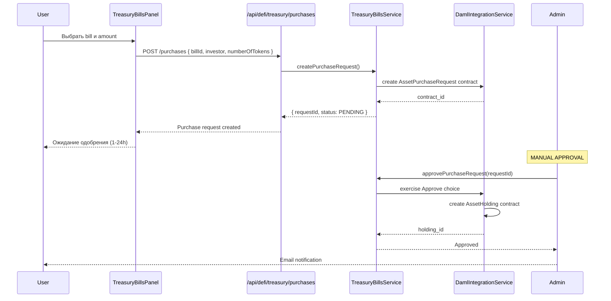
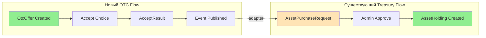
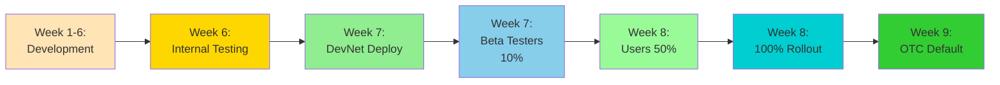
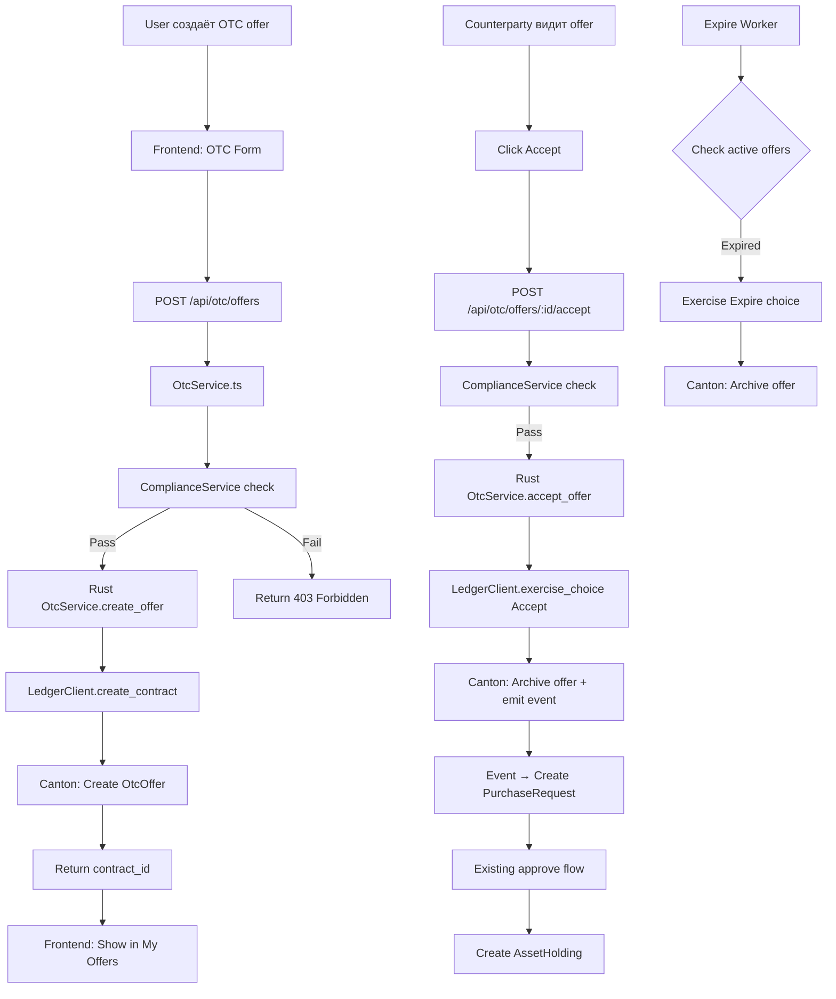
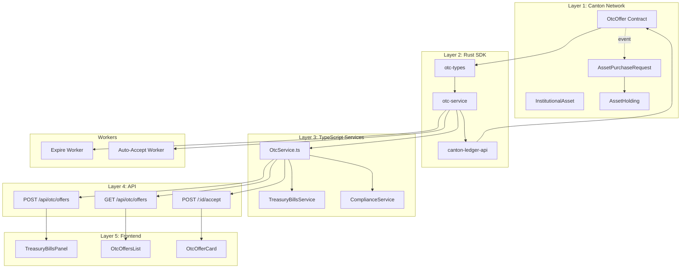

# 🏗️ Архитектурный План Интеграции Canton OTC
## Полный Анализ Требований и План Реализации

**Дата создания:** 2026-02-11  
**Версия:** 1.0  
**Статус:** Ready for Review  
**Автор:** Architect Mode Analysis

---

## 📋 Содержание

1. [Executive Summary](#1-executive-summary)
2. [Полный Список Требований](#2-полный-список-требований)
3. [Существующая Архитектура](#3-существующая-архитектура)
4. [Gap-Анализ](#4-gap-анализ)
5. [Детальный План Интеграции](#5-детальный-план-интеграции)
6. [Архитектурные Решения](#6-архитектурные-решения)
7. [Оценка Сложности](#7-оценка-сложности)
8. [Риски и Митигации](#8-риски-и-митигации)
9. [Рекомендации](#9-рекомендации-по-порядку-выполнения)

---

## 1. Executive Summary

### 1.1 Цель проекта

Интеграция автоматизированного децентрализованного **OTC-режима** в существующую систему **Canton OTC** с полной автоматизацией торговых процессов через Daml smart contracts на Canton Network.

### 1.2 Ключевые характеристики решения

- **Автономность:** OTC работает независимо, не требует внешних систем
- **Автоматизация:** Лимиты, таймауты, settlement через on-chain логику
- **Технология:** Daml smart contracts + Rust SDK + TypeScript Frontend
- **Compliance:** Встроенные KYC/AML чеки и immutable audit trail
- **Интеграция:** Совместимость с существующими Treasury Bills и потоками покупки

### 1.3 Масштаб изменений

```
НОВЫЕ КОМПОНЕНТЫ (30-35%):
├─ Daml OTC Contracts (5 модулей)
├─ Rust SDK (2 новых крейта: otc-types, otc-service)
├─ TypeScript OTC Service
├─ 4 новых API endpoints
├─ 2 новых React компонента
└─ Workers (expire, auto-accept)

РАСШИРЯЕМЫЕ КОМПОНЕНТЫ (15-20%):
├─ TreasuryBillsPanel (добавить OTC mode)
├─ TreasuryBillsService (OTC методы)
├─ Canton Ledger API (высокоуровневые методы)
└─ Мониторинг и метрики

БЕЗ ИЗМЕНЕНИЙ (45-50%):
├─ Существующий OTC flow (Canton Coin)
├─ CCPurchaseWidget
├─ DamlIntegrationService (core)
├─ Compliance, Oracle сервисы
└─ Инфраструктура (K8s, Docker)
```

### 1.4 Целевая архитектура

```
┌─────────────────────────────────────────────────────────┐
│                   FRONTEND LAYER                         │
│  ┌───────────────────┐  ┌───────────────────────────┐  │
│  │ TreasuryBillsPanel│  │  OTC Components (NEW)     │  │
│  │ [Market] [Holdings│  │  - OtcOffersList          │  │
│  │  [My Offers] NEW  │  │  - OtcOfferCard           │  │
│  │  Mode: [OTC][Std] │  │  - Mode Toggle            │  │
│  └───────────────────┘  └───────────────────────────┘  │
└────────────────┬────────────────────────────────────────┘
                 │
┌────────────────▼────────────────────────────────────────┐
│                   API LAYER                              │
│  POST /api/otc/offers          GET /api/otc/offers      │
│  POST /api/otc/offers/:id/accept                        │
│  POST /api/defi/treasury/purchases { mode: "otc" }      │
└────────────────┬────────────────────────────────────────┘
                 │
┌────────────────▼────────────────────────────────────────┐
│              SERVICE LAYER (TypeScript)                  │
│  ┌──────────────────┐      ┌────────────────────────┐  │
│  │ OtcService (NEW) │◄────►│ TreasuryBillsService    │  │
│  │ create/accept/   │      │ (EXTEND with OTC)       │  │
│  │ cancel/list      │      │                         │  │
│  └─────────┬────────┘      └────────────────────────┘  │
│            │                                            │
│  ┌─────────▼────────┐      ┌────────────────────────┐  │
│  │ComplianceService │      │ DamlIntegrationService  │  │
│  │(USE existing)    │      │ (USE existing)          │  │
│  └──────────────────┘      └────────────────────────┘  │
└────────────────┬────────────────────────────────────────┘
                 │
┌────────────────▼────────────────────────────────────────┐
│              RUST SDK LAYER                              │
│  ┌──────────────────────────────────────────────────┐  │
│  │ otc-service (NEW)                                │  │
│  │ - OtcService struct                              │  │
│  │ - create_offer, accept_offer, list_offers        │  │
│  │ - cancel/reject/expire methods                   │  │
│  └───────────────┬──────────────────────────────────┘  │
│                  │                                       │
│  ┌───────────────▼──────────────────────────────────┐  │
│  │ otc-types (NEW)                                  │  │
│  │ - Rust types (OtcOffer, Price, AcceptResult)     │  │
│  │ - Converters: ToDamlRecord, FromDamlRecord       │  │
│  └───────────────┬──────────────────────────────────┘  │
│                  │                                       │
│  ┌───────────────▼──────────────────────────────────┐  │
│  │ canton-ledger-api (EXTEND)                       │  │
│  │ - create_contract, exercise_choice (NEW)         │  │
│  │ - get_active_contracts, subscribe_updates (NEW)  │  │
│  └───────────────┬──────────────────────────────────┘  │
└──────────────────┼──────────────────────────────────────┘
                   │
┌──────────────────▼──────────────────────────────────────┐
│           CANTON NETWORK (Daml Ledger)                   │
│  ┌──────────────────────────────────────────────────┐  │
│  │ OTC Contracts (NEW)                              │  │
│  │ - OtcOffer template                              │  │
│  │ - Choices: Accept, Reject, Cancel, Expire        │  │
│  │ - IOffer interface                               │  │
│  └─────────┬────────────────────────────────────────┘  │
│            │                                            │
│  ┌─────────▼────────────────────────────────────────┐  │
│  │ Existing Contracts                               │  │
│  │ - InstitutionalAsset                             │  │
│  │ - AssetPurchaseRequest                           │  │
│  │ - AssetHolding                                   │  │
│  └──────────────────────────────────────────────────┘  │
└─────────────────────────────────────────────────────────┘

┌─────────────────────────────────────────────────────────┐
│                WORKERS (Automation)                      │
│  ┌──────────────────┐      ┌──────────────────────┐    │
│  │ Expire Worker    │      │ Auto-Accept Worker   │    │
│  │ (NEW)            │      │ (NEW - Optional)     │    │
│  │ - Poll active    │      │ - Subscribe to       │    │
│  │   offers         │      │   CreatedEvents      │    │
│  │ - Archive expired│      │ - Auto-accept if     │    │
│  │                  │      │   conditions met     │    │
│  └──────────────────┘      └──────────────────────┘    │
└─────────────────────────────────────────────────────────┘
```

---

## 2. Полный Список Требований

### 2.1 Требования из документации (по категориям)

#### 📄 Документ 1: OTC_AUTOMATED_DAML_CONTRACT_REQUIREMENTS.md (3768 строк)

**A. Daml Smart Contracts (10 требований)**

| ID | Требование | Описание | Приоритет |
|----|-----------|----------|-----------|
| DAML-1 | OtcOffer template | Шаблон с полями: offerId, maker, taker, assetId, side, quantity, price, limits, expiry | P0 |
| DAML-2 | Choices | Accept, Reject, Cancel, Expire с явными controllers | P0 |
| DAML-3 | Валидация | ensure и assertMsg для лимитов, срока, compliance | P0 |
| DAML-4 | Contract key | (operator, offerId) для уникальности | P0 |
| DAML-5 | Авторизация | signatory: maker + operator; observer: taker + auditors | P0 |
| DAML-6 | IOffer interface | Абстракция для расширяемости | P1 |
| DAML-7 | FSM | Created → Accepted/Rejected/Cancelled/Expired → Settled | P0 |
| DAML-8 | Decimal precision | 10+10 digits для всех сумм (без float) | P0 |
| DAML-9 | Идемпотентность | command_id + deduplication_period | P0 |
| DAML-10 | Версионирование | .dar пакетов с semantic versioning | P1 |

**B. Интеграция с Treasury (4 требования)**

| ID | Требование | Описание | Приоритет |
|----|-----------|----------|-----------|
| INT-1 | AssetPurchaseRequest | После Accept создать PurchaseRequest (Вариант A) | P0 |
| INT-2 | Маппинг типов | OtcOffer ↔ InstitutionalAsset | P0 |
| INT-3 | Compatibility | С существующим purchase flow | P0 |
| INT-4 | Event-driven | Settlement через адаптеры | P1 |

**C. Автоматизация (5 требований)**

| ID | Требование | Описание | Приоритет |
|----|-----------|----------|-----------|
| AUTO-1 | Expire Worker | Автоматическое истечение офер по времени | P0 |
| AUTO-2 | Auto-Accept | При autoAccept=true и условиях выполнены | P1 |
| AUTO-3 | Лимиты | Проверка min/max в choice Accept | P0 |
| AUTO-4 | Expiry check | Проверка времени при каждом action | P0 |
| AUTO-5 | Однократность | Архивирование при Accept | P0 |

#### 📄 Документ 2: OTC_SDK_REQUIREMENTS.md (1315 строк)

**D. Rust SDK (11 требований)**

| ID | Требование | Описание | Приоритет |
|----|-----------|----------|-----------|
| SDK-1 | otc-types крейт | Rust типы для Daml контрактов | P0 |
| SDK-2 | Конвертеры | ToDamlRecord, FromDamlRecord трейты | P0 |
| SDK-3 | otc-service крейт | OtcService API | P0 |
| SDK-4 | CRUD методы | create/accept/list/cancel/reject/expire | P0 |
| SDK-5 | LedgerClient extensions | create_contract, exercise_choice | P0 |
| SDK-6 | Query & Stream | get_active_contracts, subscribe_updates | P0 |
| SDK-7 | Error handling | OtcError с детальными вариантами | P0 |
| SDK-8 | Observability | Tracing для всех операций | P1 |
| SDK-9 | Unit tests | 100% coverage для конвертеров | P0 |
| SDK-10 | Property tests | For roundtrip Daml ↔ Rust | P0 |
| SDK-11 | Integration tests | На Canton DevNet | P1 |

#### 📄 Документ 3: OTC_FRONTEND_REQUIREMENTS.md (2623 строки)

**E. Frontend UI (10 требований)**

| ID | Требование | Описание | Приоритет |
|----|-----------|----------|-----------|
| UI-1 | Mode Toggle | OTC/Standard переключатель в TreasuryBillsPanel | P0 |
| UI-2 | OTC форма | Поля: price, min/max amount, expiry, taker | P0 |
| UI-3 | OtcOffersList | Компонент списка офер пользователя | P0 |
| UI-4 | OtcOfferCard | Компонент карточки оферты для Market | P0 |
| UI-5 | My Offers tab | Новая вкладка в TreasuryBillsPanel | P0 |
| UI-6 | Status badges | Open, Filled, Cancelled, Expired визуализация | P0 |
| UI-7 | Feature flags | Для постепенного роллаута | P0 |
| UI-8 | Backward compat | Сохранение Standard mode | P0 |
| UI-9 | Responsive | Мобильная версия | P1 |
| UI-10 | i18n | Русский/Английский | P2 |

**F. Frontend API (4 требования)**

| ID | Требование | Описание | Приоритет |
|----|-----------|----------|-----------|
| API-F1 | OtcService.ts | TypeScript сервис с create/accept/cancel/list | P0 |
| API-F2 | TreasuryBillsService | Расширение OTC методами | P0 |
| API-F3 | useOtcOffers hook | SWR кэширование | P1 |
| API-F4 | Optimistic updates | При создании офер | P1 |

#### 📄 Документ 4: 06-cryptographic-requirements.md (1505 строк)

**G. Криптография (12 требований)**

| ID | Требование | Описание | Приоритет |
|----|-----------|----------|-----------|
| CRYPTO-1 | Ed25519 support | Для Canton transaction signing | P0 |
| CRYPTO-2 | ECDSA support | P-256, secp256k1 для cross-chain | P0 |
| CRYPTO-3 | KeyStore interface | generate, import, sign, verify | P0 |
| CRYPTO-4 | InMemoryKeyStore | Для development/testing | P0 |
| CRYPTO-5 | HSM integration | HashiCorp Vault для production | P1 |
| CRYPTO-6 | Canton Party ID | Формат partyHint::fingerprint | P0 |
| CRYPTO-7 | BIP-39 mnemonic | Для Canton и EVM ключей | P1 |
| CRYPTO-8 | AES-256-GCM | Симметричное шифрование | P1 |
| CRYPTO-9 | ECIES | Асимметричное шифрование (X25519) | P1 |
| CRYPTO-10 | Merkle tree | Для efficient proofs | P2 |
| CRYPTO-11 | Cross-chain verify | Signature verification | P1 |
| CRYPTO-12 | Zeroization | Чувствительных данных в памяти | P0 |

### 2.2 Общая статистика

```
┌──────────────────────────────────────────┐
│  ВСЕГО требований: 56                    │
├──────────────────────────────────────────┤
│  P0 (Critical - для MVP):  38 (68%)      │
│  P1 (High - для v1.1):     16 (29%)      │
│  P2 (Medium - для v2.0):    2 (3%)       │
└──────────────────────────────────────────┘
```

---

## 3. Существующая Архитектура

### 3.1 Текущая структура

#### Frontend (Next.js 15.5.7 + React 19.2.1 + TypeScript 5.9.3)

**Существующие компоненты:**

```typescript
// ✅ РАБОТАЕТ: OTC для Canton Coin
src/app/page.tsx                           // 3-step flow (landing → wallet → summary)
src/components/IntegratedLandingPage.tsx   // Step 1: Token selection & amount
src/components/WalletDetailsForm.tsx       // Step 2: Addresses & contacts
src/components/OrderSummary.tsx            // Step 3: Confirmation & payment
src/app/api/create-order/route.ts          // API для создания заказа

// ✅ РАБОТАЕТ: Treasury Bills (Manual Mode)
src/app/defi/treasury/page.tsx             // Treasury Bills page
src/components/defi/treasury/TreasuryBillsPanel.tsx  // UI (ДЛЯ РАСШИРЕНИЯ)
src/lib/canton/services/treasuryBillsService.ts      // Service (ДЛЯ РАСШИРЕНИЯ)
src/app/api/defi/treasury/bills/route.ts             // GET bills
src/app/api/defi/treasury/purchases/route.ts         // POST purchase (manual)

// ✅ РАБОТАЕТ: Canton Integration
src/lib/canton/services/damlIntegrationService.ts    // Daml SDK wrapper
src/lib/canton/services/complianceService.ts         // KYC/AML checks
src/lib/canton/services/oracleService.ts             // Price/yield feeds

// ✅ РАБОТАЕТ: Support Services
src/lib/services/googleSheets.ts           // Order storage
src/lib/services/intercom.ts               // Customer support
src/lib/services/email.ts                  // Notifications

// ⚠️ КОНФИГУРАЦИЯ
src/config/otc.ts                          // OTC_CONFIG (ДЛЯ РАСШИРЕНИЯ)
```

**Зависимости ([`package.json`](package.json:1)):**
- Next.js: 15.5.7
- React: 19.2.1
- @daml/ledger: 2.9.0 ✅
- @daml/types: 2.9.0 ✅
- Decimal.js: 10.6.0 ✅
- Framer Motion: 12.23.24
- Lucide React: 0.546.0

#### Backend SDK (Rust)

**Существующие крейты ([`cantonnet-omnichain-sdk/Cargo.toml`](cantonnet-omnichain-sdk/Cargo.toml:1)):**

```rust
// ✅ ГОТОВЫ К ИСПОЛЬЗОВАНИЮ:
crates/canton-core/              // Базовые типы, ошибки, трейты
crates/canton-crypto/            // Ed25519, ECDSA, hashing, encryption
crates/canton-wallet/            // Party management, key derivation
crates/canton-observability/     // Metrics, tracing infrastructure

// ⚠️ НЕДОСТАТОЧНО (ТРЕБУЮТ РАСШИРЕНИЯ):
crates/canton-ledger-api/        // Базовый gRPC клиент
  ├── proto/                     // ✅ Canton Ledger API v2 .proto файлы
  ├── src/client.rs              // ⚠️ Только submit() и connect()
  └── src/lib.rs                 // ⚠️ Нет высокоуровневых методов

// ❌ ОТСУТСТВУЮТ (СОЗДАТЬ):
crates/otc-types/                // Rust типы для OTC
crates/otc-service/              // Доменная логика OTC
```

**Workspace dependencies готовы:**
- tokio: 1.37 (async runtime)
- serde: 1.0 (serialization)
- tonic: 0.11 (gRPC)
- rust_decimal: через workspace.dependencies
- tracing: 0.1 (observability)

#### Daml Contracts

**Статус:** ❌ **Полностью отсутствуют**

Текущая структура:
```
contracts/
└── CantonBridge.sol    # Solidity contract для EVM bridge
```

**Нужно создать:**
```
contracts/daml/
├── daml.yaml
└── daml/
    ├── OTC/
    │   ├── Types.daml
    │   ├── Offer.daml
    │   └── Interfaces/IOffer.daml
    └── Test/
        └── OtcOfferTest.daml
```

### 3.2 Текущий Purchase Flow (Baseline)



**Проблемы текущего flow:**
- ❌ Требует ручного одобрения (не масштабируется)
- ❌ Задержка 1-24 часа
- ❌ Нет orderbook/matching
- ❌ Фиксированная цена
- ❌ Нет partial fills

### 3.3 Существующие сервисы (детально)

**[`DamlIntegrationService`](src/lib/canton/services/damlIntegrationService.ts:193):**
- ✅ create<T>(template, payload): Promise<ContractId<T>>
- ✅ exercise<T,R>(contractId, choice, arg): Promise<R>
- ✅ query<T>(template, filter?): Promise<Contract<T>[]>
- ✅ Кэширование контрактов (assetContracts, holdingContracts)
- ⚠️ Использует @daml/ledger (TypeScript SDK)
- 🔧 **Для OTC:** Использовать как есть, добавить OTC templates

**[`TreasuryBillsService`](src/lib/canton/services/treasuryBillsService.ts:182):**
- ✅ createTreasuryBill(billData): Promise<TreasuryBill>
- ✅ createPurchaseRequest(): Promise<PurchaseRequest>
- ✅ approvePurchaseRequest(): Promise<void>
- ✅ getInvestorHoldings(): Promise<TreasuryBillHolding[]>
- ✅ Yield distribution автоматизация
- 🔧 **Для OTC:** Добавить createOtcOffer, acceptOtcOffer методы

**[`ComplianceService`](src/lib/canton/services/complianceService.ts:152):**
- ✅ validateTransaction(): Promise<ComplianceResult>
- ✅ KYC level checks
- ✅ Jurisdiction validation
- ✅ Amount limits
- 🔧 **Для OTC:** Использовать как есть

---

## 4. Gap-Анализ

### 4.1 Матрица "Что есть vs Что нужно"

| Слой | Компонент | Есть | Нужно | Gap % | Действие |
|------|-----------|------|-------|-------|----------|
| **Daml** | Types.daml | ❌ | ✅ | 100% | Создать с нуля |
| **Daml** | Offer.daml | ❌ | ✅ | 100% | Создать с нуля |
| **Daml** | IOffer.daml | ❌ | ✅ | 100% | Создать с нуля |
| **Daml** | Tests | ❌ | ✅ | 100% | Создать с нуля |
| **Rust** | otc-types | ❌ | ✅ | 100% | Создать с нуля |
| **Rust** | otc-service | ❌ | ✅ | 100% | Создать с нуля |
| **Rust** | canton-ledger-api | ⚠️ 20% | ✅ | 80% | Расширить (4 метода) |
| **TS** | otcService.ts | ❌ | ✅ | 100% | Создать с нуля |
| **TS** | treasuryBillsService | ✅ 30% | ✅ | 70% | Добавить OTC методы |
| **API** | /api/otc/offers | ❌ | ✅ | 100% | Создать с нуля |
| **API** | /api/otc/offers/:id/* | ❌ | ✅ | 100% | Создать с нуля |
| **UI** | OtcOffersList | ❌ | ✅ | 100% | Создать с нуля |
| **UI** | OtcOfferCard | ❌ | ✅ | 100% | Создать с нуля |
| **UI** | TreasuryBillsPanel | ✅ 40% | ✅ | 60% | Добавить OTC UI |
| **Workers** | Expire Worker | ❌ | ✅ | 100% | Создать с нуля |
| **Workers** | Auto-Accept | ❌ | ✅ | 100% | Создать с нуля |
| **Monitor** | OTC Metrics | ❌ | ✅ | 100% | Добавить метрики |
| **Monitor** | Dashboard | ❌ | ✅ | 100% | Создать Grafana JSON |
| **Docs** | User Guide | ❌ | ✅ | 100% | Написать |
| **Docs** | OpenAPI | ❌ | ✅ | 100% | Написать |

### 4.2 Критические зависимости

```
OtcOffer.daml (Daml Contract)
       ↓
    Всё остальное зависит от этого
       ↓
┌──────┴──────────────────────────┐
│                                  │
otc-types (Rust)          OtcService.ts (TypeScript)
       ↓                           ↓
otc-service (Rust)         API Endpoints
       ↓                           ↓
Expire Worker              Frontend UI Components
```

**Критический путь:**
1. OtcOffer.daml template
2. otc-types крейт (Rust)
3. otc-service крейт (Rust)
4. OtcService.ts (TypeScript)
5. API endpoints
6. UI components

Без пункта 1-3 невозможно начать 4-6.

### 4.3 Gap Score Summary

```
┌─────────────────────────────────────────────────┐
│  ОБЩАЯ ГОТОВНОСТЬ СИСТЕМЫ                       │
├─────────────────────────────────────────────────┤
│  Существующая инфраструктура:  45% ████████     │
│  OTC функционал:                0% ░░░░░░░░     │
│  Требуется реализовать:        55% ███████████  │
└─────────────────────────────────────────────────┘

По слоям:
├─ Daml Contracts:     0%  ████████████████████
├─ Rust SDK:          20%  ████░░░░░░░░░░░░░░░░
├─ TypeScript:        30%  ██████░░░░░░░░░░░░░░
├─ API:                0%  ████████████████████
├─ Frontend UI:       40%  ████████░░░░░░░░░░░░
├─ Workers:            0%  ████████████████████
└─ Monitoring:         0%  ████████████████████
```

---

## 5. Детальный План Интеграции

### Phase 1: Daml Contracts (неделя 1-2) 🔴 КРИТИЧНО

**Специализированный режим:** Code Mode  
**Сложность:** 🔴 Высокая  
**Приоритет:** P0

#### Артефакты для создания:

**1. `contracts/daml/daml.yaml`**
```yaml
sdk-version: 2.10.3
name: otc-contracts
version: 1.0.0
source: daml
dependencies:
  - daml-prim
  - daml-stdlib
```

**2. `contracts/daml/daml/OTC/Types.daml` (100 строк)**
```daml
module OTC.Types where

data OtcSide = Buy | Sell deriving (Eq, Show)
data OfferStatus = Active | Accepted | Rejected | Expired | Cancelled | Settled
data Price = Price with rate : Decimal; currency : Text deriving (Eq, Show)
data VolumeLimits = VolumeLimits with minAmount : Decimal; maxAmount : Decimal
data AcceptResult = AcceptResult with tradeId : Text; actualQuantity : Decimal; ...
```

**3. `contracts/daml/daml/OTC/Offer.daml` (200 строк)**
```daml
module OTC.Offer where

import OTC.Types

template OtcOffer
  with
    offerId : Text
    operator : Party
    maker : Party
    taker : Optional Party
    assetId : Text
    side : OtcSide
    quantity : Decimal
    price : Price
    limits : VolumeLimits
    createdAt : Time
    expiryAt : Time
    autoAccept : Bool
    minComplianceLevel : Text
    auditors : [Party]
  where
    signatory maker, operator
    observer taker, auditors
    
    key (operator, offerId) : (Party, Text)
    maintainer key._1
    
    ensure
      quantity > 0.0 &&
      limits.minAmount > 0.0 &&
      limits.maxAmount >= limits.minAmount &&
      expiryAt > createdAt &&
      price.rate > 0.0
    
    choice Accept : AcceptResult
      with
        acceptor : Party
        requestedQuantity : Decimal
        complianceOk : Bool
        currentTime : Time
      controller acceptor
      do
        assertMsg "Offer expired" (currentTime <= expiryAt)
        assertMsg "Below min" (requestedQuantity >= limits.minAmount)
        assertMsg "Above max" (requestedQuantity <= limits.maxAmount)
        assertMsg "Compliance failed" complianceOk
        archive self
        return AcceptResult with ...
    
    choice Reject : ()
    choice Cancel : ()
    choice Expire : ()
```

**4. `contracts/daml/daml/OTC/Interfaces/IOffer.daml` (80 строк)**

**5. `contracts/daml/daml/Test/OtcOfferTest.daml` (150+ строк)**

#### Acceptance Criteria:
- ✅ `daml build` успешен
- ✅ `daml test` проходит (4+ тестов)
- ✅ .dar загружен на DevNet
- ✅ Package ID сохранён в config/otc-template-ids.yaml

---

### Phase 2: Rust SDK - otc-types (неделя 2)

**Специализированный режим:** Code Mode  
**Сложность:** 🟡 Средняя  
**Приоритет:** P0

#### Артефакты:

**1. `cantonnet-omnichain-sdk/crates/otc-types/Cargo.toml`**
```toml
[package]
name = "otc-types"
version = "0.1.0"
edition = "2021"

[dependencies]
canton-core = { workspace = true }
serde = { workspace = true }
rust_decimal = "1.33"
chrono = { workspace = true }
```

**2. Структура:**
```
crates/otc-types/
└── src/
    ├── lib.rs
    ├── offer.rs         # OtcOffer, CreateOfferInput, AcceptOfferInput
    ├── trade.rs         # AcceptResult, OtcTrade
    ├── common.rs        # OtcSide, Price, VolumeLimits
    ├── events.rs        # OfferCreated, OfferAccepted
    └── converters/
        ├── mod.rs       # Трейты
        ├── offer.rs     # impl FromDamlRecord for OtcOffer
        ├── value.rs     # Примитивные конвертеры
        └── decimal.rs   # Decimal ↔ DamlValue
```

**3. Ключевые типы** (`src/offer.rs`):
```rust
#[derive(Debug, Clone, Serialize, Deserialize)]
pub struct OtcOffer {
    pub offer_id: String,
    pub operator: PartyId,
    pub maker: PartyId,
    pub taker: Option<PartyId>,
    pub asset_id: String,
    pub side: OtcSide,
    pub quantity: Decimal,
    pub price: Price,
    pub limits: VolumeLimits,
    pub created_at: DateTime<Utc>,
    pub expiry_at: DateTime<Utc>,
    pub auto_accept: bool,
    pub contract_id: Option<ContractId>,
}
```

**4. Конвертеры** (`src/converters/offer.rs`):
```rust
impl ToDamlRecord for CreateOfferInput {
    fn to_daml_record(&self) -> SdkResult<DamlRecord> {
        // Конвертация всех полей
    }
}

impl FromDamlRecord for OtcOffer {
    fn from_daml_record(record: &DamlRecord) -> SdkResult<Self> {
        // Парсинг из Daml
    }
}
```

#### Tests:
- Unit tests для каждого конвертера
- Property-based tests для roundtrip
- Test coverage: 100%

#### Acceptance Criteria:
- ✅ `cargo test --package otc-types` проходит
- ✅ Coverage ≥ 95%
- ✅ proptest roundtrip tests проходят

---

### Phase 3: Rust SDK - otc-service & Extensions (неделя 3-4)

**Режим:** Code Mode  
**Сложность:** 🟡 Средняя  
**Приоритет:** P0

#### 3.1 Расширить canton-ledger-api

**Файл:** `cantonnet-omnichain-sdk/crates/canton-ledger-api/src/client.rs`

**Добавить методы:**
```rust
impl LedgerClient {
    // HIGH-LEVEL CREATES
    pub async fn create_contract<T: ToDamlRecord>(
        &mut self,
        template_id: &Identifier,
        payload: T,
        command_id: &str,
    ) -> SdkResult<ContractId> {
        let record = payload.to_daml_record()?;
        // Build Commands, submit, wait for completion
    }
    
    // HIGH-LEVEL EXERCISE
    pub async fn exercise_choice<A: ToDamlRecord, R: FromDamlValue>(
        &mut self,
        contract_id: &ContractId,
        choice_name: &str,
        args: A,
        command_id: &str,
    ) -> SdkResult<R> {
        // Build exercise command, submit, parse result
    }
    
    // QUERY ACTIVE CONTRACTS
    pub async fn get_active_contracts<T: FromDamlRecord>(
        &mut self,
        template_id: &Identifier,
        filter: Option<TransactionFilter>,
    ) -> SdkResult<Vec<ActiveContract<T>>> {
        // Call StateService::GetActiveContracts
    }
    
    // SUBSCRIBE TO UPDATES
    pub async fn subscribe_updates(
        &mut self,
        from_offset: LedgerOffset,
        filter: TransactionFilter,
    ) -> SdkResult<impl Stream<Item = SdkResult<Update>>> {
        // Call UpdateService::SubscribeUpdates
    }
}
```

#### 3.2 Создать otc-service

**Структура:**
```
crates/otc-service/
├── Cargo.toml
├── src/
│   ├── lib.rs
│   ├── service.rs      # OtcService implementation
│   ├── config.rs       # OtcConfig, OtcTemplateIds
│   ├── filters.rs      # OfferFilter
│   ├── events.rs       # Event types
│   └── workers/
│       ├── mod.rs
│       └── expire.rs   # Expire worker
└── tests/
    └── integration.rs  # DevNet integration tests
```

**OtcService implementation:**
```rust
pub struct OtcService {
    ledger: LedgerClient,
    template_ids: OtcTemplateIds,
    operator_party: PartyId,
}

impl OtcService {
    #[tracing::instrument]
    pub async fn create_offer(&mut self, input: CreateOfferInput) 
        -> OtcResult<OtcOffer> 
    {
        let offer_id = uuid::Uuid::new_v4().to_string();
        let now = Utc::now();
        let expiry_at = now + input.expiry_duration;
        
        let record = self.build_offer_record(&offer_id, &input, now, expiry_at)?;
        let command_id = format!("otc-create-{}", offer_id);
        
        let contract_id = self.ledger.create_contract(
            &self.template_ids.otc_offer,
            record,
            &command_id
        ).await?;
        
        Ok(OtcOffer { offer_id, contract_id: Some(contract_id), ... })
    }
    
    // accept_offer, list_offers, cancel_offer, etc.
}
```

#### Acceptance Criteria:
- ✅ `cargo test --package otc-service` проходит
- ✅ `cargo test --features integration` выполняет тесты на DevNet
- ✅ create_offer + accept_offer работает end-to-end
- ✅ Expire worker архивирует истёкшие оферты

---

### Phase 4: TypeScript Services (неделя 3, параллельно с Phase 3)

**Режим:** Code Mode  
**Сложность:** 🟢 Низкая  
**Приоритет:** P0

#### 4.1 Создать OtcService.ts

**Файл:** `src/lib/canton/services/otcService.ts` (400 строк)

```typescript
import { EventEmitter } from 'events';
import { DamlIntegrationService } from './damlIntegrationService';
import { ComplianceService } from './complianceService';

export interface OtcOffer {
  offerId: string;
  billId: string;
  billName: string;
  maker: string;
  taker?: string;
  offerPrice: string;
  totalSize: string;
  filledSize: string;
  minOrderSize: string;
  maxOrderSize?: string;
  status: 'OPEN' | 'PARTIALLY_FILLED' | 'FILLED' | 'CANCELLED' | 'EXPIRED';
  createdAt: string;
  expiresAt: string;
  fillCount: number;
  contractId?: string;
}

export class OtcService extends EventEmitter {
  private offers: Map<string, OtcOffer> = new Map();
  
  constructor(
    private damlService: DamlIntegrationService,
    private complianceService: ComplianceService
  ) {
    super();
  }
  
  async createOffer(params: CreateOtcOfferParams): Promise<OtcOffer> {
    // 1. Validate params
    // 2. Compliance check
    // 3. Create via DamlIntegrationService
    // 4. Emit event
    // 5. Return offer
  }
  
  async acceptOffer(offerId: string, acceptor: string, quantity: string): Promise<OtcMatch> {
    // 1. Find offer
    // 2. Validate (expiry, limits, taker)
    // 3. Compliance check
    // 4. Exercise Accept choice
    // 5. Create match record
    // 6. Update offer status
    // 7. Settle (create Holding)
  }
  
  // cancel, list, get методы
}
```

#### 4.2 Расширить TreasuryBillsService

**Файл:** `src/lib/canton/services/treasuryBillsService.ts` (добавить 150 строк)

```typescript
export class TreasuryBillsService extends EventEmitter {
  private otcOffers: Map<string, OtcOffer> = new Map();  // NEW
  private otcMatches: Map<string, OtcMatch> = new Map(); // NEW
  
  // EXISTING methods remain unchanged
  
  // NEW OTC methods:
  public async createOtcOffer(offerData: {...}): Promise<OtcOffer> {
    const bill = this.treasuryBills.get(offerData.billId);
    if (!bill) throw new Error('Bill not found');
    
    const offerId = this.generateOfferId();
    const offer: OtcOffer = { offerId, ... };
    
    this.otcOffers.set(offerId, offer);
    this.emit('otc_offer_created', { offerId, offer });
    
    return offer;
  }
  
  public async acceptOtcOffer(...): Promise<OtcMatch> { ... }
  public async cancelOtcOffer(...): Promise<void> { ... }
  public getAvailableOffers(...): OtcOffer[] { ... }
  public getUserOffers(...): OtcOffer[] { ... }
}
```

#### Acceptance Criteria:
- ✅ OtcService создаёт оферты
- ✅ TreasuryBillsService интегрирован
- ✅ TypeScript types определены
- ✅ Unit tests проходят

**Файлы:**
- СОЗДАТЬ: `src/lib/canton/services/otcService.ts`
- СОЗДАТЬ: `src/lib/canton/types/otc.ts`
- СОЗДАТЬ: `src/lib/canton/events/otcEventBus.ts`
- МОДИФИЦИРОВАТЬ: `src/lib/canton/services/treasuryBillsService.ts`

---

### Phase 5: API Endpoints (неделя 4)

**Режим:** Code Mode  
**Сложность:** 🟢 Низкая  
**Приоритет:** P0

#### 5.1 Создать API структуру

```
src/app/api/otc/
├── offers/
│   ├── route.ts                    # GET /api/otc/offers, POST /api/otc/offers
│   └── [offerId]/
│       ├── route.ts                # GET /api/otc/offers/:id
│       ├── accept/
│       │   └── route.ts            # POST /api/otc/offers/:id/accept
│       ├── cancel/
│       │   └── route.ts            # POST /api/otc/offers/:id/cancel
│       └── reject/
│           └── route.ts            # POST /api/otc/offers/:id/reject
```

#### 5.2 Impl POST /api/otc/offers (150 строк)

```typescript
import { NextRequest, NextResponse } from 'next/server';
import { getOtcService } from '@/lib/canton/services';

export async function POST(request: NextRequest) {
  try {
    const body = await request.json();
    
    // Validate
    if (!body.maker || !body.assetId || !body.quantity || !body.price) {
      return NextResponse.json({
        success: false,
        error: 'Missing required fields'
      }, { status: 400 });
    }
    
    const otcService = getOtcService();
    const offer = await otcService.createOffer(body);
    
    return NextResponse.json({
      success: true,
      data: offer
    }, { status: 201 });
  } catch (error: any) {
    return NextResponse.json({
      success: false,
      error: error.message
    }, { status: 500 });
  }
}
```

#### 5.3 Impl GET /api/otc/offers (100 строк)

Query: `?status=OPEN&maker=0x...&billId=TB001&limit=50&cursor=...`

#### 5.4 Impl POST /api/otc/offers/:id/accept (120 строк)

#### 5.5 Impl Cancel & Reject endpoints (по 80 строк)

#### Acceptance Criteria:
- ✅ Все endpoints возвращают корректные статусы
- ✅ API integration tests проходят
- ✅ Error handling для всех edge cases
- ✅ Rate limiting настроен

**Файлы для создания:** 6 API route файлов

---

### Phase 6: Frontend UI Components (неделя 5)

**Режим:** Code Mode  
**Сложность:** 🟡 Средняя  
**Приоритет:** P0

#### 6.1 Создать OtcOffersList

**Файл:** `src/components/defi/treasury/OtcOffersList.tsx` (300 строк)

```typescript
'use client';

import { useState, useEffect } from 'react';
import { motion } from 'framer-motion';

export interface OtcOffer {
  offerId: string;
  billName: string;
  offerPrice: string;
  totalSize: string;
  filledSize: string;
  status: 'OPEN' | 'PARTIALLY_FILLED' | 'FILLED' | 'CANCELLED' | 'EXPIRED';
  expiresAt: string;
  // ...
}

export const OtcOffersList: React.FC<{ userAddress?: string }> = ({ userAddress }) => {
  const [offers, setOffers] = useState<OtcOffer[]>([]);
  const [isLoading, setIsLoading] = useState(true);
  
  useEffect(() => {
    if (!userAddress) return;
    
    fetch(`/api/otc/offers?maker=${userAddress}`)
      .then(res => res.json())
      .then(data => {
        setOffers(data.offers || []);
        setIsLoading(false);
      });
  }, [userAddress]);
  
  const handleCancel = async (offerId: string) => {
    await fetch(`/api/otc/offers/${offerId}/cancel`, { method: 'POST' });
    setOffers(prev => prev.map(o => 
      o.offerId === offerId ? { ...o, status: 'CANCELLED' } : o
    ));
  };
  
  return (
    <div className="space-y-4">
      {offers.map(offer => (
        <OfferCard key={offer.offerId} offer={offer} onCancel={handleCancel} />
      ))}
    </div>
  );
};
```

#### 6.2 Создать OtcOfferCard

**Файл:** `src/components/defi/treasury/OtcOfferCard.tsx` (250 строк)

```typescript
export const OtcOfferCard: React.FC<{
  offer: OtcOffer;
  onAccept: (offerId: string) => void;
  userAddress?: string;
}> = ({ offer, onAccept, userAddress }) => {
  const isOwnOffer = offer.maker === userAddress;
  const canAccept = !isOwnOffer && (!offer.taker || offer.taker === userAddress);
  
  return (
    <motion.div className="bg-gradient-to-br from-white/10 to-white/5 backdrop-blur-xl rounded-2xl p-6">
      {/* Header с status badge */}
      {/* Offer details (price, size, limits) */}
      {/* Fill progress bar (if PARTIALLY_FILLED) */}
      {/* Accept button */}
    </motion.div>
  );
};
```

#### 6.3 Расширить TreasuryBillsPanel

**Файл:** `src/components/defi/treasury/TreasuryBillsPanel.tsx` (добавить 200 строк)

**Изменения:**
1. Добавить state: `const [purchaseMode, setPurchaseMode] = useState<'otc' | 'standard'>('otc')`
2. Добавить Mode Toggle в header
3. Добавить вкладку "My Offers"
4. Расширить Purchase Modal с OTC полями
5. Условный рендеринг формы

```typescript
// В header (после tabs):
<div className="flex items-center gap-2 ml-auto">
  <span>Purchase Mode:</span>
  <div className="flex bg-white/5 rounded-xl p-1">
    <button onClick={() => setPurchaseMode('otc')} 
            className={purchaseMode === 'otc' ? 'active' : ''}>
      OTC (Instant)
    </button>
    <button onClick={() => setPurchaseMode('standard')}
            className={purchaseMode === 'standard' ? 'active' : ''}>
      Standard (Approval)
    </button>
  </div>
</div>

// В Purchase Modal:
{mode === 'otc' && (
  <>
    <input label="Offer Price Per Token" value={offerPrice} ... />
    <input label="Min Order Size" value={minAmount} ... />
    <input label="Max Order Size" value={maxAmount} ... />
    <select label="Expires In" value={expiryHours} ... />
    <input label="Allowed Taker (Optional)" value={allowedTaker} ... />
  </>
)}
```

#### Acceptance Criteria:
- ✅ Mode toggle переключается между OTC/Standard
- ✅ OTC форма отображает все поля
- ✅ My Offers вкладка показывает список
- ✅ Accept/Cancel действия работают
- ✅ Responsive на мобильных

**Файлы:**
- СОЗДАТЬ: `src/components/defi/treasury/OtcOffersList.tsx`
- СОЗДАТЬ: `src/components/defi/treasury/OtcOfferCard.tsx`
- МОДИФИЦИРОВАТЬ: `src/components/defi/treasury/TreasuryBillsPanel.tsx`

---

### Phase 7: Workers & Automation (неделя 5)

**Режим:** Code Mode  
**Сложность:** 🟡 Средняя  
**Приоритет:** P0 (Expire), P1 (Auto-Accept)

#### 7.1 Expire Worker (Rust)

**Файл:** `cantonnet-omnichain-sdk/crates/otc-service/src/workers/expire.rs` (200 строк)

```rust
use tokio::time::{interval, Duration};
use chrono::Utc;
use tracing::{info, warn};

pub async fn expire_worker(
    mut otc_service: OtcService,
    config: OtcWorkerConfig,
) -> Result<(), OtcError> {
    let mut ticker = interval(Duration::from_secs(config.check_interval_sec));
    
    info!("Starting OTC expire worker (interval: {}s)", config.check_interval_sec);
    
    loop {
        ticker.tick().await;
        
        match expire_check(&mut otc_service).await {
            Ok(expired_count) => {
                if expired_count > 0 {
                    info!("Expired {} offers", expired_count);
                }
            }
            Err(e) => {
                warn!("Expire check failed: {}", e);
            }
        }
    }
}

async fn expire_check(service: &mut OtcService) -> Result<usize, OtcError> {
    let active_offers = service.list_offers(Some(OfferFilter {
        status: Some(vec!["OPEN".to_string(), "PARTIALLY_FILLED".to_string()]),
        ..Default::default()
    })).await?;
    
    let now = Utc::now();
    let mut expired_count = 0;
    
    for offer in active_offers {
        if offer.expiry_at < now {
            match service.expire_offer(&offer.contract_id.unwrap()).await {
                Ok(_) => {
                    expired_count += 1;
                    info!(offer_id = %offer.offer_id, "Offer expired");
                }
                Err(e) => {
                    warn!(offer_id = %offer.offer_id, error = %e, "Failed to expire");
                }
            }
        }
    }
    
    Ok(expired_count)
}
```

#### 7.2 Auto-Accept Worker (опционально)

**Файл:** `cantonnet-omnichain-sdk/crates/otc-service/src/workers/auto_accept.rs` (250 строк)

Подписывается на CreatedEvents, проверяет autoAccept флаг, выполняет compliance, принимает автоматически.

#### 7.3 Worker Deployment

**Kubernetes:**
```yaml
# config/kubernetes/k8s/otc-expire-worker.yaml
apiVersion: apps/v1
kind: Deployment
metadata:
  name: otc-expire-worker
  namespace: canton-otc
spec:
  replicas: 1
  template:
    spec:
      containers:
      - name: worker
        image: ghcr.io/themacroeconomicdao/otc-expire-worker:latest
        env:
        - name: OTC_EXPIRE_INTERVAL_SEC
          value: "300"
        - name: CANTON_PARTICIPANT_URL
          valueFrom:
            configMapKeyRef:
              name: canton-config
              key: participant_url
```

#### Acceptance Criteria:
- ✅ Worker запускается и работает непрерывно
- ✅ Expire worker архивирует истёкшие оферты
- ✅ Логирование структурированное (JSON)
- ✅ Metrics экспонируются
- ✅ Graceful shutdown

**Файлы:**
- СОЗДАТЬ: `cantonnet-omnichain-sdk/crates/otc-service/src/workers/expire.rs`
- СОЗДАТЬ: `cantonnet-omnichain-sdk/crates/otc-service/src/workers/auto_accept.rs` (опц.)
- СОЗДАТЬ: `config/kubernetes/k8s/otc-expire-worker.yaml`

---

### Phase 8: Monitoring & Documentation (неделя 5-6)

**Режим:** Code + Architect Mode  
**Сложность:** 🟢 Низкая  
**Приоритет:** P1-P2

#### 8.1 OTC Metrics (Prometheus)

**Файл:** `cantonnet-omnichain-sdk/crates/otc-service/src/metrics.rs` (150 строк)

```rust
use prometheus_client::metrics::{counter::Counter, gauge::Gauge, histogram::Histogram};

pub struct OtcMetrics {
    pub offers_created: Counter,
    pub offers_accepted: Counter,
    pub offers_rejected: Counter,
    pub offers_expired: Counter,
    pub offers_cancelled: Counter,
    pub offers_active: Gauge,
    pub accept_latency: Histogram,
}

// Регистрация метрик, методы record_*
```

#### 8.2 Grafana Dashboard

**Файл:** `monitoring/grafana/dashboards/otc-dashboard.json` (JSON)

Панели:
- Active Offers (gauge)
- Offers Created/Accepted/Rejected (counters)
- Accept Latency p50/p95/p99 (histogram)
- Fill Rate (accepted / created)
- Expired Offers Not Processed (alert)

#### 8.3 Documentation

**Файл 1:** `docs/OTC_USER_GUIDE.md` (500 строк)
- Что такое OTC режим
- Как создать оферту
- Как принять оферту
- Статусы офер
- FAQ

**Файл 2:** `docs/openapi-otc.yaml` (300 строк)
- OpenAPI 3.0 спецификация всех endpoints
- Request/Response schemas
- Error codes

**Файл 3:** Обновить `README.md` (добавить раздел OTC Mode)

#### Acceptance Criteria:
- ✅ Метрики корректно отображаются в /metrics
- ✅ Dashboard загружается в Grafana
- ✅ Документация полная и понятная

**Файлы:**
- СОЗДАТЬ: Metrics, Dashboard, Docs (5 файлов)
- МОДИФИЦИРОВАТЬ: `README.md`

---

## 6. Архитектурные Решения

### 6.1 Принятые решения

| # | Вопрос | Варианты | Решение | Обоснование |
|---|--------|----------|---------|-------------|
| **AD-1** | Архитектура контрактов | 1) Один OtcOffer<br>2) OtcOffer + OtcTrade | **Вариант 1** | Простота, автономность, достаточно для MVP |
| **AD-2** | Settlement | A) OTC → PurchaseRequest<br>B) OTC → AssetHolding | **Вариант A** | Минимальные изменения существующего кода |
| **AD-3** | API routes | 1) /api/otc/*<br>2) /api/defi/otc/* | **Вариант 1** | OTC - автономный сервис, не часть DeFi |
| **AD-4** | SDK структура | 1) Отдельные крейты<br>2) В canton-ledger-api | **Вариант 1** | Модульность, автономность, размер |
| **AD-5** | Decimal type (Rust) | 1) rust_decimal<br>2) bigdecimal<br>3) f64 | **Вариант 1** | Exact arithmetic, Daml compatible |
| **AD-6** | Async API | 1) Async/await<br>2) Sync | **Вариант 1** | Современный Rust, gRPC = async |
| **AD-7** | Frontend integration | 1) Новые компоненты<br>2) Модифицировать существующие | **Смешанный** | Баланс между DRY и изоляцией |
| **AD-8** | Backward compat | 1) Feature flags<br>2) Breaking change | **Вариант 1** | Постепенный роллаут, zero downtime |
| **AD-9** | Expire mechanism | 1) Active (worker)<br>2) Passive (check) | **Вариант 1** | Чистый ACS, audit trail |
| **AD-10** | Status tracking | 1) Explicit field<br>2) Implicit (archive) | **Вариант 2** | Immutability, простота |

### 6.2 Технологический стек

```
┌─────────────────────────────────────────┐
│  Frontend                                │
├─────────────────────────────────────────┤
│  Next.js:       15.5.7                  │
│  React:         19.2.1                  │
│  TypeScript:    5.9.3                   │
│  Framer Motion: 12.23.24                │
│  Tailwind CSS:  3.4.18                  │
│  Decimal.js:    10.6.0                  │
└─────────────────────────────────────────┘

┌─────────────────────────────────────────┐
│  Backend SDK (Rust)                      │
├─────────────────────────────────────────┤
│  Rust:          1.77+                   │
│  tokio:         1.37                    │
│  tonic:         0.11  (gRPC)            │
│  serde:         1.0                     │
│  rust_decimal:  1.33                    │
│  tracing:       0.1                     │
│  thiserror:     1.0                     │
└─────────────────────────────────────────┘

┌─────────────────────────────────────────┐
│  Smart Contracts                         │
├─────────────────────────────────────────┤
│  Daml SDK:      2.10.3                  │
│  Language:      Daml                    │
│  Target:        Canton Ledger API v2    │
└─────────────────────────────────────────┘

┌─────────────────────────────────────────┐
│  Infrastructure                          │
├─────────────────────────────────────────┤
│  Kubernetes:    1.28+                   │
│  Docker:        24+                     │
│  PostgreSQL:    15+   (для БД)          │
│  Redis:         7+    (для кэша)        │
│  Prometheus:    2.x   (метрики)         │
│  Grafana:       10.x  (dashboards)      │
└─────────────────────────────────────────┘
```

### 6.3 Паттерны проектирования

**6.3.1 Daml Patterns**
- ✅ **Propose-Accept:** OtcOffer (предложение) → Accept (принятие)
- ✅ **Authorization:** signatory, observer, controller разделение
- ✅ **Contract Key:** Для уникальности и lookup
- ✅ **Locking:** Блокировка актива при Sell (опционально в v2)

**6.3.2 Rust Patterns**
- ✅ **Newtype:** ContractId, PartyId обёртки
- ✅ **Builder:** Для DamlRecord конструирования
- ✅ **Error Handling:** thiserror для доменных ошибок
- ✅ **Async/Await:** Tokio runtime для I/O

**6.3.3 Frontend Patterns**
- ✅ **Container/Presenter:** Логика vs UI разделение
- ✅ **Event-Driven:** EventEmitter для services
- ✅ **Optimistic Updates:** UI обновляется до API response
- ✅ **Feature Flags:** Environment variables для роллаута

### 6.4 Интеграция с существующей системой



**Ключевые точки интеграции:**
1. **После Accept** → Создать AssetPurchaseRequest через адаптер
2. **Маппинг данных:** OtcOffer.assetId → TreasuryBill.billId
3. **Metadata:** otcOfferId, otcTradeId в PurchaseRequest
4. **Автоматизация:** Auto-approve при условиях (опционально)

---

## 7. Оценка Сложности

### 7.1 По компонентам (Story Points)

| Компонент | Строк кода | Сложность | Story Points | Обоснование |
|-----------|------------|-----------|--------------|-------------|
| **Daml Contracts** | ~600 | 🔴 Высокая | 13 | Новый язык, критичная логика, формальная верификация |
| **otc-types (Rust)** | ~800 | 🟡 Средняя | 8 | Конвертеры требуют аккуратности, property tests |
| **otc-service (Rust)** | ~1200 | 🟡 Средняя | 13 | Бизнес-логика, async, integration с Canton |
| **canton-ledger-api ext** | ~400 | 🟡 Средняя | 5 | gRPC knowhow, но паттерны есть |
| **OtcService.ts** | ~400 | 🟢 Низкая | 3 | Wrapper над Rust SDK |
| **TreasuryBillsService ext** | ~150 | 🟢 Низкая | 2 | Добавление методов |
| **API endpoints** | ~600 | 🟢 Низкая | 5 | Стандартные Next.js routes |
| **OtcOffersList** | ~300 | 🟢 Низкая | 3 | React component, паттерн известен |
| **OtcOfferCard** | ~250 | 🟢 Низкая | 2 | React component |
| **TreasuryBillsPanel ext** | ~200 | 🟢 Низкая | 3 | Добавление UI |
| **Expire Worker** | ~200 | 🟡 Средняя | 5 | Background job, error handling |
| **Auto-Accept Worker** | ~250 | 🟡 Средняя | 5 | Event subscription, conditions |
| **Monitoring** | ~300 | 🟢 Низкая | 2 | Метрики, dashboard configuration |
| **Documentation** | ~1000 | 🟢 Низкая | 3 | Написание текста |
| **Testing** | ~1500 | 🟡 Средняя | 8 | Unit, integration, E2E tests |
| **ИТОГО** | **~8150** | - | **80 SP** | **8-10 недель** команда 2-3 разработчика |

### 7.2 Сложность по слоям

```
Daml Layer:           🔴🔴🔴🔴🔴 Высокая (5/5)
- Новый язык для команды
- Формальная верификация
- Критичная бизнес-логика

Rust SDK Layer:       🟡🟡🟡🟡░ Средне-высокая (4/5)
- Async Rust knowhow
- gRPC integration
- Type conversions
- Performance requirements

TypeScript Layer:     🟢🟢🟡░░ Средне-низкая (2/5)
- Знакомый стек
- Чёткие паттерны
- Хорошая база

Frontend Layer:       🟢🟢🟢░░ Низкая-средняя (3/5)
- React best practices
- Готовые компоненты
- Design system есть

Infrastructure:       🟢🟢░░░ Низкая (2/5)
- K8s манифесты готовы
- CI/CD работает
- Только конфигурация
```

### 7.3 Риски сложности

| Риск | Вероятность | Влияние | Митигация |
|------|-------------|---------|-----------|
| Daml learning curve для команды | High | High | Обучение, примеры, ревью от Daml эксперта |
| Type mismatch Daml ↔ Rust | Medium | Critical | Property-based tests, exhaustive matching |
| Performance в конвертерах | Low | Medium | Benchmarks, профилирование |
| Canton Network instability | Low | High | Retry logic, circuit breakers, health checks |
| Integration complexity | Medium | Medium | Чёткие интерфейсы, adapter pattern |

---

## 8. Риски и Митигации

### 8.1 Risk Matrix

| ID | Риск | Вероятность | Влияние | Приоритет | Митигация |
|----|------|-------------|---------|-----------|-----------|
| **R1** | **Smart contract bugs** в Daml | Low | Critical | P1 | Extensive testing, Daml script tests 100%, security audit |
| **R2** | **Canton network downtime** | Low | Critical | P1 | Retry logic, circuit breakers, failover participant |
| **R3** | **Performance degradation** (>10k active offers) | Medium | High | P1 | Expire worker, архивация, кэширование (TTL 30s), pagination |
| **R4** | **Compliance bottleneck** (медл енные KYC) | High | Medium | P2 | Async validation, pre-checks, cache (TTL 1h) |
| **R5** | **Security:** front-running, price manipulation | Medium | High | P1 | Private offers (designated taker), price oracle, rate limiting |
| **R6** | **Upgrade breaking changes** | Medium | High | P2 | Semantic versioning, migration scripts, parallel deploy |
| **R7** | **Data inconsistency** Canton ↔ off-chain DB | Low | High | P2 | Event-driven sync, reconciliation job (hourly) |
| **R8** | **Regulatory changes** | Medium | Medium | P3 | Modular compliance, configurable rules |
| **R9** | **Integration failures** с external systems | Medium | Medium | P3 | Loose coupling, adapters, graceful degradation |
| **R10** | **User adoption** - сложность OTC | High | Low | P3 | User guide, tooltips, in-app onboarding |
| **R11** | **Type mismatch** Daml ↔ Rust | High | Critical | P1 | Property-based tests, exhaustive enum matching |
| **R12** | **Daml learning curve** | High | Medium | P2 | Training, code review, examples |

### 8.2 Contingency Plans

**R1-R2: Critical system failures**
```
IF Canton недоступен OR critical bug THEN:
  1. Immediate (<5 min): Enable maintenance mode (API → 503)
  2. Short-term (<1 hour): Rollback to last known good version
  3. Recovery: Re-enable gradually (10% → 50% → 100%)
```

**R3: Performance degradation**
```
Triggers: API latency >5s (p95) OR active offers >10k
Actions:
  - Enable aggressive archiving
  - Increase cache TTL
  - Scale up resources
  - Add read replicas
```

**R11: Type mismatch issues**
```
Prevention:
  - Property-based tests для ВСЕХ конвертеров
  - Exhaustive pattern matching
  - CI fails при любом warning
  
Recovery:
  - Детальные error messages с контекстом
  - Fast rollback mechanism
```

---

## 9. Рекомендации по Порядку Выполнения

### 9.1 Критический путь (MUST DO FIRST)

```
Неделя 1-2: Daml Contracts
    ↓
Неделя 2: Rust otc-types (параллельно с Daml tests)
    ↓
Неделя 3-4: Rust SDK (otc-service + canton-ledger-api)
    ↓
Неделя 3:TypeScript Services (параллельно с Rust SDK)
    ↓
Неделя 4: API Endpoints
    ↓
Неделя 5: Frontend UI + Workers
    ↓
Неделя 5-6: Monitoring & Docs
```

### 9.2 Детальный порядок задач

**🔴 БЛОК 1: Foundation (нед. 1-2) - НЕЛЬЗЯ ПАРАЛЛЕЛИТЬ**

1. ☑️ [DAML-1] Создать OTC/Types.daml
2. ☑️ [DAML-1] Создать OTC/Offer.daml с полями
3. ☑️ [DAML-2] Реализовать choices (Accept, Reject, Cancel, Expire)
4. ☑️ [DAML-3] Добавить валидацию (ensure, assertMsg)
5. ☑️ [DAML-4] Добавить contract key
6. ☑️ [DAML-8] Тесты Decimal precision
7. ☑️ [DAML-7] Daml script tests для FSM
8. ☑️ `daml build` → загрузить .dar на DevNet
9. ☑️ Зафиксировать Package ID в config

**🟡 БЛОК 2: SDK Foundation (нед. 2) - ЗАВИСИТ ОТ БЛОК 1**

10. ☑️ [SDK-1] Создать otc-types/Cargo.toml
11. ☑️ [SDK-1] Реализовать Rust types (OtcOffer, Price, etc.)
12. ☑️ [SDK-2] Написать трейты ToDamlRecord, FromDamlRecord
13. ☑️ [SDK-2] Impl конвертеров для всех типов
14. ☑️ [SDK-9] Unit tests (coverage 100%)
15. ☑️ [SDK-10] Property-based tests
16. ☑️ `cargo test --package otc-types`

**🟢 БЛОК 3A: Rust SDK Core (нед. 3-4) - ПАРАЛЛЕЛЬНО С 3B**

17. ☑️ [SDK-5] Расширить LedgerClient: create_contract()
18. ☑️ [SDK-5] Расширить LedgerClient: exercise_choice()
19. ☑️ [SDK-6] Добавить get_active_contracts()
20. ☑️ [SDK-6] Добавить subscribe_updates()
21. ☑️ [SDK-3] Создать otc-service/Cargo.toml
22. ☑️ [SDK-4] Impl OtcService::create_offer()
23. ☑️ [SDK-4] Impl OtcService::accept_offer()
24. ☑️ [SDK-4] Impl list/cancel/reject/expire методы
25. ☑️ [SDK-7] Error types (OtcError enum)
26. ☑️ [SDK-8] Tracing для всех методов
27. ☑️ [SDK-11] Integration tests на DevNet

**🟢 БЛОК 3B: TypeScript Services (нед. 3) - ПАРАЛЛЕЛЬНО С 3A**

28. ☑️ [API-F1] Создать otcService.ts
29. ☑️ [API-F1] Impl create/accept/cancel/list методы
30. ☑️ [API-F2] Расширить TreasuryBillsService OTC методами
31. ☑️ TypeScript types для OTC
32. ☑️ EventBus для OTC events
33. ☑️ Unit tests для сервисов

**🔵 БЛОК 4: API Layer (нед. 4) - ЗАВИСИТ ОТ БЛОК 3**

34. ☑️ Создать /api/otc/offers/route.ts (GET, POST)
35. ☑️ Создать /api/otc/offers/[offerId]/route.ts (GET)
36. ☑️ Создать /api/otc/offers/[offerId]/accept/route.ts
37. ☑️ Создать /api/otc/offers/[offerId]/cancel/route.ts
38. ☑️ Создать /api/otc/offers/[offerId]/reject/route.ts
39. ☑️ API integration tests
40. ☑️ Rate limiting configuration

**🎨 БЛОК 5: Frontend UI (нед. 5) - ЗАВИСИТ ОТ БЛОК 4**

41. ☑️ [UI-3] Создать OtcOffersList.tsx
42. ☑️ [UI-4] Создать OtcOfferCard.tsx
43. ☑️ [UI-1] Добавить Mode Toggle в TreasuryBillsPanel
44. ☑️ [UI-2] Расширить Purchase Modal с OTC полями
45. ☑️ [UI-5] Добавить вкладку "My Offers"
46. ☑️ [UI-6] Status badges визуализация
47. ☑️ [UI-7] Feature flags implementation
48. ☑️ E2E tests (Playwright)

**⚙️ БЛОК 6: Workers (нед. 5) - ПАРАЛЛЕЛЬНО С БЛОК 5**

49. ☑️ [AUTO-1] Impl Expire Worker (Rust)
50. ☑️ [AUTO-2] Impl Auto-Accept Worker (опц.)
51. ☑️ Kubernetes deployment для workers
52. ☑️ Worker integration tests

**📊 БЛОК 7: Monitoring & Docs (нед. 5-6) - НИЗКИЙ ПРИОРИТЕТ**

53. ☑️ OTC Metrics (Prometheus)
54. ☑️ Grafana Dashboard
55. ☑️ OTC User Guide
56. ☑️ OpenAPI specification
57. ☑️ README обновление

### 9.3 Параллелизация

```
│ Неделя │    Daml    │    Rust SDK    │   TypeScript   │  Frontend  │  Workers   │
├────────┼────────────┼────────────────┼────────────────┼────────────┼────────────┤
│   1    │ ████████   │                │                │            │            │
│   2    │ ██ Tests   │ ████████       │                │            │            │
│        │            │ otc-types      │                │            │            │
│   3    │            │ ████████████   │ ████████       │            │            │
│        │            │ otc-service    │ OtcService.ts  │            │            │
│   4    │            │ ████ Tests     │ ████████       │            │            │
│        │            │                │ API Endpoints  │            │            │
│   5    │            │                │                │ ████████   │ ████████   │
│        │            │                │                │ UI Comps   │ Expire Wkr │
│   6    │            │                │                │ ████ Tests │ ██ Monitor │
│        │            │                │                │ E2E        │ Docs       │
```

**Возможная параллелизация:**
- Неделя 2: Daml tests + Rust otc-types одновременно
- Неделя 3: Rust otc-service + TypeScript OtcService одновременно
- Неделя 5: Frontend UI + Workers одновременно

**Критические блокеры:**
- TypeScript Services блокируют API Endpoints
- API Endpoints блокируют Frontend UI
- Rust otc-service блокирует Workers

### 9.4 Рекомендуемый Team Setup

**Оптимальная команда: 3 разработчика**

```
Dev 1 (Daml/Rust):
├─ Week 1-2: Daml contracts + tests
├─ Week 2-4: Rust SDK (otc-types, otc-service)
└─ Week 5: Workers + integration support

Dev 2 (Backend):
├─ Week 3: TypeScript OtcService
├─ Week 4: API endpoints + integration tests
└─ Week 5-6: Monitoring + backend support

Dev 3 (Frontend):
├─ Week 1-4: Подготовка, изучение API контракта
├─ Week 5: UI components (OtcOffersList, Card)
├─ Week 5: TreasuryBillsPanel расширение
└─ Week 6: E2E tests + UI polish
```

**Минимальная команда: 2 разработчика** (10-12 недель)

### 9.5 Фазированный роллаут (рекомендуется)



**Feature Flags Strategy:**
```typescript
// Week 6: Deploy code, flags OFF
OTC_ENABLED=false
OTC_DEFAULT_MODE=false
LEGACY_MODE_AVAILABLE=true

// Week 7: Beta testing
OTC_ENABLED=true (for beta testers only)
OTC_DEFAULT_MODE=false
LEGACY_MODE_AVAILABLE=true

// Week 8: Gradual rollout
OTC_ENABLED=true (for all users)
OTC_DEFAULT_MODE=false
LEGACY_MODE_AVAILABLE=true

// Week 9: OTC becomes default
OTC_ENABLED=true
OTC_DEFAULT_MODE=true
LEGACY_MODE_AVAILABLE=true

// Future (optional): Legacy deprecation
OTC_DEFAULT_MODE=true
LEGACY_MODE_AVAILABLE=false
```

---

## 10. Итоговая Таблица Артефактов

### 10.1 Файлы для создания (НОВЫЕ)

| # | Файл | Размер | Сложность | Приоритет | Блок |
|---|------|--------|-----------|-----------|------|
| 1 | `contracts/daml/daml.yaml` | 20 | 🟢 | P0 | 1 |
| 2 | `contracts/daml/daml/OTC/Types.daml` | 100 | 🟡 | P0 | 1 |
| 3 | `contracts/daml/daml/OTC/Offer.daml` | 250 | 🔴 | P0 | 1 |
| 4 | `contracts/daml/daml/OTC/Interfaces/IOffer.daml` | 80 | 🟡 | P1 | 1 |
| 5 | `contracts/daml/daml/Test/OtcOfferTest.daml` | 200 | 🟡 | P0 | 1 |
| 6 | `cantonnet-omnichain-sdk/crates/otc-types/Cargo.toml` | 30 | 🟢 | P0 | 2 |
| 7 | `cantonnet-omnichain-sdk/crates/otc-types/src/lib.rs` | 50 | 🟢 | P0 | 2 |
| 8 | `cantonnet-omnichain-sdk/crates/otc-types/src/offer.rs` | 150 | 🟡 | P0 | 2 |
| 9 | `cantonnet-omnichain-sdk/crates/otc-types/src/trade.rs` | 80 | 🟢 | P0 | 2 |
| 10 | `cantonnet-omnichain-sdk/crates/otc-types/src/common.rs` | 100 | 🟢 | P0 | 2 |
| 11 | `cantonnet-omnichain-sdk/crates/otc-types/src/converters/mod.rs` | 60 | 🟡 | P0 | 2 |
| 12 | `cantonnet-omnichain-sdk/crates/otc-types/src/converters/offer.rs` | 200 | 🔴 | P0 | 2 |
| 13 | `cantonnet-omnichain-sdk/crates/otc-types/src/converters/decimal.rs` | 60 | 🟡 | P0 | 2 |
| 14 | `cantonnet-omnichain-sdk/crates/otc-service/Cargo.toml` | 40 | 🟢 | P0 | 3 |
| 15 | `cantonnet-omnichain-sdk/crates/otc-service/src/lib.rs` | 50 | 🟢 | P0 | 3 |
| 16 | `cantonnet-omnichain-sdk/crates/otc-service/src/service.rs` | 600 | 🔴 | P0 | 3 |
| 17 | `cantonnet-omnichain-sdk/crates/otc-service/src/config.rs` | 80 | 🟢 | P0 | 3 |
| 18 | `cantonnet-omnichain-sdk/crates/otc-service/src/workers/expire.rs` | 200 | 🟡 | P0 | 6 |
| 19 | `cantonnet-omnichain-sdk/crates/otc-service/src/workers/auto_accept.rs` | 250 | 🟡 | P1 | 6 |
| 20 | `src/lib/canton/services/otcService.ts` | 400 | 🟡 | P0 | 3 |
| 21 | `src/lib/canton/types/otc.ts` | 120 | 🟢 | P0 | 3 |
| 22 | `src/lib/canton/events/otcEventBus.ts` | 100 | 🟢 | P1 | 3 |
| 23 | `src/app/api/otc/offers/route.ts` | 200 | 🟢 | P0 | 4 |
| 24 | `src/app/api/otc/offers/[offerId]/route.ts` | 100 | 🟢 | P0 | 4 |
| 25 | `src/app/api/otc/offers/[offerId]/accept/route.ts` | 150 | 🟡 | P0 | 4 |
| 26 | `src/app/api/otc/offers/[offerId]/cancel/route.ts` | 80 | 🟢 | P0 | 4 |
| 27 | `src/app/api/otc/offers/[offerId]/reject/route.ts` | 80 | 🟢 | P0 | 4 |
| 28 | `src/components/defi/treasury/OtcOffersList.tsx` | 300 | 🟡 | P0 | 5 |
| 29 | `src/components/defi/treasury/OtcOfferCard.tsx` | 250 | 🟡 | P0 | 5 |
| 30 | `src/lib/canton/config/features.ts` | 40 | 🟢 | P0 | 5 |
| 31 | `monitoring/grafana/dashboards/otc-dashboard.json` | 400 | 🟢 | P1 | 7 |
| 32 | `monitoring/alerting/otc-rules.yml` | 100 | 🟢 | P1 | 7 |
| 33 | `docs/OTC_USER_GUIDE.md` | 500 | 🟢 | P2 | 7 |
| 34 | `docs/openapi-otc.yaml` | 300 | 🟢 | P2 | 7 |
| 35 | `config/kubernetes/k8s/otc-expire-worker.yaml` | 80 | 🟢 | P0 | 6 |

**ИТОГО: 35 новых файлов, ~6200 строк кода**

### 10.2 Файлы для модификации (РАСШИРЕНИЕ)

| # | Файл | Добавить строк | Сложность | Риск ломки |
|---|------|----------------|-----------|------------|
| 1 | `cantonnet-omnichain-sdk/crates/canton-ledger-api/src/client.rs` | 400 | 🟡 | Low |
| 2 | `cantonnet-omnichain-sdk/Cargo.toml` | 10 | 🟢 | Very Low |
| 3 | `src/lib/canton/services/treasuryBillsService.ts` | 200 | 🟢 | Low |
| 4 | `src/components/defi/treasury/TreasuryBillsPanel.tsx` | 250 | 🟡 | Medium |
| 5 | `src/config/otc.ts` | 50 | 🟢 | Very Low |
| 6 | `README.md` | 100 | 🟢 | Very Low |
| 7 | `.env.example` | 10 | 🟢 | Very Low |

**ИТОГО: 7 модификаций, ~1020 добавленных строк**

### 10.3 Общий объём работ

```
┌────────────────────────────────────────────┐
│  НОВЫЕ ФАЙЛЫ:        35 файлов             │
│  НОВЫЙ КОД:          ~6200 строк           │
│                                            │
│  МОДИФИКАЦИИ:        7 файлов              │
│  ДОБАВЛЕННЫЙ КОД:    ~1020 строк           │
│                                            │
│  ИТОГО КОД:          ~7220 строк           │
│                                            │
│  ТЕСТЫ:              ~1500 строк           │
│  ДОКУМЕНТАЦИЯ:       ~1000 строк           │
│                                            │
│  ОБЩИЙ ОБЪЁМ:        ~9720 строк           │
└────────────────────────────────────────────┘
```

---

## 11. Checklist для каждой Phase

### ✅ Phase 1: Daml Contracts

```markdown
- [ ] Создать contracts/daml/daml.yaml
- [ ] Создать OTC/Types.daml
- [ ] Создать OTC/Offer.daml с template
- [ ] Добавить все choices (Accept, Reject, Cancel, Expire)
- [ ] Добавить валидацию (ensure + assertMsg)
- [ ] Добавить contract key
- [ ] Создать IOffer interface (опционально)
- [ ] Создать Test/OtcOfferTest.daml
- [ ] Написать test_create_and_accept
- [ ] Написать test_expire
- [ ] Написать test_limits_validation
- [ ] Написать test_single_accept
- [ ] Выполнить `daml build` без ошибок
- [ ] Выполнить `daml test` - все тесты проходят
- [ ] Загрузить .dar на DevNet participant
- [ ] Зафиксировать Package ID в config/otc-template-ids.yaml
- [ ] Code review Daml контрактов
```

### ✅ Phase 2: Rust otc-types

```markdown
- [ ] Создать crates/otc-types/Cargo.toml
- [ ] Создать src/lib.rs с re-exports
- [ ] Реализовать src/offer.rs (OtcOffer, CreateOfferInput, AcceptOfferInput)
- [ ] Реализовать src/trade.rs (AcceptResult)
- [ ] Реализовать src/common.rs (OtcSide, Price, VolumeLimits)
- [ ] Реализовать src/events.rs
- [ ] Создать src/converters/mod.rs с трейтами
- [ ] Impl FromDamlRecord for OtcOffer
- [ ] Impl ToDamlRecord for CreateOfferInput
- [ ] Impl converters для всех типов
- [ ] Unit tests для всех конвертеров
- [ ] Property-based tests для roundtrip
- [ ] `cargo test --package otc-types` - все проходят
- [ ] Code coverage ≥ 95%
- [ ] Clippy без warnings
- [ ] Rustdoc documentation
```

### ✅ Phase 3: Rust SDK Core

```markdown
- [ ] Расширить canton-ledger-api: create_contract()
- [ ] Расширить canton-ledger-api: exercise_choice()
- [ ] Добавить get_active_contracts()
- [ ] Добавить subscribe_updates()
- [ ] Создать crates/otc-service/Cargo.toml
- [ ] Создать src/service.rs
- [ ] Impl OtcService::new()
- [ ] Impl create_offer() с tracing
- [ ] Impl accept_offer() с validation
- [ ] Impl list_offers() с filtering
- [ ] Impl cancel/reject/expire методы
- [ ] Создать src/config.rs
- [ ] Создать src/filters.rs
- [ ] Создать src/workers/expire.rs
- [ ] Unit tests с mock LedgerClient
- [ ] Integration test: create + accept на DevNet
- [ ] Integration test: expire flow
- [ ] `cargo test --all` проходят
- [ ] Benchmarks (<1ms конвертация, <200ms create_offer)
```

### ✅ Phase 4: TypeScript Services

```markdown
- [ ] Создать src/lib/canton/services/otcService.ts
- [ ] Impl createOffer() method
- [ ] Impl acceptOffer() method
- [ ] Impl cancelOffer() method
- [ ] Impl listOffers() method
- [ ] Создать TypeScript types (src/lib/canton/types/otc.ts)
- [ ] Создать EventBus (src/lib/canton/events/otcEventBus.ts)
- [ ] Расширить TreasuryBillsService OTC методами
- [ ] Integration с ComplianceService
- [ ] Integration с DamlIntegrationService
- [ ] Unit tests для OtcService
- [ ] TypeScript type-check проходит
```

### ✅ Phase 5: API Endpoints

```markdown
- [ ] POST /api/otc/offers - создание
- [ ] GET /api/otc/offers - список с фильтрами
- [ ] GET /api/otc/offers/:id - детали оферты
- [ ] POST /api/otc/offers/:id/accept
- [ ] POST /api/otc/offers/:id/cancel
- [ ] POST /api/otc/offers/:id/reject
- [ ] Валидация входных данных
- [ ] Error handling (4xx/5xx)
- [ ] Rate limiting configuration
- [ ] API integration tests
- [ ] Postman/Insomnia collection
```

### ✅ Phase 6: Frontend UI

```markdown
- [ ] Создать OtcOffersList.tsx компонент
- [ ] Создать OtcOfferCard.tsx компонент
- [ ] Добавить Mode Toggle в TreasuryBillsPanel
- [ ] Расширить Purchase Modal с OTC полями
- [ ] Добавить вкладку "My Offers"
- [ ] Status badges (Open, Filled, etc.)
- [ ] Feature flags implementation
- [ ] Responsive design (mobile)
- [ ] Accessibility (ARIA labels)
- [ ] E2E tests (Playwright):
  - [ ] Create offer flow
  - [ ] Accept offer flow
  - [ ] Cancel offer flow
  - [ ] Mode toggle works
```

### ✅ Phase 7: Workers

```markdown
- [ ] Impl Expire Worker (Rust)
- [ ] Worker configuration (interval, enable/disable)
- [ ] Kubernetes deployment manifest
- [ ] Health check endpoint
- [ ] Graceful shutdown
- [ ] Structured logging
- [ ] Worker integration test
- [ ] Auto-Accept Worker (optional)
```

### ✅ Phase 8: Monitoring & Docs

```markdown
- [ ] OTC Prometheus metrics
- [ ] Grafana dashboard JSON
- [ ] Alert rules YAML
- [ ] OTC User Guide (MD)
- [ ] OpenAPI specification
- [ ] README update
- [ ] Deployment guide update
```

---

## 12. Финальная Рекомендация

### 12.1 Recommended Approach

**✅ РЕКОМЕНДУЕТСЯ:**

1. **Start with Daml** (неделя 1-2)
   - Самый критичный компонент
   - Блокирует всё остальное
   - Требует обучения команды
   - **Режим:** Code

2. **Parallel: Rust SDK Foundation** (неделя 2)
   - Начать otc-types пока идут Daml tests
   - **Режим:** Code

3. **Parallel Tracks** (неделя 3-4)
   - Track A: Rust otc-service + canton-ledger-api extensions
   - Track B: TypeScript OtcService + API endpoints
   - **Режим:** Code для обоих

4. **Integration** (неделя 5)
   - Frontend UI components
   - Workers
   - **Режим:** Code

5. **Polish** (неделя 6)
   - Testing
   - Documentation
   - Monitoring
   - **Режим:** Code + Architect (для docs)

### 12.2 Success Criteria для Release

**Обязательные (P0):**
- ✅ Daml контракты задеплоены на Canton DevNet
- ✅ Rust SDK может создавать и принимать оферты
- ✅ API endpoints работают корректно
- ✅ Frontend UI позволяет создавать оферты
- ✅ Expire worker архивирует истёкшие оферты
- ✅ Integration tests проходят на DevNet
- ✅ Backward compatibility с Standard mode сохранена

**Желательные (P1):**
- ✅ Auto-Accept worker реализован
- ✅ Metrics и dashboard настроены
- ✅ E2E tests проходят
- ✅ Documentation полная

**Опциональные (P2):**
- ⚪ i18n (русский/английский)
- ⚪ Advanced features (Counter-Offer, Multi-sig)
- ⚪ Mobile app specific optimizations

### 12.3 Next Steps

**Immediate Actions:**

1. **Review этого документа** с командой разработки
2. **Создать задачи** в трекере (Jira/Linear/GitHub Issues)
3. **Allocate developers** (минимум 2, оптимально 3)
4. **Setup Canton DevNet** access для тестирования
5. **Начать Phase 1** с Daml контрактов

**Recommended Starting Point:**
```bash
# 1. Создать ветку
git checkout -b feature/otc-integration

# 2. Создать структуру Daml проекта
mkdir -p contracts/daml/daml/{OTC,Test}
cd contracts/daml

# 3. Начать с daml.yaml
# 4. Переключиться в Code Mode для реализации
```

---

## 13. Архитектурная Диаграмма Интеграции

### Текущее состояние (AS-IS)

```
┌─────────────────────────────────────────────────────┐
│                   СЕЙЧАС                             │
├─────────────────────────────────────────────────────┤
│  Frontend: Manual Purchase Flow                     │
│  ├─ TreasuryBillsPanel (select bill)                │
│  ├─ Purchase Modal (amount only)                    │
│  └─ API: POST /api/defi/treasury/purchases          │
│                                                      │
│  Backend: Manual Approval                            │
│  ├─ TreasuryBillsService.createPurchaseRequest()    │
│  ├─ Admin reviews & approves                        │
│  └─ Creates AssetHolding when approved              │
│                                                      │
│  Canton: Existing Contracts                          │
│  ├─ InstitutionalAsset                              │
│  ├─ AssetPurchaseRequest                            │
│  └─ AssetHolding                                    │
│                                                      │
│  Проблемы:                                           │
│  ❌ Ручное одобрение (не масштабируется)            │
│  ❌ Задержка 1-24 часа                              │
│  ❌ Нет orderbook                                   │
│  ❌ Фиксированная цена                              │
└─────────────────────────────────────────────────────┘
```

### Целевое состояние (TO-BE)

```
┌──────────────────────────────────────────────────────────┐
│                   ПОСЛЕ ИНТЕГРАЦИИ                        │
├──────────────────────────────────────────────────────────┤
│  Frontend: Dual Mode (OTC + Legacy)                      │
│  ├─ TreasuryBillsPanel                                   │
│  │   ├─ [Market] [Holdings] [My Offers] ◄── NEW         │
│  │   └─ Mode: [●OTC] [○Standard] ◄────────── NEW        │
│  ├─ OTC Modal:                                           │
│  │   ├─ Price, Min/Max, Expiry ◄────────────── NEW      │
│  │   └─ Submit → Creates OtcOffer                       │
│  ├─ OtcOffersList ◄───────────────────────── NEW        │
│  └─ API: POST /api/otc/offers ◄──────────── NEW         │
│                                                           │
│  Backend: Automated + Manual Modes                        │
│  ├─ OtcService (NEW)                                     │
│  │   ├─ createOffer() → Canton                          │
│  │   ├─ acceptOffer() → Instant settlement              │
│  │   └─ listOffers() → Active offers                    │
│  ├─ TreasuryBillsService (Extended)                      │
│  │   ├─ Existing methods (unchanged)                    │
│  │   └─ New OTC methods                                 │
│  └─ Expire Worker (background job) ◄───────── NEW       │
│                                                           │
│  Rust SDK: OTC Support                                    │
│  ├─ otc-types: Daml ↔ Rust conversion ◄──── NEW         │
│  ├─ otc-service: Business logic ◄───────────NEW         │
│  └─ canton-ledger-api: High-level API ◄───── EXTENDED   │
│                                                           │
│  Canton: New + Existing Contracts                         │
│  ├─ OtcOffer (NEW)                                       │
│  │   ├─ Accept → AcceptResult                           │
│  │   └─ Event → Adapter → PurchaseRequest              │
│  ├─ InstitutionalAsset (existing)                        │
│  ├─ AssetPurchaseRequest (existing)                      │
│  └─ AssetHolding (existing)                             │
│                                                           │
│  Преимущества:                                            │
│  ✅ Instant settlement (seconds vs hours)               │
│  ✅ Custom pricing                                       │
│  ✅ Orderbook matching                                   │
│  ✅ Automated workflow                                   │
│  ✅ Backward compatible (Standard mode remains)          │
└──────────────────────────────────────────────────────────┘
```

---

## 14. Заключение

### 14.1 Резюме анализа

**Проанализировано:**
- ✅ 4 документа требований (7906 строк)
- ✅ Существующая архитектура Canton OTC
- ✅ Rust SDK структура (13 крейтов)
- ✅ Frontend компоненты и сервисы
- ✅ API endpoints и flows

**Выявлено:**
- 📊 56 требований (38 P0, 16 P1, 2 P2)
- 📁 35 новых файлов для создания
- 📝 7 файлов для расширения
- 💻 ~7220 строк нового кода
- 🧪 ~1500 строк тестов

**Gap-анализ:**
- 🔴 Daml Contracts: 0% (создать с нуля)
- 🟡 Rust SDK: 20% готовности (расширить)
- 🟡 TypeScript: 30% готовности (добавить OTC)
- 🟢 Frontend: 40% готовности (расширить UI)
- 🔴 Workers: 0% (создать с нуля)

### 14.2 Критический путь для MVP

```
1. Daml OtcOffer.daml (week 1-2) ⚡ BLOCKER
      ↓
2. Rust otc-types (week 2) ⚡ BLOCKER
      ↓
3. Rust otc-service + TS OtcService (week 3-4) ⚡ BLOCKER
      ↓
4. API endpoints (week 4) ⚡ BLOCKER
      ↓
5. Frontend UI (week 5)
      ↓
6. Workers + Testing (week 5-6)
      ↓
READY FOR BETA TESTING
```

### 14.3 Рекомендации

**Для успешной реализации:**

1. **Начать с Daml контрактов** - самый критичный и блокирующий компонент
2. **Использовать Code Mode** для всех фаз 1-7
3. **Параллелизовать** где возможно (Rust SDK + TypeScript Services)
4. **Тестировать на каждом этапе** - не accumulate technical debt
5. **Feature flags** для постепенного роллаута
6. **Сохранить backward compatibility** - Standard mode остаётся

**Предлагаемая команда:**
- 1 Daml/Rust developer (senior) - Phases 1-3, 7
- 1 Backend developer (mid/senior) - Phases 4, 8
- 1 Frontend developer (mid) - Phases 5-6

**Timeline:** 6-8 недель до MVP, 8-10 недель до production-ready

### 14.4 Ключевые решения

| Решение | Альтернатива | Выбрано | Почему |
|---------|--------------|---------|--------|
| OtcOffer единый шаблон | OtcOffer + OtcTrade | **Единый** | Простота, автономность |
| Settlement вариант | Прямой AssetHolding | **Event-driven** | Loose coupling, гибкость |
| API маршруты | /api/defi/otc/* | **/api/otc/*** | OTC автономен |
| SDK крейты | Встроить в canton-ledger-api | **Отдельные** | Модульность |
| Decimal implementation | f64, bigdecimal | **rust_decimal** | Exact arithmetic |
| Expire механизм | Passive check | **Active worker** | Clean ACS, audit |

---

## Приложение A: Мermaid Диаграммы

### A.1 Data Flow Diagram



### A.2 Component Dependency Graph



---

**КОНЕЦ АРХИТЕКТУРНОГО ПЛАНА**

**Статус:** ✅ Готов к использованию для планирования и реализации  
**Следующий шаг:** Review с командой → Создание задач → Начало Phase 1  
**Режим для реализации:** Code Mode (для фаз 1-7), Architect Mode (для документации)

