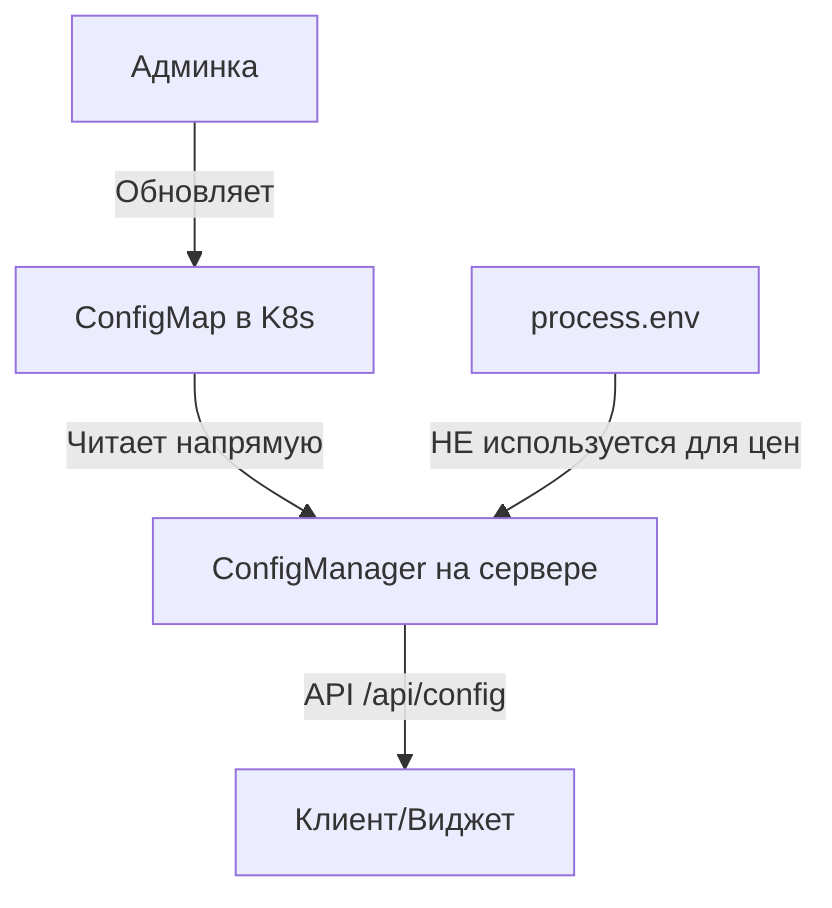

# 🔧 Отчет об исправлении загрузки цен из ConfigMap

## 🎯 Проблема
Цены сначала загружались со старыми значениями из ConfigMap (0.25/0.18), а потом обновлялись из админки (0.77/0.22). Это происходило потому что:

1. При старте контейнера переменные окружения устанавливаются из ConfigMap один раз
2. ConfigManager при инициализации использовал эти устаревшие значения из process.env
3. Только после первого обновления (через 30 секунд) загружались актуальные значения

## ✅ Внесенные изменения

### 1. ConfigManager инициализация (src/lib/config-manager.ts)
```typescript
// БЫЛО: брали значения из process.env
const cantonCoinBuyPrice = process.env?.CANTON_COIN_BUY_PRICE_USD 
  ? parseFloat(process.env.CANTON_COIN_BUY_PRICE_USD) 
  : 0;

// СТАЛО: инициализируем нулями, чтобы сразу загрузить из ConfigMap
const cantonCoinBuyPrice = 0;
const cantonCoinSellPrice = 0;
```

### 2. Загрузка из ConfigMap (src/lib/config-manager.ts)
```typescript
// БЫЛО: fallback на process.env
const cantonCoinBuyPrice = parseFloat(
  configMapData.CANTON_COIN_BUY_PRICE_USD || 
  process.env.CANTON_COIN_BUY_PRICE_USD || 
  '0'
);

// СТАЛО: только из ConfigMap
const cantonCoinBuyPrice = parseFloat(
  configMapData.CANTON_COIN_BUY_PRICE_USD || '0'
);
```

### 3. API endpoint /api/config
- Убрали fallback на process.env для цен
- Теперь возвращает 0 если ConfigMap недоступен

### 4. Обновлен файл ConfigMap
- config/kubernetes/k8s/minimal-stage/configmap.yaml теперь содержит актуальные цены (0.77/0.22)

### 5. Создан скрипт для обновления цен
- scripts/update-configmap-prices.sh - позволяет быстро обновить цены в ConfigMap

## 🏗️ Архитектура решения



## 📝 Как это работает теперь

1. **При старте приложения:**
   - ConfigManager инициализируется с нулевыми ценами
   - Сразу запрашивает актуальные данные из ConfigMap
   - НЕ использует process.env для цен

2. **При обновлении из админки:**
   - Админка обновляет ConfigMap через Kubernetes API
   - ConfigManager автоматически читает новые значения
   - Клиенты получают обновленные цены через /api/config

3. **Fallback режим (только для локальной разработки):**
   - Если ConfigMap недоступен, цены будут 0
   - Появится предупреждение в консоли

## 🚀 Рекомендации

1. **Для применения изменений:**
   ```bash
   # Применить обновленный ConfigMap
   kubectl apply -f config/kubernetes/k8s/minimal-stage/configmap.yaml
   
   # Перезапустить поды для загрузки новых переменных окружения
   kubectl rollout restart deployment canton-otc -n canton-otc-minimal-stage
   ```

2. **Для обновления цен:**
   ```bash
   # Использовать скрипт
   ./scripts/update-configmap-prices.sh
   
   # Или напрямую через kubectl
   kubectl patch configmap canton-otc-config -n canton-otc-minimal-stage --type merge -p '{"data":{"CANTON_COIN_BUY_PRICE_USD":"0.77","CANTON_COIN_SELL_PRICE_USD":"0.22"}}'
   ```

## ⚠️ Важные замечания

1. **НЕ используйте process.env для цен** - они содержат значения на момент старта контейнера
2. **ConfigMap - единственный источник правды** для цен
3. **Админка должна обновлять ConfigMap**, а не локальные переменные

## ✅ Результат

Теперь виджет всегда будет показывать актуальные цены из ConfigMap, которые устанавливаются через админку. Больше не будет сброса на старые значения при загрузке страницы.
