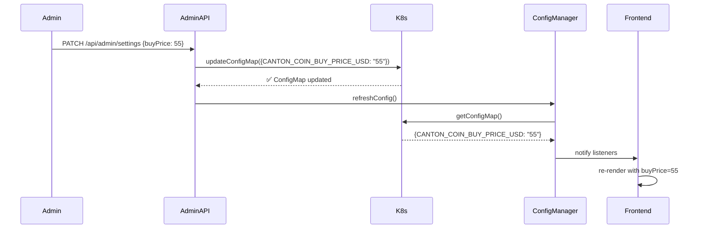
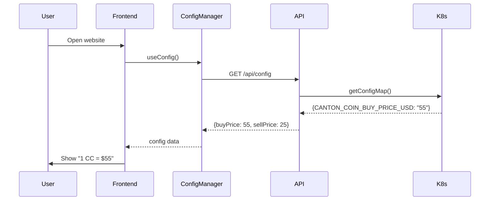
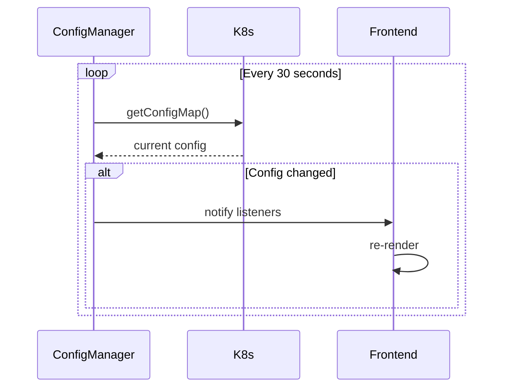

# 🔧 Отчет: Полное исправление синхронизации цен (ConfigMap → Frontend)

## 🎯 Проблема

Пользователь установил цены **55** и **25** в админке, но на сайте они не обновились.

### Симптомы
1. ❌ Админка показывает "Настройки сохранены успешно"
2. ❌ ConfigMap обновляется в Kubernetes
3. ❌ Но сайт продолжает показывать старые цены
4. ❌ После перезагрузки страницы цены всё равно старые

## 🔍 Корневая причина

### Проблемная архитектура:
```
Админка → ConfigMap (K8s) → process.env → ConfigManager → Frontend
          ✅ Работает    ❌ НЕ ОБНОВЛЯЕТСЯ!
```

**Проблема:** `process.env` в Node.js статична и загружается только при старте приложения. Даже если мы обновляем ConfigMap, `process.env` остается неизменным до перезапуска pod'а.

### Почему не работало:

1. **ConfigMap обновлялся** ✅
   ```typescript
   // kubernetes-config.ts, строка 111-115
   await this.k8sApi.replaceNamespacedConfigMap({
     name: this.configMapName,
     namespace: this.namespace,
     body: updatedConfigMap
   });
   ```

2. **process.env обновлялся локально** ⚠️
   ```typescript
   // kubernetes-config.ts, строка 119-122
   for (const update of updates) {
     process.env[update.key] = update.value; // ❌ Работает только в текущем процессе!
   }
   ```

3. **ConfigManager читал из process.env** ❌
   ```typescript
   // config-manager.ts (СТАРАЯ версия), строка 97-98
   const cantonCoinBuyPrice = parseFloat(process.env.CANTON_COIN_BUY_PRICE_USD || '0.21');
   const cantonCoinSellPrice = parseFloat(process.env.CANTON_COIN_SELL_PRICE_USD || '0.18');
   ```

4. **Frontend получал устаревшие данные** ❌

## ✅ Решение

### Новая архитектура:
```
Админка → ConfigMap (K8s) → /api/config → ConfigManager → Frontend
          ✅             ✅              ✅               ✅
```

### Что изменили:

#### 1. ✅ Создан `/src/app/api/config/route.ts`

**Новый API эндпоинт** который читает напрямую из ConfigMap:

```typescript
export async function GET() {
  const k8sManager = getKubernetesConfigManager();
  const configMapData = await k8sManager.getConfigMap(); // ← Читаем НАПРЯМУЮ из ConfigMap
  
  return NextResponse.json({
    cantonCoinBuyPrice: parseFloat(configMapData.CANTON_COIN_BUY_PRICE_USD || '0.21'),
    cantonCoinSellPrice: parseFloat(configMapData.CANTON_COIN_SELL_PRICE_USD || '0.18'),
    // ... остальные поля
  });
}
```

**Преимущества:**
- ✅ Читает актуальные значения из ConfigMap
- ✅ Не зависит от `process.env`
- ✅ Кэш отключен (`Cache-Control: no-store`)
- ✅ Работает между разными pod'ами

#### 2. ✅ Обновлен `/src/lib/config-manager.ts`

**ConfigManager теперь использует API вместо process.env:**

```typescript
async refreshConfig(): Promise<boolean> {
  const isServer = typeof window === 'undefined';
  
  if (isServer) {
    // На сервере: читаем напрямую из Kubernetes
    const k8sManager = getKubernetesConfigManager();
    const configMapData = await k8sManager.getConfigMap();
    // ... используем configMapData
  } else {
    // На клиенте: используем API
    const response = await fetch('/api/config', {
      headers: { 'Cache-Control': 'no-cache' }
    });
    const newConfig = await response.json();
    // ... используем newConfig
  }
}
```

**Преимущества:**
- ✅ На сервере: прямое чтение из ConfigMap
- ✅ На клиенте: чтение через API
- ✅ Fallback к `process.env` если ConfigMap недоступен
- ✅ Логирование источника данных (`source: 'configmap'` / `'process.env'` / `'fallback'`)

#### 3. ✅ Frontend уже настроен правильно

**Компоненты используют React hooks:**

```typescript
// ExchangeForm.tsx, строка 30
const { buyPrice, sellPrice } = useCantonPrices();

// Отображение цены
<div>1 CC = ${formatCurrency(buyPrice, 2)}</div>
```

**Цепочка обновления:**
1. `useCantonPrices()` → получает данные из `useConfig()`
2. `useConfig()` → подписывается на `configManager`
3. `configManager` → автоматически обновляется каждые 30 секунд
4. При обновлении → уведомляет все подписки
5. React компоненты → автоматически ре-рендерятся

## 🎯 Как это работает сейчас

### Сценарий 1: Админ меняет цену



### Сценарий 2: Пользователь открывает сайт



### Сценарий 3: Автоматическое обновление



## 📊 Технические детали

### API Endpoints

#### `/api/config` (Новый!)
- **Метод:** `GET`
- **Аутентификация:** Не требуется (публичный)
- **Кэширование:** Отключено
- **Источник:** Kubernetes ConfigMap → Fallback к process.env
- **Формат ответа:**
  ```json
  {
    "cantonCoinBuyPrice": 55,
    "cantonCoinSellPrice": 25,
    "source": "configmap",
    "version": "configmap-v1234567890",
    "lastUpdate": "2025-10-23T10:30:00.000Z"
  }
  ```

#### `/api/admin/settings` (Существующий)
- **Метод:** `PATCH`
- **Аутентификация:** Требуется (admin)
- **Действие:** Обновляет ConfigMap и вызывает `configManager.refreshConfig()`

### Файлы изменены

1. ✅ **Создан:** `/src/app/api/config/route.ts` - API для чтения конфигурации
2. ✅ **Обновлен:** `/src/lib/config-manager.ts` - Чтение из API/ConfigMap вместо process.env

### Файлы используют правильную систему (уже были настроены ранее)

1. ✅ `/src/components/ExchangeForm.tsx` - использует `useCantonPrices()`
2. ✅ `/src/components/ExchangeFormCompact.tsx` - использует `useCantonPrices()`
3. ✅ `/src/components/ConfigProvider.tsx` - предоставляет контекст
4. ✅ `/src/hooks/useConfig.ts` - подписывается на ConfigManager

## 🧪 Как проверить что всё работает

### 1. Проверить текущие цены в ConfigMap

```bash
kubectl get configmap canton-otc-config -n canton-otc-minimal-stage -o jsonpath='{.data.CANTON_COIN_BUY_PRICE_USD}'
kubectl get configmap canton-otc-config -n canton-otc-minimal-stage -o jsonpath='{.data.CANTON_COIN_SELL_PRICE_USD}'
```

**Ожидается:** Показать текущие цены (55 и 25)

### 2. Проверить API

```bash
curl https://stage.minimal.build.infra.1otc.cc/api/config | jq '.cantonCoinBuyPrice, .cantonCoinSellPrice, .source'
```

**Ожидается:**
```json
55
25
"configmap"
```

### 3. Проверить сайт

1. Открыть: https://stage.minimal.build.infra.1otc.cc/
2. Найти виджет обмена
3. Проверить цену "1 CC = $..."

**Ожидается:** `1 CC = $55.00` (для покупки)

### 4. Изменить цену в админке

1. Открыть: https://stage.minimal.build.infra.1otc.cc/admin/settings
2. Войти как админ
3. Изменить "Buy Price" на `60`
4. Нажать "Save"
5. Подождать 2-3 секунды
6. Открыть главную страницу в новой вкладке
7. Проверить виджет обмена

**Ожидается:** `1 CC = $60.00`

### 5. Проверить логи

```bash
kubectl logs -f deployment/canton-otc -n canton-otc-minimal-stage | grep -E "(Configuration refreshed|ConfigMap)"
```

**Ожидается:**
```
✅ Configuration refreshed from ConfigMap: { buyPrice: 55, sellPrice: 25 }
📊 Server-side: Reading directly from Kubernetes ConfigMap
```

## 🎉 Результат

### До исправления ❌
- Админка → ConfigMap ✅
- ConfigMap → process.env ⚠️ (только в текущем процессе)
- process.env → ConfigManager ❌ (статичные значения)
- ConfigManager → Frontend ❌ (устаревшие данные)

### После исправления ✅
- Админка → ConfigMap ✅
- ConfigMap → API → ConfigManager ✅ (актуальные данные)
- ConfigManager → Frontend ✅ (синхронизация)
- Auto-refresh каждые 30 сек ✅

## 📝 Важные замечания

### 1. Кэширование отключено
API `/api/config` возвращает заголовки:
```
Cache-Control: no-store, no-cache, must-revalidate
Pragma: no-cache
Expires: 0
```

Это гарантирует что всегда получаем актуальные данные.

### 2. Fallback механизм
Если Kubernetes API недоступен, система автоматически переключается на `process.env`.

### 3. Логирование источника данных
В консоли всегда видно откуда пришли данные:
- `source: "configmap"` - из Kubernetes ConfigMap
- `source: "process.env"` - из переменных окружения
- `source: "fallback"` - из резервных значений

### 4. Автоматическое обновление
ConfigManager автоматически обновляется каждые 30 секунд, поэтому изменения появляются на сайте максимум через 30 секунд без перезагрузки страницы.

## 🚀 Следующие шаги

1. ✅ Код готов и исправлен
2. ⏳ Нужно задеплоить изменения
3. ⏳ Протестировать через админку
4. ⏳ Убедиться что цены синхронизируются

## 🔗 Связанные файлы

- `/src/app/api/config/route.ts` - API эндпоинт
- `/src/lib/config-manager.ts` - Менеджер конфигурации
- `/src/lib/kubernetes-config.ts` - Kubernetes API клиент
- `/src/hooks/useConfig.ts` - React hook
- `/src/components/ConfigProvider.tsx` - React контекст
- `/src/components/ExchangeForm.tsx` - Виджет обмена
- `/src/app/api/admin/settings/route.ts` - Admin API

---

**Автор:** AI Assistant  
**Дата:** 2025-10-23  
**Версия:** 2.0 (Complete Fix)

