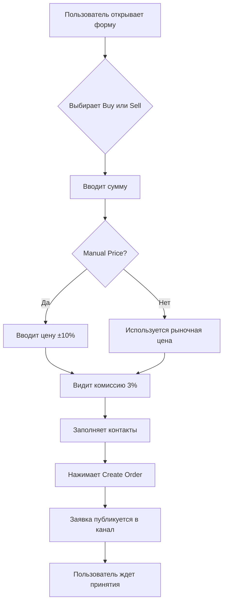
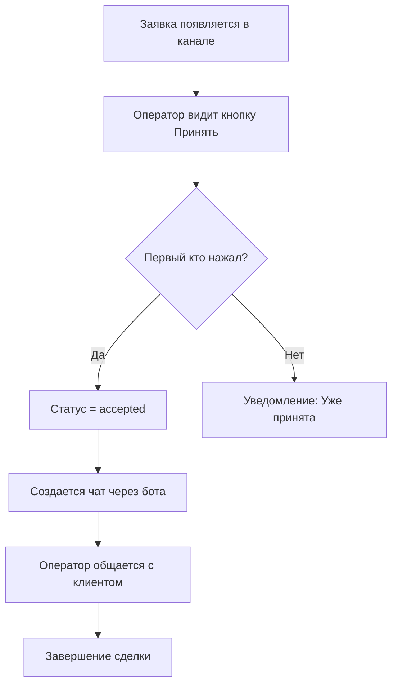

# 🏗️ ПРОМПТ: Обновление OTC-платформы Canton - Полная Реализация

## 📋 КОНТЕКСТ ПРОЕКТА

Вы работаете с OTC-платформой Canton на Next.js 15 (App Router) + TypeScript + Tailwind CSS.

**Текущая архитектура:**
- Frontend: React 19 + Next.js 15 + Framer Motion + Tailwind
- Backend: Next.js API Routes
- База данных: Supabase (PostgreSQL)
- Интеграции: Telegram Bot API, Intercom, Google Sheets
- Deployment: Kubernetes + Docker

**Текущие файлы для модификации:**
- `src/components/ExchangeForm.tsx` - форма обмена (desktop)
- `src/components/ExchangeFormCompact.tsx` - форма обмена (mobile)
- `src/app/api/create-order/route.ts` - API создания заказа
- `src/lib/services/telegram.ts` - сервис Telegram
- `src/config/otc.ts` - конфигурация OTC
- `src/app/api/admin/settings/route.ts` - API настроек

---

## 🎯 ЗАДАЧА: Реализация улучшений OTC-платформы

### Требования к реализации

#### 1. UI: Кнопки Buy / Sell вместо переключателя

**Было:** Круглый переключатель (toggle) для выбора направления
**Будет:** Две отдельные кнопки Buy и Sell

**Дизайн:**
```tsx
// Две кнопки рядом, активная выделена
<div className="flex gap-4">
  <button 
    onClick={() => setDirection('buy')}
    className={cn(
      "flex-1 py-4 px-6 rounded-xl font-bold text-lg transition-all",
      direction === 'buy' 
        ? "bg-gradient-to-r from-green-600 to-emerald-500 text-white shadow-lg scale-105"
        : "bg-white/10 text-white/60 hover:bg-white/20"
    )}
  >
    🛒 BUY Canton
  </button>
  <button 
    onClick={() => setDirection('sell')}
    className={cn(
      "flex-1 py-4 px-6 rounded-xl font-bold text-lg transition-all",
      direction === 'sell'
        ? "bg-gradient-to-r from-red-600 to-orange-500 text-white shadow-lg scale-105"
        : "bg-white/10 text-white/60 hover:bg-white/20"
    )}
  >
    💸 SELL Canton
  </button>
</div>
```

**Логика:**
- Только одна кнопка может быть активна
- При клике на неактивную - переключается направление
- Сохранить текущую логику очистки полей при смене направления

#### 2. Отображение комиссии

**Расположение:** Под строкой с ценой

**Формат:**
```tsx
<div className="text-center mt-2">
  <p className="text-sm text-white/70">
    Service Commission: <span className="font-bold text-cyan-400">{serviceCommission}%</span>
  </p>
  <p className="text-xs text-white/50 mt-1">
    Commission is added to the final price
  </p>
</div>
```

**Значение комиссии:**
- По умолчанию: 3%
- Редактируется через админ-панель (`/admin/settings`)
- Хранится в ConfigMap Kubernetes
- Добавляется к итоговой цене (не включена в базовую цену)

**Расчет с комиссией:**
```typescript
// При покупке Canton
const basePrice = buyPrice; // Базовая цена
const priceWithCommission = basePrice * (1 + serviceCommission / 100);
const cantonAmount = paymentAmountUSD / priceWithCommission;

// При продаже Canton
const basePrice = sellPrice;
const priceWithCommission = basePrice * (1 - serviceCommission / 100);
const usdtAmount = cantonAmount * priceWithCommission;
```

#### 3. Ручной ввод цены

**UI элемент:**
```tsx
<div className="flex items-center gap-3 mb-4">
  <input
    type="checkbox"
    id="manualPriceInput"
    checked={isManualPrice}
    onChange={(e) => setIsManualPrice(e.target.checked)}
    className="w-5 h-5 rounded border-2 border-white/30"
  />
  <label htmlFor="manualPriceInput" className="text-white font-medium">
    📝 Manual Price Input
  </label>
</div>

{isManualPrice && (
  <div className="mt-4">
    <label className="block text-sm text-white/80 mb-2">
      Custom Price (±10% from market)
    </label>
    <Input
      type="number"
      value={customPrice}
      onChange={handleCustomPriceChange}
      step="0.0001"
      min={marketPrice * 0.9}
      max={marketPrice * 1.1}
      className="text-lg font-bold"
    />
    <p className="text-xs text-white/60 mt-1">
      Market price: ${marketPrice.toFixed(4)} | 
      Range: ${(marketPrice * 0.9).toFixed(4)} - ${(marketPrice * 1.1).toFixed(4)}
    </p>
  </div>
)}
```

**Валидация:**
```typescript
const validateCustomPrice = (price: number, marketPrice: number): {valid: boolean, error?: string} => {
  if (price < marketPrice * 0.9) {
    return {valid: false, error: 'Price too low (min -10% from market)'};
  }
  if (price > marketPrice * 1.1) {
    return {valid: false, error: 'Price too high (max +10% from market)'};
  }
  return {valid: true};
};
```

#### 4. Публикация в публичный Telegram канал

**Новый метод в `telegram.ts`:**
```typescript
/**
 * Публикация заявки в публичный канал
 */
async sendPublicOrderNotification(order: OTCOrder): Promise<{success: boolean, messageId?: number}> {
  try {
    const publicChatId = process.env.TELEGRAM_PUBLIC_CHANNEL_ID;
    if (!publicChatId) {
      throw new Error('Public channel not configured');
    }

    const message = this.formatPublicOrderMessage(order);
    
    const response = await axios.post(
      `${this.baseUrl}${this.config!.botToken}/sendMessage`,
      {
        chat_id: publicChatId,
        text: message,
        parse_mode: 'HTML',
        disable_web_page_preview: true,
        reply_markup: {
          inline_keyboard: [
            [
              {
                text: '✅ Принять заявку',
                callback_data: `accept_order:${order.orderId}`
              }
            ],
            [
              {
                text: '📋 Детали заявки',
                callback_data: `order_details:${order.orderId}`
              }
            ]
          ]
        }
      }
    );

    if (response.data.ok) {
      return {
        success: true, 
        messageId: response.data.result.message_id
      };
    }
    
    return {success: false};
  } catch (error) {
    console.error('Failed to send public order notification:', error);
    return {success: false};
  }
}

/**
 * Форматирование сообщения для публичного канала
 */
private formatPublicOrderMessage(order: OTCOrder): string {
  const direction = order.exchangeDirection === 'buy' ? '🛒 ПОКУПКА' : '💸 ПРОДАЖА';
  const timestamp = new Date(order.timestamp).toLocaleString('ru-RU', {
    timeZone: 'Europe/Moscow',
    day: '2-digit',
    month: '2-digit',
    year: 'numeric',
    hour: '2-digit',
    minute: '2-digit'
  });

  const price = order.manualPrice || (order.exchangeDirection === 'buy' ? this.getBuyPrice() : this.getSellPrice());
  const commission = order.serviceCommission || 3;

  return `
🔔 <b>НОВАЯ ЗАЯВКА OTC</b>

📊 <b>Тип:</b> ${direction} Canton Coin
💰 <b>Сумма:</b> ${order.exchangeDirection === 'buy' 
    ? `$${order.paymentAmountUSD.toFixed(2)} → ${order.cantonAmount.toFixed(2)} CC`
    : `${order.cantonAmount.toFixed(2)} CC → $${order.paymentAmountUSD.toFixed(2)}`
  }

💵 <b>Цена:</b> $${price.toFixed(4)} ${order.manualPrice ? '(ручной ввод)' : '(рыночная)'}
📈 <b>Комиссия:</b> ${commission}%
📋 <b>ID заявки:</b> <code>${order.orderId}</code>
🕐 <b>Создана:</b> ${timestamp} (МСК)

⚡️ <i>Нажмите "Принять заявку" для начала сделки</i>
  `.trim();
}
```

**Переменные окружения (добавить в ConfigMap):**
```yaml
TELEGRAM_PUBLIC_CHANNEL_ID: "@your_public_channel"  # ID публичного канала
TELEGRAM_SERVICE_BOT_USERNAME: "@TECH_HY_Customer_Service_bot"
```

#### 5. Логика принятия заявки

**Webhook обработчик (`/api/telegram-mediator/webhook`):**
```typescript
// src/app/api/telegram-mediator/webhook/route.ts
import { NextRequest, NextResponse } from 'next/server';
import { supabase } from '@/lib/supabase';
import { telegramService } from '@/lib/services/telegram';

export async function POST(request: NextRequest) {
  try {
    const update = await request.json();
    
    // Обработка callback кнопок
    if (update.callback_query) {
      const callbackData = update.callback_query.data;
      const chatId = update.callback_query.message.chat.id;
      const messageId = update.callback_query.message.message_id;
      const operatorId = update.callback_query.from.id;
      const operatorUsername = update.callback_query.from.username;

      // Парсим callback_data
      const [action, orderId] = callbackData.split(':');

      if (action === 'accept_order') {
        // Проверяем, что заявка еще не принята
        const { data: order, error } = await supabase
          .from('public_orders')
          .select('*')
          .eq('order_id', orderId)
          .single();

        if (error || !order) {
          await answerCallback(update.callback_query.id, '❌ Заявка не найдена');
          return NextResponse.json({ok: true});
        }

        if (order.status !== 'pending') {
          await answerCallback(update.callback_query.id, '⚠️ Заявка уже принята другим оператором');
          return NextResponse.json({ok: true});
        }

        // Блокируем заявку для этого оператора
        const { error: updateError } = await supabase
          .from('public_orders')
          .update({
            status: 'accepted',
            operator_id: operatorId,
            operator_username: operatorUsername,
            accepted_at: new Date().toISOString()
          })
          .eq('order_id', orderId)
          .eq('status', 'pending'); // Проверка на race condition

        if (updateError) {
          await answerCallback(update.callback_query.id, '❌ Ошибка принятия заявки');
          return NextResponse.json({ok: true});
        }

        // Обновляем сообщение в канале
        await telegramService.editMessageText(
          chatId,
          messageId,
          `${update.callback_query.message.text}\n\n✅ <b>Заявка принята</b>\n👤 Оператор: @${operatorUsername}`
        );

        // Создаем сервисный чат через бота
        const serviceBotUsername = process.env.TELEGRAM_SERVICE_BOT_USERNAME;
        const chatLink = await telegramService.createServiceChat(orderId, order, operatorId);

        // Отправляем инструкции оператору
        await telegramService.sendMessage(
          operatorId,
          `✅ Вы приняли заявку #${orderId}\n\n` +
          `Перейдите в чат для общения с клиентом:\n${chatLink}\n\n` +
          `📋 Детали заявки:\n` +
          `Тип: ${order.exchange_direction === 'buy' ? '🛒 Покупка' : '💸 Продажа'}\n` +
          `Сумма: $${order.payment_amount_usd}\n` +
          `Цена: $${order.price}\n` +
          `Комиссия: ${order.service_commission}%\n\n` +
          `📧 Email клиента: ${order.email}\n` +
          `💬 Telegram: ${order.telegram || 'не указан'}`
        );

        await answerCallback(update.callback_query.id, '✅ Заявка принята! Проверьте личные сообщения.');
      }
    }

    return NextResponse.json({ok: true});
  } catch (error) {
    console.error('Webhook error:', error);
    return NextResponse.json({ok: true}); // Всегда возвращаем ok для Telegram
  }
}

async function answerCallback(callbackQueryId: string, text: string) {
  const botToken = process.env.TELEGRAM_BOT_TOKEN;
  await fetch(`https://api.telegram.org/bot${botToken}/answerCallbackQuery`, {
    method: 'POST',
    headers: {'Content-Type': 'application/json'},
    body: JSON.stringify({
      callback_query_id: callbackQueryId,
      text,
      show_alert: true
    })
  });
}
```

**Создание сервисного чата:**
```typescript
// В telegram.ts
async createServiceChat(orderId: string, order: any, operatorId: number): Promise<string> {
  const serviceBotUsername = process.env.TELEGRAM_SERVICE_BOT_USERNAME;
  
  // Отправляем deep link для открытия чата через сервисного бота
  // Формат: https://t.me/{bot_username}?start={payload}
  const payload = Buffer.from(JSON.stringify({
    orderId,
    operatorId,
    clientEmail: order.email
  })).toString('base64url');

  return `https://t.me/${serviceBotUsername}?start=${payload}`;
}
```

#### 6. База данных (Supabase)

**Миграция для таблицы public_orders:**
```sql
-- Создание таблицы для публичных заявок
CREATE TABLE IF NOT EXISTS public_orders (
  id BIGSERIAL PRIMARY KEY,
  order_id TEXT UNIQUE NOT NULL,
  exchange_direction TEXT NOT NULL, -- 'buy' или 'sell'
  payment_amount_usd DECIMAL(18, 2) NOT NULL,
  canton_amount DECIMAL(18, 6) NOT NULL,
  price DECIMAL(18, 6) NOT NULL, -- Цена за 1 Canton
  manual_price BOOLEAN DEFAULT FALSE,
  service_commission DECIMAL(5, 2) DEFAULT 3.0, -- Комиссия в %
  
  -- Адреса
  canton_address TEXT NOT NULL,
  receiving_address TEXT, -- Для sell: адрес получения USDT
  refund_address TEXT,
  
  -- Контакты
  email TEXT NOT NULL,
  telegram TEXT,
  whatsapp TEXT,
  
  -- Статус
  status TEXT DEFAULT 'pending', -- pending, accepted, in_progress, completed, cancelled
  operator_id BIGINT,
  operator_username TEXT,
  
  -- Timestamps
  created_at TIMESTAMPTZ DEFAULT NOW(),
  accepted_at TIMESTAMPTZ,
  completed_at TIMESTAMPTZ,
  
  -- Metadata
  telegram_message_id BIGINT, -- ID сообщения в публичном канале
  chat_link TEXT, -- Ссылка на сервисный чат
  
  CONSTRAINT status_check CHECK (status IN ('pending', 'accepted', 'in_progress', 'completed', 'cancelled'))
);

-- Индексы
CREATE INDEX idx_public_orders_status ON public_orders(status);
CREATE INDEX idx_public_orders_created_at ON public_orders(created_at DESC);
CREATE INDEX idx_public_orders_operator ON public_orders(operator_id);

-- RLS политики (Row Level Security)
ALTER TABLE public_orders ENABLE ROW LEVEL SECURITY;

-- Публичное чтение для всех
CREATE POLICY "Public orders are viewable by everyone"
  ON public_orders FOR SELECT
  USING (true);

-- Создание только через API
CREATE POLICY "Only service role can insert"
  ON public_orders FOR INSERT
  WITH CHECK (auth.role() = 'service_role');

-- Обновление только операторами
CREATE POLICY "Only operators can update"
  ON public_orders FOR UPDATE
  USING (auth.role() = 'service_role');
```

#### 7. Обновление API создания заказа

**Модификация `create-order/route.ts`:**
```typescript
// Добавить в конец processOrderAsync
async function processOrderAsync(order: OTCOrder, startTime: number): Promise<void> {
  try {
    // ... существующий код ...

    // ✅ НОВОЕ: Публикация в публичный канал
    const publicChannelResult = await telegramService.sendPublicOrderNotification(order);
    
    if (publicChannelResult.success) {
      // Сохраняем в Supabase
      const { error: dbError } = await supabase
        .from('public_orders')
        .insert({
          order_id: order.orderId,
          exchange_direction: order.exchangeDirection || 'buy',
          payment_amount_usd: order.paymentAmountUSD,
          canton_amount: order.cantonAmount,
          price: order.manualPrice || (order.exchangeDirection === 'buy' ? buyPrice : sellPrice),
          manual_price: !!order.manualPrice,
          service_commission: order.serviceCommission || 3,
          canton_address: order.cantonAddress,
          receiving_address: order.receivingAddress,
          refund_address: order.refundAddress,
          email: order.email,
          telegram: order.telegram,
          whatsapp: order.whatsapp,
          telegram_message_id: publicChannelResult.messageId
        });

      if (dbError) {
        console.error('Failed to save to public_orders:', dbError);
      } else {
        console.log('✅ Order published to public channel and saved to DB');
      }
    }

  } catch (error) {
    console.error('Background processing error:', error);
  }
}
```

#### 8. Админ-панель: Управление комиссией

**Добавить в `/admin/settings`:**
```typescript
// В SettingsPageContent.tsx
const [serviceCommission, setServiceCommission] = useState(3);

// В форме настроек
<div className="space-y-2">
  <label className="block text-sm font-medium">
    Service Commission (%)
  </label>
  <Input
    type="number"
    value={serviceCommission}
    onChange={(e) => setServiceCommission(parseFloat(e.target.value))}
    step="0.1"
    min="0"
    max="20"
  />
  <p className="text-xs text-gray-500">
    Commission added to final price (recommended: 2-5%)
  </p>
</div>
```

**В API `/admin/settings/route.ts`:**
```typescript
// Добавить обработку serviceCommission
if (updates.serviceCommission !== undefined) {
  configUpdates.push({
    key: 'SERVICE_COMMISSION_PERCENT',
    value: updates.serviceCommission.toString()
  });
}

// В GET endpoint
return NextResponse.json({
  // ... существующие поля
  serviceCommission: parseFloat(configMapData.SERVICE_COMMISSION_PERCENT || '3'),
});
```

#### 9. Обновление типов

**В `otc.ts`:**
```typescript
export interface OTCOrder {
  // ... существующие поля
  manualPrice?: number; // Ручная цена (если указана)
  serviceCommission?: number; // Комиссия сервиса в %
  telegramMessageId?: number; // ID сообщения в публичном канале
  chatLink?: string; // Ссылка на сервисный чат
}
```

---

## 🎨 ДИЗАЙН ТРЕБОВАНИЯ

### Стиль кнопок Buy/Sell

```css
/* Active Buy button */
.buy-button-active {
  background: linear-gradient(135deg, #10b981 0%, #059669 100%);
  box-shadow: 0 8px 32px rgba(16, 185, 129, 0.4);
  transform: scale(1.05);
}

/* Active Sell button */
.sell-button-active {
  background: linear-gradient(135deg, #ef4444 0%, #dc2626 100%);
  box-shadow: 0 8px 32px rgba(239, 68, 68, 0.4);
  transform: scale(1.05);
}

/* Inactive buttons */
.button-inactive {
  background: rgba(255, 255, 255, 0.1);
  color: rgba(255, 255, 255, 0.6);
}
```

### Анимации

```typescript
// Framer Motion варианты для кнопок
const buttonVariants = {
  active: {
    scale: 1.05,
    boxShadow: "0 8px 32px rgba(16, 185, 129, 0.4)",
  },
  inactive: {
    scale: 1,
    boxShadow: "0 0 0 rgba(0, 0, 0, 0)",
  },
};
```

---

## 📝 ПЛАН РЕАЛИЗАЦИИ

### Этап 1: UI изменения (1-2 часа)
1. ✅ Заменить переключатель на кнопки в ExchangeForm.tsx
2. ✅ Заменить переключатель на кнопки в ExchangeFormCompact.tsx
3. ✅ Добавить отображение комиссии
4. ✅ Добавить чекбокс и поле ручного ввода цены
5. ✅ Реализовать валидацию ±10%

### Этап 2: Backend логика (2-3 часа)
1. ✅ Обновить расчет цен с учетом комиссии
2. ✅ Добавить поле serviceCommission в ConfigMap
3. ✅ Добавить валидацию manualPrice в API
4. ✅ Обновить типы OTCOrder

### Этап 3: Telegram интеграция (3-4 часа)
1. ✅ Создать метод sendPublicOrderNotification
2. ✅ Настроить webhook для callback обработки
3. ✅ Реализовать логику accept_order
4. ✅ Создать метод createServiceChat

### Этап 4: База данных (1 час)
1. ✅ Создать миграцию для public_orders
2. ✅ Настроить RLS политики
3. ✅ Интегрировать сохранение в create-order API

### Этап 5: Админ-панель (1 час)
1. ✅ Добавить поле Service Commission
2. ✅ Подключить к ConfigMap
3. ✅ Тестирование изменений

### Этап 6: Тестирование (2-3 часа)
1. ✅ E2E тест создания заявки
2. ✅ Тест публикации в канал
3. ✅ Тест принятия заявки
4. ✅ Тест создания чата

**ОБЩЕЕ ВРЕМЯ: 10-14 часов**

---

## 🔧 КОНФИГУРАЦИЯ

### Переменные окружения (ConfigMap)

```yaml
# Telegram
TELEGRAM_BOT_TOKEN: "your_bot_token"
TELEGRAM_CHAT_ID: "your_operator_chat_id"
TELEGRAM_PUBLIC_CHANNEL_ID: "@your_public_channel"
TELEGRAM_SERVICE_BOT_USERNAME: "@TECH_HY_Customer_Service_bot"

# OTC настройки
SERVICE_COMMISSION_PERCENT: "3.0"
ALLOW_MANUAL_PRICE: "true"
MANUAL_PRICE_DEVIATION_PERCENT: "10"
```

### Supabase Environment

```env
NEXT_PUBLIC_SUPABASE_URL=your_supabase_url
NEXT_PUBLIC_SUPABASE_ANON_KEY=your_anon_key
SUPABASE_SERVICE_ROLE_KEY=your_service_role_key
```

---

## ✅ ЧЕКЛИСТ ВНЕДРЕНИЯ

### Предварительная подготовка
- [ ] Создать публичный Telegram канал
- [ ] Настроить @TECH_HY_Customer_Service_bot
- [ ] Получить ID публичного канала
- [ ] Добавить бота в канал как администратора
- [ ] Настроить webhook для бота

### Код изменения
- [ ] Обновить ExchangeForm.tsx (кнопки Buy/Sell)
- [ ] Обновить ExchangeFormCompact.tsx (кнопки Buy/Sell)
- [ ] Добавить отображение комиссии
- [ ] Реализовать ручной ввод цены
- [ ] Обновить create-order API
- [ ] Добавить методы в telegram.ts
- [ ] Создать webhook handler
- [ ] Обновить admin/settings

### База данных
- [ ] Выполнить миграцию public_orders
- [ ] Настроить RLS политики
- [ ] Проверить связь с API

### Тестирование
- [ ] Создать тестовую заявку (Buy)
- [ ] Создать тестовую заявку (Sell)
- [ ] Проверить публикацию в канал
- [ ] Протестировать кнопку "Принять заявку"
- [ ] Проверить создание чата через бота
- [ ] Проверить изменение комиссии в админке
- [ ] Проверить ручной ввод цены

### Деплой
- [ ] Обновить ConfigMap с новыми переменными
- [ ] Задеплоить изменения в Kubernetes
- [ ] Проверить работу в production
- [ ] Мониторинг логов

---

## 🚨 ВАЖНЫЕ ЗАМЕЧАНИЯ

1. **Комиссия добавляется СВЕРХУ:**
   ```
   Пример: Покупка Canton на $100 при комиссии 3%
   - Базовая цена Canton: $0.17
   - Цена с комиссией: $0.17 * 1.03 = $0.1751
   - Количество Canton: $100 / $0.1751 = 571.1 CC
   ```

2. **Валидация ручной цены:**
   - Только ±10% от рыночной цены
   - Показывать диапазон пользователю
   - Toast уведомление при выходе за границы

3. **Race condition при принятии заявки:**
   - Используем WHERE status = 'pending' в UPDATE
   - Только один оператор может принять заявку
   - Остальные получат уведомление "Уже принята"

4. **Безопасность:**
   - Webhook Telegram должен быть защищен (проверка secret token)
   - Только операторы могут принимать заявки
   - Контакты клиента видны только принявшему оператору

5. **UX улучшения:**
   - Анимация перехода между Buy/Sell
   - Визуальная обратная связь при валидации цены
   - Loading состояние при создании заявки
   - Success toast при публикации

---

## 📚 ДОПОЛНИТЕЛЬНЫЕ РЕСУРСЫ

### Telegram Bot API
- [sendMessage](https://core.telegram.org/bots/api#sendmessage)
- [answerCallbackQuery](https://core.telegram.org/bots/api#answercallbackquery)
- [Inline Keyboards](https://core.telegram.org/bots/features#inline-keyboards)

### Supabase
- [Row Level Security](https://supabase.com/docs/guides/auth/row-level-security)
- [Real-time subscriptions](https://supabase.com/docs/guides/realtime)

### Next.js
- [API Routes](https://nextjs.org/docs/app/building-your-application/routing/route-handlers)
- [Server Actions](https://nextjs.org/docs/app/building-your-application/data-fetching/server-actions-and-mutations)

---

## 🎯 КРИТЕРИИ УСПЕХА

✅ **UI:**
- Кнопки Buy/Sell работают корректно
- Комиссия отображается под ценой
- Ручной ввод цены с валидацией ±10%

✅ **Функционал:**
- Заявки публикуются в публичный канал
- Кнопка "Принять заявку" работает
- Создается чат между оператором и клиентом
- Комиссия корректно учитывается в расчетах

✅ **Безопасность:**
- Только один оператор может принять заявку
- Webhook защищен
- Валидация всех входных данных

✅ **Production Ready:**
- Логирование всех операций
- Обработка ошибок
- Мониторинг через админ-панель

---

## 🔄 ПРОЦЕСС РАБОТЫ (User Flow)

### Создание заявки пользователем



### Принятие заявки оператором



---

**🎉 ГОТОВО! Этот документ содержит все необходимое для полной реализации обновлений OTC-платформы Canton.**

возможно чего то не хватает для полной реализации условий 

заявку принимает пользователь в публичном канале, но операционно он осуществляет сделку через администратора. Мы контролируем процесс сделки и являемся гарантом. 

2. Платформа контролирует процесс и является гарантом сделки

3. Платформа держит средства обоих сторон

4. С обеих сторон. Кто покупает и кто продает

5.  b) Боб переводит Canton на эскроу платформы, Алиса переводит $ на эскроу, агент проверяет и отправляет каждому?

6. Telegram

это P2P marketplace с посредничеством платформы. Это существенно меняет архитектуру! У меня есть важные вопросы для точного проектирования:

1. Кто может принимать заявки?

Любой пользователь в публичном канале?
Нужна регистрация/верификация перед принятием заявки?
Есть ли система рейтинга/репутации пользователей?
2. Роль агента платформы (ваших операторов):

Агент просто ПОДТВЕРЖДАЕТ что обе стороны готовы к сделке?
Агент ПРОВЕРЯЕТ переводы средств от обеих сторон?
Агент КОНТРОЛИРУЕТ весь процесс от начала до конца?
3. Эскроу система (holding средств):

Платформа временно держит средства от обеих сторон?
Или пользователи переводят напрямую друг другу под контролем агента?
Если есть эскроу - средства идут на адреса платформы?
4. Комиссия 3%:

Берется только с одной стороны (кто создал заявку) или с обеих?
При Buy-ordере: комиссию платит покупатель?
При Sell-ордере: комиссию платит продавец?
5. Процесс сделки (пример Buy order):

Алиса создает: "КУПЛЮ 1000 CC за $170 (по $0.17/CC)"
↓
Боб видит в канале и нажимает "Продать"
↓
Что происходит дальше? - дальше происходит заявка которую видит администратор через нашу систему оповещения которая уже реализована

система даёт пользователям эскроу адреса соответствующие их направлению(адреса устанавливаются в админке)

b) Боб переводит Canton на эскроу платформы, Алиса переводит $ на эскроу, агент проверяет и отправляет каждому?


6. Безопасность:

не Нужна предварительная регистрация пользователей
=Telegram account обязателен?