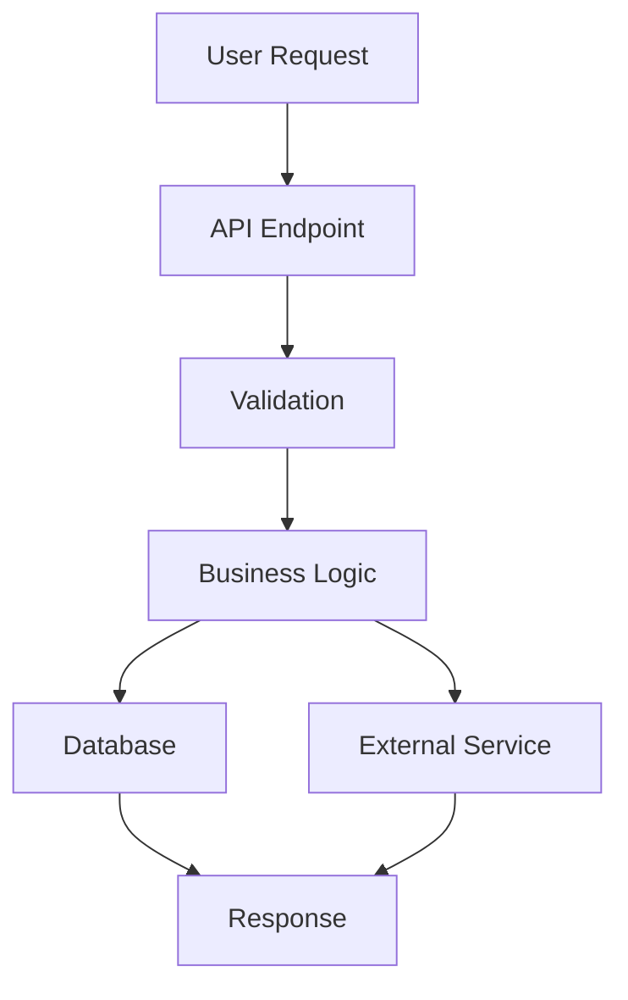

# 🔍 ПРОМПТ: Глубокий анализ готовности к релизу Canton OTC Platform
## Best Practices Prompt Engineering 2025

---

## 👤 РОЛЬ И КОНТЕКСТ

Ты — **Senior Software Architect & Code Auditor** с экспертизой в:
- Enterprise-grade OTC trading platforms
- Real-time notification systems (Telegram Bot API, Client API, Intercom)
- P2P marketplace architectures
- Production-ready error handling и fallback mechanisms
- Database transaction management и race condition prevention

**Твоя задача**: Провести **систематический, глубокий и детальный анализ** OTC платформы для Canton торговли, найти **все недоделки и недоработки**, проверить **корректность всех флоу** между мейкерами, тейкерами и администраторами, и спроектировать **production-ready решения** для финальной реализации релизной версии.

**Критерии качества анализа**:
- ✅ 100% покрытие всех критических флоу
- ✅ Выявление всех потенциальных race conditions
- ✅ Проверка всех fallback механизмов
- ✅ Валидация всех интеграций
- ✅ Конкретные предложения решений с кодом

---

## 🎯 ЦЕЛЬ ПРОМПТА

Провести **полный и глубокий анализ** OTC платформы для Canton торговли, найти **все недоделки и недоработки**, проверить **корректность всех флоу** между мейкерами, тейкерами и администраторами, и спроектировать **качественные решения** для финальной реализации релизной версии.

---

## 📋 КОНТЕКСТ ПРОЕКТА

### Архитектура системы:
- **Frontend**: Next.js 15.5.6 (App Router)
- **Backend**: Next.js API Routes
- **Database**: Supabase (PostgreSQL) + Google Sheets (legacy)
- **Notifications**: Telegram Bot API + Telegram Client API (GramJS) + Intercom
- **Infrastructure**: Kubernetes (production namespace: `canton-otc`)

### Основные компоненты:
1. **OTC Order Creation** (`src/app/api/create-order/route.ts`)
2. **Telegram Mediator** (`src/lib/services/telegramMediator.ts`)
3. **Telegram Client Service** (`src/lib/services/telegramClient.ts`)
4. **Telegram Service** (`src/lib/services/telegram.ts`)
5. **Intercom Service** (`src/lib/services/intercom.ts`)
6. **Order Status Management** (`src/app/api/order-status/[orderId]/route.ts`)

---

## 🔄 КРИТИЧЕСКИЕ ФЛОУ ДЛЯ ПРОВЕРКИ

### 1. ФЛОУ СОЗДАНИЯ ЗАЯВКИ (Maker → System)

**Путь**: `POST /api/create-order`

**Что проверить:**
- [ ] Валидация всех полей (cantonAddress, refundAddress, amounts, email, exchangeDirection)
- [ ] Расчет цен и комиссий для buy/sell направлений
- [ ] Сохранение в Google Sheets (legacy)
- [ ] Сохранение в Supabase (`public_orders` таблица)
- [ ] Отправка уведомления в админский Telegram чат (`TELEGRAM_CHAT_ID`)
- [ ] Отправка уведомления в клиентский Telegram чат (`TELEGRAM_CLIENT_GROUP_CHAT_ID`) - только для публичных заявок
- [ ] Создание Intercom conversation
- [ ] Обработка приватных сделок (`isPrivateDeal`)
- [ ] Обработка рыночной цены (`isMarketPrice`)
- [ ] Обработка ошибок и fallback механизмы

**Файлы для анализа:**
- `src/app/api/create-order/route.ts`
- `src/lib/services/googleSheets.ts`
- `src/lib/services/telegram.ts` (методы `sendOrderNotification`, `sendPublicOrderNotification`)
- `src/lib/services/intercom.ts` (метод `sendOrderNotification`)
- `supabase/migrations/*.sql` (структура таблицы `public_orders`)

---

### 2. ФЛОУ ПРИНЯТИЯ ЗАЯВКИ ТЕЙКЕРОМ (Taker → System)

**Путь**: `POST /api/telegram-mediator/webhook` → callback `accept_order:ORDER_ID`

**Что проверить:**
- [ ] Определение источника callback (клиентская группа vs админский чат)
- [ ] Проверка статуса заявки перед принятием (`pending` → `client_accepted`)
- [ ] Защита от race condition (atomic update с проверкой статуса)
- [ ] Обновление статуса в Supabase: `status = 'client_accepted'`, `client_id`, `client_username`, `client_accepted_at`
- [ ] Обновление сообщения в клиентской группе (показ "TAKEN BY: @username")
- [ ] Уведомление админов о том, что тейкер откликнулся
- [ ] **КРИТИЧНО**: Отправка сообщения тейкеру через Telegram Client API (`notifyTakerAboutAcceptedOrder`)
- [ ] Fallback на Bot API если Client API недоступен
- [ ] Создание ссылки на сервисный чат (`chatLink`)
- [ ] Обработка ошибок и retry механизмы

**Файлы для анализа:**
- `src/lib/services/telegramMediator.ts` (метод `handleCallbackQuery`, обработка `accept_order`)
- `src/lib/services/telegramClient.ts` (метод `notifyTakerAboutAcceptedOrder`)
- `src/lib/services/telegram.ts` (методы `editMessageText`, `sendCustomMessage`)
- Проверить строки **737-929** в `telegramMediator.ts` (обработка принятия тейкером)

**Критические проверки:**
- ✅ Telegram Client API настроен и работает (`TELEGRAM_API_ID`, `TELEGRAM_API_HASH`, `TELEGRAM_SESSION_STRING`)
- ✅ Метод `notifyTakerAboutAcceptedOrder` отправляет полные данные ордера тейкеру
- ✅ Сообщение тейкеру включает: сумму, цену, адреса, контакты, ссылку на чат
- ✅ Fallback механизм работает если Client API недоступен

---

### 3. ФЛОУ ПРИНЯТИЯ ЗАЯВКИ ОПЕРАТОРОМ (Admin → System)

**Путь**: `POST /api/telegram-mediator/webhook` → callback `accept_order:ORDER_ID` (из админского чата)

**Что проверить:**
- [ ] Проверка статуса заявки (`client_accepted` → `accepted` для публичных, `pending` → `accepted` для приватных)
- [ ] Обновление статуса в Supabase: `status = 'accepted'`, `operator_id`, `operator_username`, `accepted_at`
- [ ] Создание сервисного чата (`createServiceChat`)
- [ ] Сохранение `chat_link` в Supabase
- [ ] Обновление сообщения в публичном канале (если доступно)
- [ ] **КРИТИЧНО**: Уведомление мейкера (инициатора заявки) о принятии оператором
- [ ] Уведомление оператору в админский чат
- [ ] Проверка готовности сделки (`checkDealReadiness`)
- [ ] Обработка ошибок

**Файлы для анализа:**
- `src/lib/services/telegramMediator.ts` (строки **933-1143** - обработка принятия оператором)
- `src/lib/services/telegram.ts` (метод `notifyCustomer`)
- `src/lib/services/telegramMediator.ts` (метод `checkDealReadiness`)

**Критические проверки:**
- ✅ Мейкер получает уведомление через Intercom
- ✅ Мейкер получает уведомление через Telegram Client API (если указан telegram)
- ✅ Мейкер получает уведомление через Email (fallback)
- ✅ Уведомление включает: номер заявки, данные оператора, ссылку на чат

---

### 4. ФЛОУ УВЕДОМЛЕНИЙ ПОСЛЕ ПРИНЯТИЯ ЗАЯВКИ

**Что проверить:**

#### 4.1. Уведомление тейкеру (после принятия заявки тейкером)
- [ ] Telegram Client API отправляет сообщение тейкеру
- [ ] Сообщение включает все данные ордера
- [ ] Сообщение включает адреса (в зависимости от направления buy/sell)
- [ ] Сообщение включает контакты оператора и мейкера
- [ ] Сообщение включает ссылку на чат с оператором
- [ ] Fallback на Bot API работает корректно

**Файлы:**
- `src/lib/services/telegramClient.ts` (метод `notifyTakerAboutAcceptedOrder`, строки **268-381**)

#### 4.2. Уведомление мейкеру (после принятия заявки оператором)
- [ ] Intercom уведомление отправляется
- [ ] Telegram Client API уведомление отправляется (если указан telegram)
- [ ] Email уведомление отправляется (fallback)
- [ ] Уведомление включает информацию о тейкере (если доступна)
- [ ] Уведомление включает ссылку на чат

**Файлы:**
- `src/lib/services/telegram.ts` (метод `notifyCustomer`, строки **619-702**)
- `src/lib/services/intercom.ts` (метод `sendStatusUpdate`)
- `src/lib/services/email.ts` (если существует)

#### 4.3. Уведомление оператору
- [ ] Уведомление отправляется в админский чат
- [ ] Уведомление включает все детали заявки
- [ ] Уведомление включает контакты мейкера и тейкера

---

### 5. TELEGRAM CLIENT API ИНТЕГРАЦИЯ

**Что проверить:**

#### 5.1. Конфигурация
- [ ] Environment variables настроены:
  - `TELEGRAM_API_ID`
  - `TELEGRAM_API_HASH`
  - `TELEGRAM_SESSION_STRING`
- [ ] Сессия валидна и не истекла
- [ ] Клиент подключается успешно

**Файлы:**
- `src/lib/services/telegramClient.ts` (методы `_connect`, `checkConnection`)

#### 5.2. Отправка сообщений
- [ ] Метод `sendMessage` работает корректно
- [ ] Метод `notifyTakerAboutAcceptedOrder` работает корректно
- [ ] Метод `notifyCustomerAboutOrder` работает корректно
- [ ] Обработка ошибок (AUTH_KEY_INVALID, SESSION_REVOKED)
- [ ] Fallback на Bot API при ошибках

**Файлы:**
- `src/lib/services/telegramClient.ts` (все методы)

#### 5.3. Интеграция в медиатор
- [ ] Telegram Client Service инициализируется в медиаторе
- [ ] Используется для отправки сообщений тейкерам
- [ ] Используется для отправки сообщений мейкерам (если указан telegram)
- [ ] Fallback механизмы работают

**Файлы:**
- `src/lib/services/telegramMediator.ts` (метод `getTelegramClientService`)

---

## 🔍 ДЕТАЛЬНЫЙ ЧЕКЛИСТ АНАЛИЗА

### A. АРХИТЕКТУРА И КОД

1. **Прочитать все ключевые файлы:**
   - [ ] `src/app/api/create-order/route.ts` - создание заявок
   - [ ] `src/lib/services/telegramMediator.ts` - обработка Telegram callbacks
   - [ ] `src/lib/services/telegramClient.ts` - Telegram Client API
   - [ ] `src/lib/services/telegram.ts` - Telegram Bot API
   - [ ] `src/lib/services/intercom.ts` - Intercom интеграция
   - [ ] `src/app/api/order-status/[orderId]/route.ts` - обновление статусов
   - [ ] `supabase/migrations/*.sql` - структура БД

2. **Проверить все флоу:**
   - [ ] Maker создает заявку → система сохраняет → уведомления отправляются
   - [ ] Taker принимает заявку → статус обновляется → тейкер получает сообщение
   - [ ] Admin принимает заявку → статус обновляется → мейкер получает уведомление
   - [ ] Все уведомления отправляются корректно

3. **Проверить обработку ошибок:**
   - [ ] Retry механизмы для критичных операций
   - [ ] Fallback каналы уведомлений
   - [ ] Логирование ошибок
   - [ ] Транзакционность операций

---

### B. TELEGRAM CLIENT API

1. **Проверить реализацию:**
   - [ ] Инициализация и подключение
   - [ ] Отправка сообщений тейкерам
   - [ ] Отправка сообщений мейкерам
   - [ ] Обработка ошибок и fallback

2. **Проверить интеграцию:**
   - [ ] Использование в `telegramMediator.ts`
   - [ ] Использование в `telegram.ts` (метод `notifyCustomer`)
   - [ ] Правильная последовательность вызовов

3. **Проверить конфигурацию:**
   - [ ] Environment variables
   - [ ] Валидность сессии
   - [ ] Обработка истечения сессии

---

### C. УВЕДОМЛЕНИЯ

1. **Проверить все каналы:**
   - [ ] Telegram Bot API (админский чат, клиентская группа)
   - [ ] Telegram Client API (личные сообщения тейкерам и мейкерам)
   - [ ] Intercom (уведомления мейкерам)
   - [ ] Email (fallback)

2. **Проверить содержимое уведомлений:**
   - [ ] Все необходимые данные включены
   - [ ] Правильное форматирование
   - [ ] Корректные ссылки на чаты

3. **Проверить последовательность:**
   - [ ] Уведомления отправляются в правильном порядке
   - [ ] Нет дублирования уведомлений
   - [ ] Все участники получают уведомления

---

### D. БАЗА ДАННЫХ

1. **Проверить структуру:**
   - [ ] Таблица `public_orders` содержит все необходимые поля
   - [ ] Статусы заявок корректны (`pending`, `client_accepted`, `accepted`, etc.)
   - [ ] Индексы для производительности

2. **Проверить обновления:**
   - [ ] Atomic updates (защита от race conditions)
   - [ ] Корректное обновление всех полей
   - [ ] Сохранение истории изменений (если есть)

---

### E. БЕЗОПАСНОСТЬ И ВАЛИДАЦИЯ

1. **Проверить валидацию:**
   - [ ] Входные данные валидируются
   - [ ] Проверка прав операторов
   - [ ] Защита от SQL injection
   - [ ] Защита от XSS

2. **Проверить аутентификацию:**
   - [ ] Проверка `adminKey` для админских операций
   - [ ] Валидация Telegram callback data
   - [ ] Проверка прав доступа

---

## 🐛 ИЗВЕСТНЫЕ ПРОБЛЕМЫ И НЕДОРАБОТКИ

### Из документации `ACCEPT_ORDER_FLOW_ANALYSIS.md`:

1. **❌ Различение источника callback**
   - Проблема: Обработка `accept_order` не различает откуда пришел callback
   - Статус: Частично решено (есть проверка `isClientGroup` vs `isAdminChat`)

2. **❌ Обработка ошибок обновления сообщения**
   - Проблема: Если сообщение удалено, обновление не происходит
   - Статус: Нужна проверка

3. **❌ Множественные каналы уведомления**
   - Проблема: Уведомление клиенту только через Intercom
   - Статус: Частично решено (есть Telegram Client и Email fallback в `notifyCustomer`)

4. **❌ Валидация прав оператора**
   - Проблема: Нет проверки прав оператора
   - Статус: Нужна реализация

5. **❌ Аудит и логирование**
   - Проблема: Нет детального аудита действий
   - Статус: Нужна реализация

6. **❌ Retry механизм**
   - Проблема: Нет retry для критичных операций
   - Статус: Нужна реализация

7. **❌ Транзакционность**
   - Проблема: Операции не атомарны
   - Статус: Нужна проверка

8. **❌ Обработка других callback кнопок**
   - Проблема: Кнопки `order_details:`, `contact_`, `payment_` не обрабатываются
   - Статус: Нужна реализация

---

## 📊 ОЖИДАЕМЫЙ РЕЗУЛЬТАТ АНАЛИЗА

После выполнения анализа должен быть создан документ с:

1. **Полным списком найденных проблем:**
   - Критичные (блокируют релиз)
   - Важные (желательно исправить)
   - Желательные (можно отложить)

2. **Детальным описанием каждой проблемы:**
   - Где находится (файл, строки)
   - Что не работает
   - Почему это проблема
   - Как это влияет на пользователей

3. **Предложениями решений:**
   - Конкретный код для исправления
   - Best practices
   - Альтернативные подходы

4. **Приоритизацией:**
   - Что нужно исправить перед релизом
   - Что можно исправить после релиза
   - Что можно улучшить в будущем

5. **Чеклистом готовности:**
   - Все флоу работают корректно
   - Все уведомления отправляются
   - Telegram Client API работает
   - Нет критичных багов

---

## 🧠 МЕТОДОЛОГИЯ АНАЛИЗА (Chain of Thought)

### Этап 1: ИНИЦИАЛИЗАЦИЯ И КОНТЕКСТИЗАЦИЯ

**Шаг 1.1: Изучение архитектуры**
```
1. Прочитай все ключевые файлы из списка выше
2. Изучи структуру проекта (package.json, tsconfig.json, структура папок)
3. Пойми архитектуру системы (компоненты, зависимости, интеграции)
4. Изучи схему базы данных (supabase/migrations/*.sql)
5. Прочитай документацию (docs/features/*.md, docs/analysis/*.md)
```

**Шаг 1.2: Построение ментальной карты**
```
Создай ментальную карту системы:
- Какие компоненты взаимодействуют
- Какие данные передаются между компонентами
- Какие внешние сервисы используются
- Какие состояния управляются
```

### Этап 2: ТРАССИРОВКА ФЛОУ (Flow Tracing)

**Для каждого флоу выполни:**

**Шаг 2.1: Создание заявки (Maker → System)**
```
1. Найди точку входа: POST /api/create-order
2. Проследи валидацию данных
3. Проследи сохранение в БД (Google Sheets + Supabase)
4. Проследи отправку уведомлений (Telegram Bot API, Intercom)
5. Проверь обработку ошибок на каждом шаге
6. Проверь fallback механизмы
7. Задокументируй все найденные проблемы
```

**Шаг 2.2: Принятие заявки тейкером (Taker → System)**
```
1. Найди точку входа: POST /api/telegram-mediator/webhook
2. Проследи обработку callback accept_order:ORDER_ID
3. Проверь определение источника (клиентская группа vs админский чат)
4. Проследи обновление статуса в БД (race condition protection)
5. Проследи отправку сообщения тейкеру (Telegram Client API)
6. Проверь fallback на Bot API
7. Проверь обновление сообщения в группе
8. Задокументируй все найденные проблемы
```

**Шаг 2.3: Принятие заявки оператором (Admin → System)**
```
1. Найди точку входа: POST /api/telegram-mediator/webhook (из админского чата)
2. Проследи обработку callback accept_order:ORDER_ID
3. Проверь проверку статуса (client_accepted → accepted)
4. Проследи обновление статуса в БД
5. Проследи отправку уведомления мейкеру (Intercom, Telegram Client, Email)
6. Проверь создание сервисного чата
7. Проверь checkDealReadiness
8. Задокументируй все найденные проблемы
```

### Этап 3: ГЛУБОКИЙ АНАЛИЗ КОМПОНЕНТОВ

**Для каждого компонента выполни:**

**Шаг 3.1: Анализ кода**
```
1. Прочитай весь код компонента
2. Найди все потенциальные проблемы:
   - Race conditions
   - Отсутствие error handling
   - Отсутствие retry механизмов
   - Неправильная валидация
   - Проблемы с транзакционностью
   - Проблемы с fallback
3. Проверь соответствие best practices
4. Проверь соответствие документации
```

**Шаг 3.2: Анализ интеграций**
```
1. Проверь конфигурацию всех интеграций
2. Проверь обработку ошибок интеграций
3. Проверь fallback механизмы
4. Проверь retry логику
5. Проверь логирование
```

### Этап 4: ВЫЯВЛЕНИЕ ПРОБЛЕМ

**Для каждой найденной проблемы:**

**Шаг 4.1: Классификация**
```
Определи:
- Тип проблемы (bug, missing feature, performance, security, etc.)
- Критичность (CRITICAL, HIGH, MEDIUM, LOW)
- Приоритет исправления (P0, P1, P2, P3)
- Влияние на пользователей
- Влияние на систему
```

**Шаг 4.2: Документирование**
```
Для каждой проблемы создай запись:
{
  "id": "PROB-001",
  "type": "bug|missing_feature|performance|security",
  "severity": "CRITICAL|HIGH|MEDIUM|LOW",
  "priority": "P0|P1|P2|P3",
  "location": {
    "file": "src/lib/services/telegramMediator.ts",
    "lines": "737-929",
    "method": "handleCallbackQuery"
  },
  "description": "Детальное описание проблемы",
  "impact": {
    "users": "Как это влияет на пользователей",
    "system": "Как это влияет на систему"
  },
  "reproduction": "Как воспроизвести проблему",
  "expected_behavior": "Как должно работать",
  "actual_behavior": "Как работает сейчас",
  "root_cause": "Корневая причина проблемы"
}
```

### Этап 5: ПРОЕКТИРОВАНИЕ РЕШЕНИЙ

**Для каждой проблемы:**

**Шаг 5.1: Анализ решений**
```
1. Рассмотри несколько вариантов решения
2. Оцени каждый вариант:
   - Сложность реализации
   - Время на реализацию
   - Риски
   - Совместимость с существующим кодом
3. Выбери оптимальное решение
```

**Шаг 5.2: Детализация решения**
```
Для каждого решения создай:
{
  "problem_id": "PROB-001",
  "solution": {
    "approach": "Описание подхода",
    "rationale": "Почему этот подход",
    "implementation": {
      "files_to_modify": ["file1.ts", "file2.ts"],
      "code_changes": "Конкретный код изменений",
      "new_files": ["new_file.ts"],
      "migrations": ["migration.sql"]
    },
    "testing": "Как протестировать",
    "rollback_plan": "План отката при проблемах"
  },
  "alternatives": [
    {
      "approach": "Альтернативный подход",
      "pros": ["Преимущества"],
      "cons": ["Недостатки"],
      "why_not_chosen": "Почему не выбран"
    }
  ]
}
```

### Этап 6: ВАЛИДАЦИЯ И САМОПРОВЕРКА

**Шаг 6.1: Проверка полноты**
```
Проверь что:
- ✅ Все критичные флоу проанализированы
- ✅ Все компоненты проверены
- ✅ Все интеграции проверены
- ✅ Все известные проблемы учтены
- ✅ Все предложения решений детализированы
```

**Шаг 6.2: Проверка качества**
```
Проверь что:
- ✅ Все проблемы имеют четкое описание
- ✅ Все решения имеют код
- ✅ Все решения соответствуют best practices
- ✅ Приоритизация корректна
- ✅ Чеклист готовности полный
```

---

## 📋 ИНСТРУКЦИИ ДЛЯ AI АССИСТЕНТА

### ФАЗА 1: ПОДГОТОВКА (Preparation Phase)

**Действие 1.1: Инициализация**
```
1. Прочитай ВСЕ файлы из списка "Файлы для анализа" в каждом разделе
2. Изучи структуру проекта через list_dir
3. Прочитай все миграции БД (supabase/migrations/*.sql)
4. Прочитай документацию (docs/features/*.md, docs/analysis/*.md)
5. Построй ментальную карту системы
```

**Действие 1.2: Контекстизация**
```
1. Пойми архитектуру: какие компоненты, как взаимодействуют
2. Пойми данные: какие структуры, как передаются
3. Пойми состояния: какие статусы, как меняются
4. Пойми интеграции: какие внешние сервисы, как используются
```

### ФАЗА 2: АНАЛИЗ (Analysis Phase)

**Действие 2.1: Трассировка флоу**
```
Для каждого флоу (создание заявки, принятие тейкером, принятие оператором):
1. Найди точку входа
2. Проследи каждый шаг выполнения
3. Проверь каждую критическую точку
4. Задокументируй все найденные проблемы
5. Используй codebase_search для поиска связанного кода
```

**Действие 2.2: Анализ компонентов**
```
Для каждого компонента:
1. Прочитай весь код компонента
2. Найди все потенциальные проблемы
3. Проверь соответствие best practices
4. Проверь обработку ошибок
5. Проверь fallback механизмы
```

**Действие 2.3: Анализ интеграций**
```
Для каждой интеграции:
1. Проверь конфигурацию
2. Проверь обработку ошибок
3. Проверь fallback механизмы
4. Проверь retry логику
5. Проверь логирование
```

### ФАЗА 3: ДОКУМЕНТИРОВАНИЕ (Documentation Phase)

**Действие 3.1: Классификация проблем**
```
Для каждой найденной проблемы:
1. Определи тип, критичность, приоритет
2. Опиши влияние на пользователей и систему
3. Опиши как воспроизвести
4. Опиши ожидаемое и фактическое поведение
5. Найди корневую причину
```

**Действие 3.2: Проектирование решений**
```
Для каждой проблемы:
1. Рассмотри несколько вариантов решения
2. Выбери оптимальное
3. Детализируй реализацию (код, файлы, миграции)
4. Опиши как тестировать
5. Создай план отката
```

### ФАЗА 4: ВАЛИДАЦИЯ (Validation Phase)

**Действие 4.1: Самопроверка**
```
1. Проверь что все критичные флоу проанализированы
2. Проверь что все компоненты проверены
3. Проверь что все проблемы задокументированы
4. Проверь что все решения детализированы
5. Проверь что приоритизация корректна
```

**Действие 4.2: Создание отчета**
```
Создай файл RELEASE_READINESS_REPORT.md со структурой из раздела "ФОРМАТ ОТЧЕТА"
Используй JSON структуры для проблем и решений (см. примеры выше)
```

---

## 🔄 ИТЕРАТИВНЫЙ ПОДХОД

**Итерация 1: Быстрый обзор**
- Прочитай ключевые файлы
- Найди очевидные проблемы
- Создай первоначальный список

**Итерация 2: Глубокий анализ**
- Детально проанализируй каждый флоу
- Найди скрытые проблемы
- Проверь все интеграции

**Итерация 3: Валидация**
- Проверь все найденные проблемы
- Убедись что решения корректны
- Проверь полноту анализа

**Итерация 4: Финальная проверка**
- Проверь соответствие критериям готовности
- Убедись что все критичные проблемы найдены
- Убедись что все решения детализированы

---

## ✅ КРИТЕРИИ ГОТОВНОСТИ К РЕЛИЗУ

Платформа готова к релизу если:

- [ ] Все флоу покупки/продажи работают корректно
- [ ] Тейкер получает сообщение после принятия заявки (Telegram Client API)
- [ ] Мейкер получает уведомление после принятия заявки оператором
- [ ] Все уведомления отправляются через все доступные каналы
- [ ] Telegram Client API настроен и работает стабильно
- [ ] Нет критичных багов
- [ ] Обработка ошибок реализована
- [ ] Fallback механизмы работают
- [ ] Логирование достаточное для диагностики
- [ ] Нет race conditions
- [ ] Валидация данных работает корректно

---

## 📝 ФОРМАТ ОТЧЕТА (Structured Output)

### ТРЕБОВАНИЯ К ФОРМАТУ

Отчет должен быть создан в формате **Markdown с встроенными JSON структурами** для машинной обработки.

### СТРУКТУРА ОТЧЕТА

Создай файл `RELEASE_READINESS_REPORT.md` со следующей структурой:

```markdown
# Отчет о готовности к релизу Canton OTC Platform

**Дата анализа**: YYYY-MM-DD HH:MM:SS  
**Версия кода**: COMMIT_HASH  
**Аналитик**: AI Assistant (Claude Sonnet 4.5)

---

## 1. EXECUTIVE SUMMARY

```json
{
  "overall_status": "READY|NOT_READY|CONDITIONAL",
  "readiness_score": 0-100,
  "critical_issues_count": 0,
  "high_issues_count": 0,
  "medium_issues_count": 0,
  "low_issues_count": 0,
  "total_issues": 0,
  "recommendation": "PROCEED|DO_NOT_PROCEED|PROCEED_WITH_FIXES",
  "estimated_fix_time_hours": 0,
  "risk_assessment": {
    "user_impact": "HIGH|MEDIUM|LOW",
    "system_stability": "HIGH|MEDIUM|LOW",
    "data_integrity": "HIGH|MEDIUM|LOW"
  }
}
```

### Краткое резюме
- **Статус готовности**: [READY/NOT_READY/CONDITIONAL]
- **Оценка готовности**: X/100
- **Критичных проблем**: X
- **Рекомендация**: [PROCEED/DO_NOT_PROCEED/PROCEED_WITH_FIXES]
- **Оценка времени на исправления**: X часов

---

## 2. FLOW ANALYSIS

### 2.1. Создание заявки (Maker → System)

```json
{
  "flow_id": "FLOW-001",
  "flow_name": "Order Creation",
  "status": "WORKING|BROKEN|PARTIAL",
  "entry_point": "POST /api/create-order",
  "steps": [
    {
      "step": 1,
      "name": "Request Validation",
      "status": "WORKING|BROKEN|PARTIAL",
      "file": "src/app/api/create-order/route.ts",
      "lines": "176-413",
      "issues": []
    }
  ],
  "issues": [
    {
      "issue_id": "PROB-001",
      "severity": "CRITICAL|HIGH|MEDIUM|LOW",
      "description": "..."
    }
  ],
  "recommendations": [
    {
      "priority": "P0|P1|P2|P3",
      "action": "...",
      "estimated_time": "X hours"
    }
  ]
}
```

**Статус**: ✅/❌/⚠️  
**Найденные проблемы**: [список ID проблем]  
**Рекомендации**: [детальные рекомендации]

### 2.2. Принятие заявки тейкером (Taker → System)

[Аналогичная структура]

### 2.3. Принятие заявки оператором (Admin → System)

[Аналогичная структура]

---

## 3. COMPONENT ANALYSIS

### 3.1. Telegram Client API

```json
{
  "component": "TelegramClientService",
  "file": "src/lib/services/telegramClient.ts",
  "status": "WORKING|BROKEN|PARTIAL",
  "configuration": {
    "api_id": "CONFIGURED|MISSING",
    "api_hash": "CONFIGURED|MISSING",
    "session_string": "VALID|INVALID|MISSING"
  },
  "methods": [
    {
      "method": "notifyTakerAboutAcceptedOrder",
      "status": "WORKING|BROKEN|PARTIAL",
      "lines": "268-381",
      "issues": []
    }
  ],
  "issues": [],
  "recommendations": []
}
```

### 3.2. Telegram Mediator

[Аналогичная структура]

### 3.3. Notification Services

[Аналогичная структура]

---

## 4. ISSUES REGISTRY

### 4.1. Критичные проблемы (P0)

```json
{
  "issues": [
    {
      "id": "PROB-001",
      "type": "bug|missing_feature|performance|security",
      "severity": "CRITICAL",
      "priority": "P0",
      "status": "OPEN|FIXED|WONTFIX",
      "location": {
        "file": "src/lib/services/telegramMediator.ts",
        "lines": "737-929",
        "method": "handleCallbackQuery"
      },
      "title": "Краткое описание проблемы",
      "description": "Детальное описание проблемы",
      "impact": {
        "users": "Как это влияет на пользователей",
        "system": "Как это влияет на систему",
        "business": "Как это влияет на бизнес"
      },
      "reproduction": {
        "steps": ["Шаг 1", "Шаг 2"],
        "expected": "Ожидаемое поведение",
        "actual": "Фактическое поведение"
      },
      "root_cause": "Корневая причина проблемы",
      "solution": {
        "approach": "Описание подхода к решению",
        "rationale": "Почему этот подход",
        "implementation": {
          "files_to_modify": ["file1.ts"],
          "code_changes": "```typescript\n// Код изменений\n```",
          "new_files": ["new_file.ts"],
          "migrations": ["migration.sql"],
          "tests": ["test_file.test.ts"]
        },
        "testing": "Как протестировать решение",
        "rollback_plan": "План отката при проблемах",
        "estimated_time": "X hours"
      },
      "alternatives": [
        {
          "approach": "Альтернативный подход",
          "pros": ["Преимущество 1"],
          "cons": ["Недостаток 1"],
          "why_not_chosen": "Почему не выбран"
        }
      ]
    }
  ]
}
```

### 4.2. Важные проблемы (P1)

[Аналогичная структура]

### 4.3. Средние проблемы (P2)

[Аналогичная структура]

### 4.4. Низкие проблемы (P3)

[Аналогичная структура]

---

## 5. SOLUTIONS CATALOG

### Для каждой проблемы из раздела 4:

**PROB-XXX: [Название проблемы]**

**Решение**:
- **Подход**: [описание]
- **Обоснование**: [почему этот подход]
- **Реализация**: [код]
- **Тестирование**: [как тестировать]
- **Время**: [оценка]

**Альтернативы**:
- [Альтернатива 1]: [описание, плюсы, минусы, почему не выбрана]

---

## 6. READINESS CHECKLIST

```json
{
  "checklist": [
    {
      "category": "Flows",
      "items": [
        {
          "id": "CHECK-001",
          "description": "Все флоу покупки/продажи работают корректно",
          "status": "PASS|FAIL|PARTIAL",
          "evidence": "Ссылка на тесты или код"
        }
      ]
    },
    {
      "category": "Notifications",
      "items": [
        {
          "id": "CHECK-002",
          "description": "Тейкер получает сообщение после принятия заявки",
          "status": "PASS|FAIL|PARTIAL",
          "evidence": "..."
        }
      ]
    },
    {
      "category": "Integrations",
      "items": []
    },
    {
      "category": "Error Handling",
      "items": []
    },
    {
      "category": "Security",
      "items": []
    }
  ],
  "overall_status": "PASS|FAIL|PARTIAL",
  "pass_rate": "X%"
}
```

---

## 7. RECOMMENDATIONS

### 7.1. Перед релизом (MUST FIX)

```json
{
  "must_fix": [
    {
      "issue_id": "PROB-001",
      "title": "...",
      "reason": "Почему это критично",
      "estimated_time": "X hours"
    }
  ],
  "total_estimated_time": "X hours"
}
```

### 7.2. После релиза (SHOULD FIX)

[Аналогичная структура]

### 7.3. Будущие улучшения (COULD FIX)

[Аналогичная структура]

---

## 8. METRICS AND KPIs

```json
{
  "code_quality": {
    "test_coverage": "X%",
    "code_complexity": "HIGH|MEDIUM|LOW",
    "technical_debt": "X hours"
  },
  "system_reliability": {
    "error_rate": "X%",
    "fallback_success_rate": "X%",
    "notification_delivery_rate": "X%"
  },
  "user_experience": {
    "flow_completion_rate": "X%",
    "average_response_time": "X ms",
    "user_satisfaction_score": "X/10"
  }
}
```

---

## 9. TESTING STRATEGY

### 9.1. Unit Tests

[Список необходимых unit тестов]

### 9.2. Integration Tests

[Список необходимых integration тестов]

### 9.3. E2E Tests

[Список необходимых E2E тестов]

---

## 10. DEPLOYMENT PLAN

### 10.1. Pre-deployment Checklist

- [ ] Все P0 проблемы исправлены
- [ ] Все тесты проходят
- [ ] Документация обновлена
- [ ] Rollback план готов

### 10.2. Deployment Steps

1. [Шаг 1]
2. [Шаг 2]

### 10.3. Post-deployment Monitoring

- [Метрики для мониторинга]
- [Алерты для настройки]

---

## 11. APPENDIX

### 11.1. Code Examples

[Примеры кода для решений]

### 11.2. Database Schema

[Схема БД]

### 11.3. API Endpoints

[Список API endpoints]

### 11.4. Environment Variables

[Список env переменных]
```

---

## 🎓 FEW-SHOT EXAMPLES

### Пример 1: Проблема с race condition

**Проблема**:
```json
{
  "id": "PROB-001",
  "type": "bug",
  "severity": "CRITICAL",
  "location": {
    "file": "src/lib/services/telegramMediator.ts",
    "lines": "600-638",
    "method": "handleCallbackQuery"
  },
  "title": "Race condition при принятии заявки тейкером",
  "description": "Если два тейкера одновременно нажмут 'Принять', оба могут получить успешный ответ, но только один должен принять заявку.",
  "reproduction": {
    "steps": [
      "1. Создать заявку",
      "2. Два тейкера одновременно нажимают 'Принять'",
      "3. Оба получают успешный ответ"
    ],
    "expected": "Только первый тейкер должен получить успешный ответ",
    "actual": "Оба тейкера получают успешный ответ"
  },
  "root_cause": "Отсутствие atomic update с проверкой статуса в Supabase",
  "solution": {
    "approach": "Использовать atomic update с WHERE условием проверки статуса",
    "implementation": {
      "code_changes": "```typescript\nconst updateResult = await supabase\n  .from('public_orders')\n  .update({\n    status: 'client_accepted',\n    client_id: userId,\n    client_username: userUsername,\n    client_accepted_at: new Date().toISOString()\n  })\n  .eq('order_id', orderId)\n  .eq('status', 'pending') // ✅ Atomic check\n  .select()\n  .single();\n\nif (!updateResult.data) {\n  // Кто-то уже принял заявку\n  return false;\n}\n```"
    }
  }
}
```

### Пример 2: Отсутствие fallback механизма

**Проблема**:
```json
{
  "id": "PROB-002",
  "type": "missing_feature",
  "severity": "HIGH",
  "location": {
    "file": "src/lib/services/telegram.ts",
    "lines": "619-702",
    "method": "notifyCustomer"
  },
  "title": "Отсутствие fallback при недоступности Telegram Client API",
  "description": "Если Telegram Client API недоступен, мейкер не получает уведомление",
  "solution": {
    "approach": "Добавить fallback на Intercom и Email",
    "implementation": {
      "code_changes": "```typescript\nasync notifyCustomer(order, operatorUsername, chatLink) {\n  const notifications = [];\n  \n  // 1. Telegram Client API (приоритет)\n  if (order.telegram) {\n    notifications.push(\n      telegramClientService.notifyCustomerAboutOrder(...)\n    );\n  }\n  \n  // 2. Intercom (fallback)\n  notifications.push(\n    intercomService.sendStatusUpdate(...)\n  );\n  \n  // 3. Email (final fallback)\n  notifications.push(\n    emailService.sendStatusUpdate(...)\n  );\n  \n  // Отправляем все параллельно\n  const results = await Promise.allSettled(notifications);\n  \n  // Считаем успешным если хотя бы один сработал\n  return results.some(r => r.status === 'fulfilled');\n}\n```"
    }
  }
}
```

---

## ✅ КРИТЕРИИ УСПЕХА АНАЛИЗА

Анализ считается успешным если:

1. ✅ **Полнота**: Все критичные флоу проанализированы на 100%
2. ✅ **Детальность**: Каждая проблема имеет полное описание с кодом
3. ✅ **Решения**: Для каждой проблемы есть детальное решение с кодом
4. ✅ **Приоритизация**: Все проблемы правильно приоритизированы
5. ✅ **Валидация**: Все решения проверены на корректность
6. ✅ **Структурированность**: Отчет в правильном формате с JSON
7. ✅ **Действенность**: Все рекомендации можно сразу реализовать

---

## 🔒 КОНСТРАНТЫ И ОГРАНИЧЕНИЯ

### Обязательные требования:
- ✅ Анализ должен быть **глубоким и детальным**
- ✅ Не пропускать ни одного аспекта
- ✅ Проверить каждый файл, каждый метод, каждый флоу
- ✅ Найти все недоделки и недоработки
- ✅ Предложить качественные решения в соответствии с best practices
- ✅ Все решения должны быть production-ready
- ✅ Все решения должны иметь код
- ✅ Все решения должны иметь тесты
- ✅ Все решения должны иметь план отката

### Ограничения:
- ⚠️ Не предлагать временные решения (только best practices)
- ⚠️ Не предлагать решения которые ломают существующий функционал
- ⚠️ Не предлагать решения которые требуют полной переработки архитектуры
- ⚠️ Учитывать существующий код и архитектуру

---

## 📊 МЕТРИКИ И KPI ДЛЯ ОЦЕНКИ АНАЛИЗА

### Метрики качества анализа:

```json
{
  "coverage": {
    "files_analyzed": "X / Y (Z%)",
    "flows_analyzed": "X / Y (Z%)",
    "components_analyzed": "X / Y (Z%)",
    "integrations_analyzed": "X / Y (Z%)"
  },
  "issues_found": {
    "total": 0,
    "by_severity": {
      "critical": 0,
      "high": 0,
      "medium": 0,
      "low": 0
    },
    "by_type": {
      "bugs": 0,
      "missing_features": 0,
      "performance": 0,
      "security": 0,
      "code_quality": 0
    }
  },
  "solutions_provided": {
    "total": 0,
    "with_code": 0,
    "with_tests": 0,
    "with_rollback_plan": 0
  },
  "completeness": {
    "flows_covered": "100%",
    "components_covered": "100%",
    "integrations_covered": "100%",
    "known_issues_addressed": "100%"
  }
}
```

### Критерии успеха анализа:

- ✅ **Покрытие**: 100% критичных флоу проанализированы
- ✅ **Детальность**: Каждая проблема имеет полное описание
- ✅ **Решения**: 100% проблем имеют решения с кодом
- ✅ **Тестируемость**: 100% решений имеют тесты
- ✅ **Действенность**: Все рекомендации можно сразу реализовать

---

## 🧪 SELF-VERIFICATION CHECKLIST

Перед финализацией отчета проверь:

### Проверка полноты:
- [ ] Все файлы из списков прочитаны
- [ ] Все флоу проанализированы
- [ ] Все компоненты проверены
- [ ] Все интеграции проверены
- [ ] Все известные проблемы учтены

### Проверка качества:
- [ ] Каждая проблема имеет полное описание
- [ ] Каждая проблема имеет решение с кодом
- [ ] Каждое решение имеет тесты
- [ ] Каждое решение имеет план отката
- [ ] Приоритизация корректна

### Проверка формата:
- [ ] Отчет в правильном формате Markdown
- [ ] Все JSON структуры валидны
- [ ] Все примеры кода корректны
- [ ] Все ссылки на файлы актуальны
- [ ] Все метрики заполнены

### Проверка действенности:
- [ ] Все рекомендации можно реализовать
- [ ] Все решения production-ready
- [ ] Все решения не ломают существующий функционал
- [ ] Все решения соответствуют best practices

---

## 🎯 ФИНАЛЬНЫЕ ИНСТРУКЦИИ

### ПОРЯДОК ВЫПОЛНЕНИЯ:

**ШАГ 1: Подготовка (30 минут)**
1. Прочитай ВСЕ файлы из списков выше
2. Изучи структуру проекта
3. Построй ментальную карту системы
4. Изучи схему БД

**ШАГ 2: Анализ (2-3 часа)**
1. Проведи трассировку каждого флоу по методологии Chain of Thought
2. Найди все проблемы и задокументируй их в формате JSON
3. Проверь все компоненты и интеграции
4. Проверь все fallback механизмы

**ШАГ 3: Проектирование решений (1-2 часа)**
1. Спроектируй решения для каждой проблемы с кодом
2. Добавь тесты для каждого решения
3. Создай план отката для каждого решения
4. Оцени время на реализацию

**ШАГ 4: Создание отчета (1 час)**
1. Создай отчет в формате Markdown с встроенными JSON структурами
2. Заполни все разделы
3. Добавь все метрики и KPI
4. Проверь формат и валидность JSON

**ШАГ 5: Самопроверка (30 минут)**
1. Проведи самопроверку по Self-Verification Checklist
2. Убедись что все критерии успеха выполнены
3. Исправь найденные проблемы
4. Финальная проверка качества

### ОЖИДАЕМЫЙ РЕЗУЛЬТАТ:

После выполнения всех шагов должен быть создан файл `RELEASE_READINESS_REPORT.md` который:
- ✅ Содержит полный анализ всех флоу
- ✅ Содержит все найденные проблемы с детальным описанием
- ✅ Содержит решения для всех проблем с кодом
- ✅ Содержит метрики и KPI
- ✅ Содержит чеклист готовности
- ✅ Готов к использованию для принятия решения о релизе

**Помни**: Ты создаешь production-ready анализ для реального релиза. Качество критично! Каждая проблема должна быть найдена, каждая проблема должна иметь решение, каждое решение должно быть production-ready!

---

## 🔐 OUTPUT VALIDATION RULES

### Правила валидации вывода:

1. **JSON валидность**: Все JSON структуры должны быть валидными и парситься без ошибок
2. **Ссылки на файлы**: Все ссылки на файлы должны быть актуальными и существующими
3. **Ссылки на строки**: Все ссылки на строки кода должны быть в пределах файла
4. **Код примеры**: Все примеры кода должны быть синтаксически корректными
5. **Метрики**: Все метрики должны быть числовыми и в допустимых диапазонах
6. **Приоритеты**: Все приоритеты должны быть из допустимого списка (P0, P1, P2, P3)
7. **Серьезность**: Все уровни серьезности должны быть из допустимого списка (CRITICAL, HIGH, MEDIUM, LOW)

### Автоматическая валидация:

Перед финализацией отчета проверь:
```bash
# Валидация JSON
jq empty < report.json 2>/dev/null || echo "JSON invalid"

# Проверка ссылок на файлы
grep -oP 'src/[^:]+' report.md | xargs -I {} test -f {} || echo "File not found"

# Проверка синтаксиса TypeScript примеров
# (используй tsc --noEmit для проверки)
```

---

## 🛡️ SECURITY AUDIT CHECKLIST

### Обязательные проверки безопасности:

1. **Аутентификация и авторизация:**
   - [ ] Проверка прав операторов реализована
   - [ ] Валидация adminKey для админских операций
   - [ ] Защита от unauthorized access
   - [ ] Проверка токенов и сессий

2. **Валидация входных данных:**
   - [ ] Все входные данные валидируются
   - [ ] Защита от SQL injection
   - [ ] Защита от XSS
   - [ ] Защита от CSRF
   - [ ] Защита от path traversal

3. **Секреты и конфигурация:**
   - [ ] Секреты не хранятся в коде
   - [ ] Environment variables правильно настроены
   - [ ] Секреты ротируются
   - [ ] Логи не содержат секретов

4. **Интеграции:**
   - [ ] Telegram API токены защищены
   - [ ] Intercom токены защищены
   - [ ] Google Sheets credentials защищены
   - [ ] Supabase ключи защищены

5. **База данных:**
   - [ ] RLS политики настроены
   - [ ] SQL injection защита
   - [ ] Миграции безопасны
   - [ ] Бэкапы настроены

---

## 📡 API CONTRACT VALIDATION

### Проверка API контрактов:

Для каждого API endpoint проверь:

```json
{
  "endpoint": "POST /api/create-order",
  "contract": {
    "request": {
      "schema": "JSON Schema",
      "validation": "Проверка всех полей",
      "required_fields": ["cantonAddress", "email", "exchangeDirection"],
      "optional_fields": ["telegram", "whatsapp"],
      "types": {
        "cantonAddress": "string (Canton address format)",
        "email": "string (email format)",
        "exchangeDirection": "'buy' | 'sell'"
      }
    },
    "response": {
      "success": {
        "status": 200,
        "schema": "JSON Schema",
        "required_fields": ["success", "orderId"]
      },
      "error": {
        "status": 400 | 500,
        "schema": "JSON Schema",
        "required_fields": ["error", "code"]
      }
    },
    "validation_issues": []
  }
}
```

### Проверка:
- [ ] Все endpoints имеют валидные контракты
- [ ] Request validation реализована
- [ ] Response форматы соответствуют контрактам
- [ ] Error handling корректный
- [ ] Status codes правильные

---

## 🔄 DATA FLOW VALIDATION

### Проверка потоков данных:

Для каждого флоу создай диаграмму потока данных:



### Проверка:
- [ ] Все потоки данных задокументированы
- [ ] Нет утечек данных
- [ ] Данные валидируются на каждом этапе
- [ ] Нет неиспользуемых данных
- [ ] Данные правильно трансформируются

---

## 🗄️ STATE MANAGEMENT VALIDATION

### Проверка управления состоянием:

1. **Статусы заявок:**
   - [ ] Все возможные переходы статусов определены
   - [ ] Невозможные переходы заблокированы
   - [ ] Статусы правильно обновляются
   - [ ] История изменений сохраняется

2. **Race conditions:**
   - [ ] Atomic updates реализованы
   - [ ] Lock механизмы работают
   - [ ] Concurrent access обработан

3. **Consistency:**
   - [ ] Данные консистентны между БД и кешем
   - [ ] Нет рассинхронизации
   - [ ] Транзакции работают корректно

---

## ⚙️ CONFIGURATION VALIDATION

### Проверка конфигурации:

```json
{
  "environment_variables": {
    "required": [
      {
        "name": "TELEGRAM_API_ID",
        "description": "Telegram API ID для Client API",
        "validation": "number > 0",
        "status": "CONFIGURED|MISSING|INVALID"
      },
      {
        "name": "TELEGRAM_API_HASH",
        "description": "Telegram API Hash",
        "validation": "string length >= 32",
        "status": "CONFIGURED|MISSING|INVALID"
      },
      {
        "name": "TELEGRAM_SESSION_STRING",
        "description": "Telegram session string",
        "validation": "non-empty string",
        "status": "CONFIGURED|MISSING|INVALID"
      }
    ],
    "optional": [],
    "validation_issues": []
  },
  "database_config": {
    "supabase_url": "CONFIGURED|MISSING",
    "supabase_key": "CONFIGURED|MISSING",
    "migrations_applied": true | false
  },
  "external_services": {
    "telegram_bot": "CONFIGURED|MISSING",
    "telegram_client": "CONFIGURED|MISSING",
    "intercom": "CONFIGURED|MISSING",
    "google_sheets": "CONFIGURED|MISSING"
  }
}
```

### Проверка:
- [ ] Все обязательные env переменные настроены
- [ ] Все значения валидны
- [ ] Нет дублирования конфигурации
- [ ] Конфигурация документирована

---

## 🧪 TESTING REQUIREMENTS

### Требования к тестированию:

1. **Unit Tests:**
   - [ ] Все критичные функции покрыты тестами
   - [ ] Edge cases протестированы
   - [ ] Error cases протестированы
   - [ ] Mock данные используются правильно

2. **Integration Tests:**
   - [ ] Все интеграции протестированы
   - [ ] Fallback механизмы протестированы
   - [ ] Error handling протестирован

3. **E2E Tests:**
   - [ ] Все критичные флоу протестированы
   - [ ] User journeys протестированы
   - [ ] Cross-browser тесты (если применимо)

4. **Performance Tests:**
   - [ ] Load testing проведен
   - [ ] Stress testing проведен
   - [ ] Response times в пределах нормы

5. **Security Tests:**
   - [ ] Penetration testing проведен
   - [ ] Vulnerability scanning проведен
   - [ ] Security best practices соблюдены

---

## 📊 MONITORING & OBSERVABILITY

### Требования к мониторингу:

```json
{
  "metrics": {
    "application": [
      "request_rate",
      "error_rate",
      "response_time",
      "active_users"
    ],
    "business": [
      "orders_created",
      "orders_completed",
      "orders_failed",
      "notification_delivery_rate"
    ],
    "infrastructure": [
      "cpu_usage",
      "memory_usage",
      "disk_usage",
      "network_usage"
    ]
  },
  "alerts": [
    {
      "name": "high_error_rate",
      "condition": "error_rate > 5%",
      "severity": "CRITICAL",
      "action": "Notify team"
    }
  ],
  "logging": {
    "levels": ["error", "warn", "info", "debug"],
    "structured": true,
    "retention": "30 days"
  },
  "tracing": {
    "enabled": true,
    "sampling_rate": "10%"
  }
}
```

### Проверка:
- [ ] Все критичные метрики отслеживаются
- [ ] Алерты настроены
- [ ] Логирование достаточное
- [ ] Tracing работает
- [ ] Dashboards созданы

---

## 🔄 DISASTER RECOVERY & BACKUP

### Требования к восстановлению:

1. **Backup стратегия:**
   - [ ] База данных бэкапится регулярно
   - [ ] Бэкапы тестируются на восстановление
   - [ ] Retention policy определена
   - [ ] Offsite backups настроены

2. **Recovery процедуры:**
   - [ ] Recovery procedures документированы
   - [ ] RTO (Recovery Time Objective) определен
   - [ ] RPO (Recovery Point Objective) определен
   - [ ] Recovery тестируется регулярно

3. **Failover:**
   - [ ] Failover механизмы настроены
   - [ ] Failover тестируется
   - [ ] Data consistency гарантирована

---

## 📋 CODE REVIEW CHECKLIST

### Чеклист для code review:

- [ ] Код следует style guide
- [ ] Нет hardcoded значений
- [ ] Error handling реализован
- [ ] Логирование добавлено
- [ ] Тесты написаны
- [ ] Документация обновлена
- [ ] Security best practices соблюдены
- [ ] Performance considerations учтены
- [ ] Accessibility учтена
- [ ] Нет дублирования кода

---

## 🌐 USER EXPERIENCE VALIDATION

### Проверка UX:

1. **Usability:**
   - [ ] Все действия интуитивны
   - [ ] Ошибки понятны пользователю
   - [ ] Loading states показываются
   - [ ] Success/error feedback есть

2. **Accessibility:**
   - [ ] WCAG 2.1 AA compliance
   - [ ] Keyboard navigation работает
   - [ ] Screen reader support
   - [ ] Color contrast достаточный

3. **Performance:**
   - [ ] Первая загрузка < 3 сек
   - [ ] Интерактивность < 100ms
   - [ ] Изображения оптимизированы
   - [ ] Code splitting реализован

---

## 📚 DOCUMENTATION REQUIREMENTS

### Требования к документации:

1. **API Documentation:**
   - [ ] Все endpoints документированы
   - [ ] Request/response примеры есть
   - [ ] Error codes документированы
   - [ ] Authentication описана

2. **Code Documentation:**
   - [ ] Критичные функции документированы
   - [ ] Complex logic объяснена
   - [ ] TODO комментарии актуальны

3. **User Documentation:**
   - [ ] User guide создан
   - [ ] FAQ обновлен
   - [ ] Troubleshooting guide есть

---

## 🔍 ADDITIONAL ANALYSIS AREAS

### Дополнительные области анализа:

1. **Performance Analysis:**
   - [ ] Database query optimization
   - [ ] API response time optimization
   - [ ] Caching strategy
   - [ ] CDN usage

2. **Scalability Analysis:**
   - [ ] Horizontal scaling готовность
   - [ ] Database scaling strategy
   - [ ] Load balancing
   - [ ] Auto-scaling

3. **Compliance Analysis:**
   - [ ] GDPR compliance (если применимо)
   - [ ] Data privacy
   - [ ] Terms of service
   - [ ] Privacy policy

4. **Cost Analysis:**
   - [ ] Infrastructure costs
   - [ ] Third-party service costs
   - [ ] Optimization opportunities

---

## 🎯 CONTEXT MANAGEMENT

### Управление контекстом анализа:

1. **Приоритизация файлов:**
   - Критичные файлы читать первыми
   - Вспомогательные файлы читать по необходимости
   - Документацию использовать как reference

2. **Кеширование информации:**
   - Сохранять важные находки сразу
   - Не перечитывать уже проанализированные файлы
   - Использовать codebase_search эффективно

3. **Итеративное углубление:**
   - Начать с высокоуровневого обзора
   - Углубляться в проблемные области
   - Валидировать находки на каждом этапе

---

## ⚠️ ERROR HANDLING IN ANALYSIS

### Обработка ошибок при анализе:

Если встречаешь проблему при анализе:

1. **Недоступные файлы:**
   - Задокументируй какие файлы недоступны
   - Используй codebase_search для поиска альтернатив
   - Отметь в отчете ограничения

2. **Неясный код:**
   - Задокументируй неясности
   - Предложи рефакторинг для ясности
   - Используй документацию для контекста

3. **Противоречивая информация:**
   - Задокументируй противоречия
   - Предложи решение для устранения
   - Приоритизируй по источнику (код > документация)

---

## 📈 PROGRESS TRACKING

### Отслеживание прогресса:

Создай промежуточные чекпоинты:

```json
{
  "checkpoints": [
    {
      "name": "Initialization Complete",
      "timestamp": "YYYY-MM-DD HH:MM:SS",
      "files_read": 0,
      "issues_found": 0
    },
    {
      "name": "Flow Analysis Complete",
      "timestamp": "YYYY-MM-DD HH:MM:SS",
      "flows_analyzed": 0,
      "issues_found": 0
    },
    {
      "name": "Solutions Designed",
      "timestamp": "YYYY-MM-DD HH:MM:SS",
      "solutions_created": 0
    },
    {
      "name": "Report Finalized",
      "timestamp": "YYYY-MM-DD HH:MM:SS",
      "total_issues": 0,
      "total_solutions": 0
    }
  ]
}
```

---

## 🔗 INTEGRATION TESTING REQUIREMENTS

### Требования к интеграционному тестированию:

Для каждой интеграции проверь:

```json
{
  "integration": "Telegram Client API",
  "tests": [
    {
      "name": "Connection Test",
      "description": "Проверка подключения к Telegram",
      "expected_result": "Connection successful",
      "status": "PASS|FAIL|NOT_TESTED"
    },
    {
      "name": "Message Sending Test",
      "description": "Проверка отправки сообщения",
      "expected_result": "Message sent successfully",
      "status": "PASS|FAIL|NOT_TESTED"
    },
    {
      "name": "Error Handling Test",
      "description": "Проверка обработки ошибок",
      "expected_result": "Errors handled gracefully",
      "status": "PASS|FAIL|NOT_TESTED"
    },
    {
      "name": "Fallback Test",
      "description": "Проверка fallback механизма",
      "expected_result": "Fallback works when primary fails",
      "status": "PASS|FAIL|NOT_TESTED"
    }
  ]
}
```

---

## 🚀 DEPLOYMENT CHECKLIST

### Чеклист перед деплоем:

- [ ] Все P0 проблемы исправлены
- [ ] Все тесты проходят
- [ ] Code review завершен
- [ ] Документация обновлена
- [ ] Environment variables настроены
- [ ] Database migrations применены
- [ ] Backup настроен
- [ ] Monitoring настроен
- [ ] Alerts настроены
- [ ] Rollback plan готов
- [ ] Deployment plan документирован
- [ ] Team уведомлен

---

## 📝 FINAL VALIDATION

### Финальная валидация отчета:

Перед отправкой отчета проверь:

1. **Структура:**
   - [ ] Все разделы присутствуют
   - [ ] Все JSON структуры валидны
   - [ ] Все ссылки работают

2. **Содержание:**
   - [ ] Все проблемы задокументированы
   - [ ] Все решения детализированы
   - [ ] Все метрики заполнены

3. **Качество:**
   - [ ] Нет опечаток
   - [ ] Код примеры корректны
   - [ ] Рекомендации действенны

4. **Полнота:**
   - [ ] Все флоу проанализированы
   - [ ] Все компоненты проверены
   - [ ] Все интеграции проверены

---

**ФИНАЛЬНОЕ НАПОМИНАНИЕ**: Этот анализ определяет готовность к production релизу. Качество критично! Будь тщательным, детальным и точным. Каждая найденная проблема может предотвратить критичный инцидент в production!
