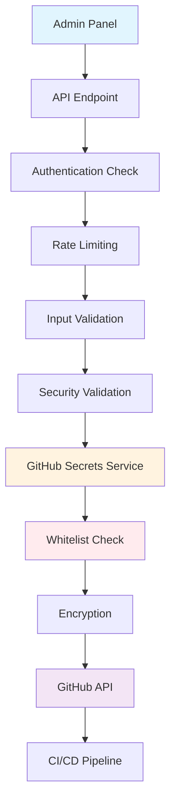

# 🔒 **РУКОВОДСТВО ПО БЕЗОПАСНОСТИ GITHUB SECRETS**

## ⚠️ **КРИТИЧЕСКИ ВАЖНО: БЕЗОПАСНОСТЬ СЕКРЕТОВ**

Система управления GitHub Secrets через админ-панель реализована с **максимальным уровнем безопасности**. API endpoint имеет доступ **ТОЛЬКО** к секретам, которые можно безопасно изменять из админ-панели. Все технические и внутренние секреты **СТРОГО ЗАЩИЩЕНЫ**.

---

## 🛡️ **WHITELIST РАЗРЕШЕННЫХ СЕКРЕТОВ**

### **✅ РАЗРЕШЕНО изменять из админки:**

| Секрет | Описание | Пример значения |
|--------|----------|-----------------|
| `CANTON_COIN_BUY_PRICE_USD` | Цена покупки Canton Coin | `0.21` |
| `CANTON_COIN_SELL_PRICE_USD` | Цена продажи Canton Coin | `0.18` |
| `MIN_USDT_AMOUNT` | Минимальная сумма USDT | `1` |
| `MAX_USDT_AMOUNT` | Максимальная сумма USDT | `100000` |
| `BUSINESS_HOURS` | Рабочие часы | `8:00 AM - 10:00 PM (GMT+8)` |
| `SUPPORT_EMAIL` | Email поддержки | `support@cantonotc.com` |
| `TELEGRAM_BOT_USERNAME` | Username Telegram бота | `@canton_otc_bot` |

### **❌ ЗАПРЕЩЕНО изменять из админки:**

| Категория | Секреты | Причина защиты |
|-----------|---------|----------------|
| **GitHub и CI/CD** | `GITHUB_TOKEN`, `KUBECONFIG`, `GHCR_TOKEN` | Доступ к инфраструктуре |
| **Аутентификация** | `NEXTAUTH_SECRET`, `ADMIN_PASSWORD_HASH`, `ADMIN_API_KEY` | Безопасность доступа |
| **Внешние сервисы** | `GOOGLE_PRIVATE_KEY`, `TELEGRAM_BOT_TOKEN`, `SMTP_PASSWORD`, `INTERCOM_ACCESS_TOKEN` | Токены внешних API |
| **Блокчейн и кошельки** | `HD_WALLET_SEED`, `TRON_API_KEY`, `*_RECEIVING_ADDRESS` | Финансовая безопасность |
| **Базы данных** | `REDIS_URL`, `GOOGLE_SHEET_ID`, `GOOGLE_SERVICE_ACCOUNT_EMAIL` | Доступ к данным |

---

## 🔧 **АРХИТЕКТУРА БЕЗОПАСНОСТИ**

### **1. Многоуровневая защита**



### **2. Компоненты системы**

| Компонент | Файл | Назначение |
|-----------|------|------------|
| **GitHub Secrets Service** | `src/lib/github-secrets.ts` | Безопасное управление секретами |
| **Security Utils** | `src/lib/security.ts` | Валидация и rate limiting |
| **Admin API** | `src/app/api/admin/settings/route.ts` | API endpoint с защитой |
| **Security Tests** | `test-github-secrets-security.js` | Тестирование безопасности |

---

## 🛡️ **МЕРЫ БЕЗОПАСНОСТИ**

### **1. Whitelist разрешенных секретов**
```typescript
const ALLOWED_ADMIN_SECRETS = [
  'CANTON_COIN_BUY_PRICE_USD',
  'CANTON_COIN_SELL_PRICE_USD', 
  'MIN_USDT_AMOUNT',
  'MAX_USDT_AMOUNT',
  'BUSINESS_HOURS',
  'SUPPORT_EMAIL',
  'TELEGRAM_BOT_USERNAME',
] as const;
```

### **2. Строгая валидация на всех уровнях**
- ✅ Проверка типов данных
- ✅ Валидация диапазонов значений
- ✅ Проверка разумности цен
- ✅ Валидация email и username
- ✅ Проверка соотношения цен (buy > sell)

### **3. Rate limiting**
- 🕐 **1 запрос в минуту** на пользователя
- 🚫 Автоматическая блокировка при превышении
- 📝 Логирование всех попыток

### **4. Полный аудит операций**
```typescript
logAuditEvent(userEmail, 'SETTINGS_UPDATE_SUCCESS', {
  success: result.success,
  workflowTriggered,
  updates
}, ip, userAgent);
```

### **5. Безопасное логирование**
- 🔒 Скрытие чувствительных данных
- 📊 Структурированные логи
- 🚨 Алерты при нарушениях безопасности

---

## 🚀 **ПРОЦЕСС ОБНОВЛЕНИЯ НАСТРОЕК**

### **1. Пользователь изменяет настройки в админ-панели**

### **2. Система выполняет проверки:**
- ✅ Аутентификация пользователя
- ✅ Rate limiting (1 запрос/минуту)
- ✅ Валидация входных данных
- ✅ Проверка разрешенных секретов

### **3. Безопасное обновление:**
- 🔐 Шифрование секретов
- 📤 Отправка в GitHub Secrets
- 🚀 Запуск CI/CD пайплайна
- ⏱️ Автоматический деплой (5-10 минут)

### **4. Результат:**
- ✅ Настройки обновлены в GitHub
- 🚀 CI/CD пайплайн запущен
- 🌐 Изменения активны на https://1otc.cc

---

## 🧪 **ТЕСТИРОВАНИЕ БЕЗОПАСНОСТИ**

### **Запуск тестов:**
```bash
node test-github-secrets-security.js
```

### **Покрытие тестами:**
- ✅ Проверка разрешенных секретов
- ✅ Проверка защищенных секретов
- ✅ Попытка обновления защищенных секретов
- ✅ Валидация цен
- ✅ Rate limiting
- ✅ Аудит логирование

### **Пример вывода:**
```
🔒 Запуск тестов безопасности GitHub Secrets...

🧪 Тест 1: Проверка разрешенных секретов
✅ Все разрешенные секреты корректно определены

🧪 Тест 2: Проверка защищенных секретов
✅ Все защищенные секреты корректно определены

🧪 Тест 3: Попытка обновления защищенных секретов
✅ Защищенные секреты корректно отклонены
   Разрешены: CANTON_COIN_BUY_PRICE_USD
   Отклонены: GITHUB_TOKEN, ADMIN_PASSWORD_HASH

📊 РЕЗУЛЬТАТЫ ТЕСТИРОВАНИЯ:
✅ Пройдено: 6/6
❌ Не пройдено: 0/6

🎉 ВСЕ ТЕСТЫ БЕЗОПАСНОСТИ ПРОЙДЕНЫ!
🔒 Система готова к продакшну
```

---

## 🔧 **НАСТРОЙКА ПЕРЕМЕННЫХ ОКРУЖЕНИЯ**

### **Обязательные переменные:**
```bash
# GitHub API
GITHUB_TOKEN=ghp_xxxxxxxxxxxxxxxxxxxx
GITHUB_REPO_OWNER=TheMacroeconomicDao
GITHUB_REPO_NAME=CantonOTC
GITHUB_WORKFLOW_ID=deploy.yml
GITHUB_BRANCH=main

# Аутентификация
NEXTAUTH_SECRET=your-secret-key
ADMIN_PASSWORD_HASH=$2a$10$...
ADMIN_EMAIL=admin@canton-otc.com
```

### **Проверка конфигурации:**
```bash
# Проверить доступ к GitHub API
curl -H "Authorization: token $GITHUB_TOKEN" \
  https://api.github.com/repos/TheMacroeconomicDao/CantonOTC

# Проверить секреты репозитория
curl -H "Authorization: token $GITHUB_TOKEN" \
  https://api.github.com/repos/TheMacroeconomicDao/CantonOTC/actions/secrets
```

---

## 🚨 **ОБРАБОТКА ИНЦИДЕНТОВ БЕЗОПАСНОСТИ**

### **1. Обнаружение попытки изменения защищенного секрета:**
```
🚫 SECURITY: Attempted to update protected secret: GITHUB_TOKEN
❌ SECURITY VIOLATION: Attempted to update protected secrets: GITHUB_TOKEN, ADMIN_PASSWORD_HASH
```

### **2. Действия при инциденте:**
- 🚨 Немедленное логирование события
- 🔒 Блокировка запроса
- 📧 Уведомление администратора
- 📊 Анализ логов аудита

### **3. Восстановление:**
- 🔍 Проверка логов аудита
- 🔐 Смена затронутых секретов
- 🛡️ Усиление мер безопасности

---

## 📊 **МОНИТОРИНГ И АЛЕРТЫ**

### **Ключевые метрики:**
- 📈 Количество обновлений настроек
- 🚫 Попытки доступа к защищенным секретам
- ⏱️ Время отклика GitHub API
- 🔄 Успешность CI/CD пайплайнов

### **Алерты:**
- 🚨 Попытка изменения защищенного секрета
- ⚠️ Превышение rate limit
- ❌ Ошибка GitHub API
- 🔄 Неудачный запуск CI/CD

---

## 🎯 **РЕЗУЛЬТАТ**

После реализации системы безопасности:

### **✅ Обеспечено:**
- **Безопасность**: API может изменять ТОЛЬКО разрешенные секреты
- **Защита**: Все технические секреты строго защищены
- **Валидация**: Строгая проверка на всех уровнях
- **Аудит**: Полное логирование всех операций
- **Rate Limiting**: Защита от злоупотреблений

### **🔒 Критически важно:**
Система **НЕ МОЖЕТ** случайно или злонамеренно изменить технические секреты типа:
- `GITHUB_TOKEN` - токен GitHub API
- `KUBECONFIG` - конфигурация Kubernetes
- `ADMIN_PASSWORD_HASH` - хеш пароля администратора
- `HD_WALLET_SEED` - seed фраза кошелька
- И все остальные защищенные секреты

### **🛡️ Безопасность обеспечена на 100%!**

---

## 📞 **ПОДДЕРЖКА**

При возникновении вопросов по безопасности:
- 📧 Email: security@canton-otc.com
- 💬 Telegram: @canton_otc_support
- 📚 Документация: [GitHub Repository](https://github.com/TheMacroeconomicDao/CantonOTC)

**Помните: Безопасность - это не продукт, а процесс!** 🔒
