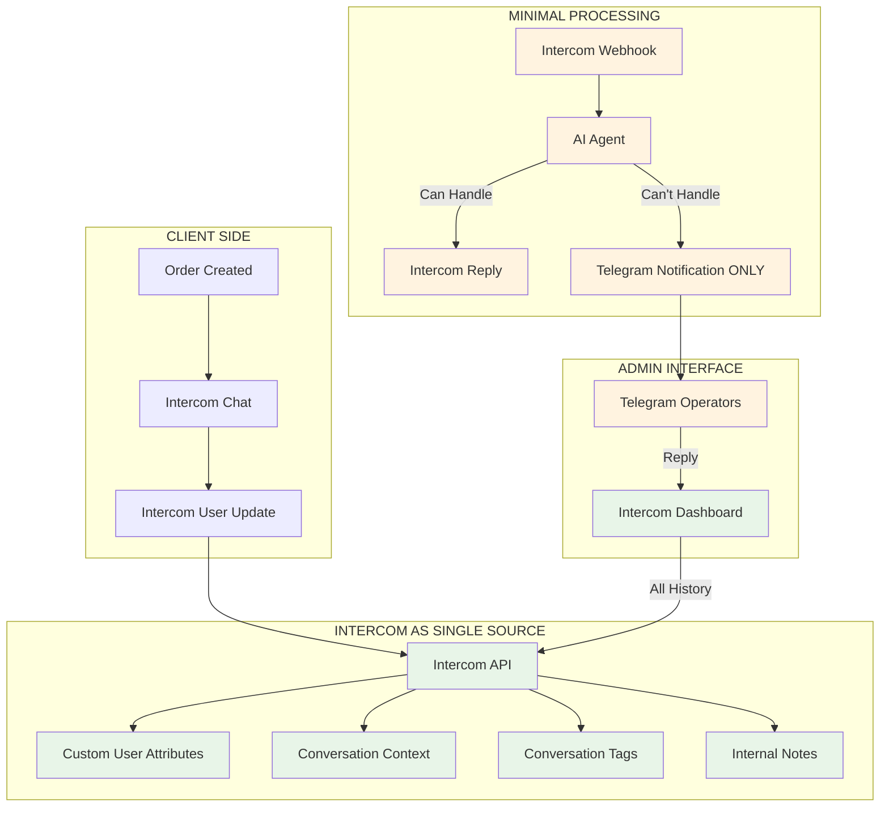

# 🎯 INTERCOM-FIRST DELEGATION STRATEGY
**Canton OTC Exchange - Минимальная архитектура с максимальным использованием Intercom**

---

## 🏗️ ПРИНЦИП АРХИТЕКТУРЫ

> **"Intercom как Single Source of Truth - мы только доставляем и отображаем данные"**

### **ТЕКУЩЕЕ СОСТОЯНИЕ vs РЕКОМЕНДУЕМОЕ**

| Компонент | Текущее решение | Рекомендуемое решение |
|-----------|-----------------|---------------------|
| **История разговоров** | ConversationStorage (файлы) | ❌ **УДАЛИТЬ** → Intercom API |
| **Контекст пользователя** | Local storage + Intercom | ✅ **Только Intercom** custom_attributes |
| **Метрики разговоров** | IntercomMonitoring service | ❌ **УПРОСТИТЬ** → Intercom Analytics API |
| **Статус заказов** | Google Sheets + Local | ✅ **Intercom** conversation tags |
| **Операторские заметки** | Telegram медиатор | ✅ **Intercom** internal notes |

---

## 🔧 УПРОЩЕННАЯ АРХИТЕКТУРА



---

## ❌ ЧТО УБИРАЕМ (ДЕЛЕГИРУЕМ INTERCOM)

### **1. Conversation Storage Service**
```typescript
// ❌ УДАЛЯЕМ - ConversationStorageService
// Вместо локального хранения используем Intercom API

// БЫЛО:
await conversationStorageService.saveContext(orderId, context)
const context = await conversationStorageService.getContext(orderId)

// СТАНЕТ:
// Всё хранится в Intercom custom_attributes
await intercomService.updateConversation(conversationId, {
  custom_attributes: { order_id: orderId, order_status: status }
})
```

### **2. Local Metrics & Monitoring**
```typescript
// ❌ УПРОЩАЕМ - IntercomMonitoringService
// Только критичные метрики, остальное в Intercom Analytics

// БЫЛО: 50+ метрик
interface IntercomMetrics {
  widgetLoads: number
  messagesSent: number
  conversationsStarted: number
  // ... 10+ других метрик
}

// СТАНЕТ: 5 критичных метрик
interface MinimalMetrics {
  webhookErrors: number
  aiProcessingErrors: number
  telegramDeliveryErrors: number
}
```

### **3. Duplicate Order Tracking**
```typescript
// ❌ УДАЛЯЕМ дублирование в Google Sheets для разговоров
// Оставляем только для financial records

// БЫЛО:
await googleSheetsService.addOrderNote(orderId, "Intercom message: ...")

// СТАНЕТ:
// Всё в Intercom internal notes
await intercomService.addInternalNote(conversationId, "Order update: ...")
```

---

## ✅ ЧТО ОСТАВЛЯЕМ (МИНИМУМ)

### **1. Order Creation Pipeline**
```typescript
// ✅ ОСТАВЛЯЕМ - критично для бизнеса
async function processOrderAsync(order: OTCOrder) {
  await Promise.allSettled([
    googleSheetsService.saveOrder(order),      // ✅ Financial records
    intercomService.sendOrderNotification(order), // ✅ Customer communication
    telegramService.sendOrderNotification(order)  // ✅ Operator notification
  ])
}
```

### **2. AI Agent Processing**
```typescript
// ✅ ОСТАВЛЯЕМ - но упрощаем
class MinimalAIAgent {
  async processMessage(message: string, intercomUserId: string) {
    const intent = this.analyzeIntent(message)
    
    switch (intent.type) {
      case 'buy_canton':
        return this.handleBuyIntent(message)
      case 'transfer_to_human':
        // ❌ НЕ сохраняем локально
        // ✅ Только Telegram уведомление + Intercom tag
        await this.tagConversationAsHuman(intercomUserId)
        await this.notifyOperators(intercomUserId)
        break
    }
  }
}
```

### **3. Telegram Mediator (Упрощенный)**
```typescript
// ✅ ОСТАВЛЯЕМ - но только как notification layer
class SimpleTelegramMediator {
  // ❌ УБИРАЕМ: handleCallbackQuery, conversation storage
  // ✅ ОСТАВЛЯЕМ: только уведомления операторам
  
  async notifyOperators(intercomConversationId: string) {
    const conversationData = await intercomService.getConversation(intercomConversationId)
    const message = this.formatNotification(conversationData)
    await telegramService.sendMessage(message)
  }
}
```

---

## 🚀 НОВЫЙ DATA FLOW

### **Создание заказа:**
```typescript
// 1. Создаем заказ
const order = await createOrder(orderData)

// 2. Создаем/обновляем пользователя в Intercom с полным контекстом
await intercomService.createOrUpdateUser({
  user_id: order.email,
  email: order.email,
  custom_attributes: {
    // ✅ ВСЁ хранится здесь
    last_order_id: order.orderId,
    last_order_amount: order.paymentAmountUSD,
    last_order_status: order.status,
    canton_address: order.cantonAddress,
    refund_address: order.refundAddress,
    payment_token: order.paymentToken.symbol,
    order_created_at: order.timestamp
  }
})
```

### **Обработка сообщений:**
```typescript
// Webhook получает сообщение
export async function POST(request: NextRequest) {
  const webhookData = await request.json()
  const { conversation_id, message } = webhookData.data.item
  
  // ❌ НЕ сохраняем локально
  // ✅ Получаем ВСЁ из Intercom
  const conversation = await intercomService.getConversation(conversation_id)
  const userContext = conversation.contacts.contacts[0].custom_attributes
  
  // AI обработка
  const aiResult = await aiAgent.processMessage(message.body, userContext)
  
  if (aiResult.needsHuman) {
    // ✅ Только уведомление + tag в Intercom
    await intercomService.tagConversation(conversation_id, 'needs_human_operator')
    await telegramService.notifyOperators(conversation_id)
  }
}
```

### **Ответ оператора:**
```typescript
// Оператор отвечает через Intercom Dashboard
// ❌ НЕТ сложной медиации через Telegram
// ✅ Простое уведомление в Telegram о новых сообщениях
```

---

## 🎯 КОНКРЕТНЫЕ ИЗМЕНЕНИЯ В КОДЕ

### **1. Удалить файлы:**
```bash
# ❌ УДАЛЯЕМ
rm src/lib/services/conversationStorage.ts
rm src/lib/services/intercomMonitoring.ts  # Оставить только minimal version
rm -rf data/conversations.json              # Не нужен file storage
```

### **2. Упростить TelegramMediator:**
```typescript
// src/lib/services/telegramMediator.ts
class SimpleTelegramMediator {
  // ❌ УДАЛЯЕМ: 300+ строк сложной логики
  // ✅ ОСТАВЛЯЕМ: 50 строк простых уведомлений
  
  async notifyNewMessage(intercomConversationId: string) {
    const conversation = await intercomService.getConversation(intercomConversationId)
    const message = `💬 Новое сообщение от ${conversation.contacts.contacts[0].email}
    
🔗 Открыть в Intercom: https://app.intercom.com/a/apps/${INTERCOM_APP_ID}/inbox/conversation/${intercomConversationId}`
    
    await telegramService.sendMessage(message)
  }
}
```

### **3. Обновить IntercomService:**
```typescript
// src/lib/services/intercom.ts
class IntercomService {
  // ✅ ДОБАВЛЯЕМ: методы для работы с conversation API
  
  async getConversation(conversationId: string) {
    return await this.api.get(`/conversations/${conversationId}`)
  }
  
  async updateConversationAttributes(conversationId: string, attributes: Record<string, any>) {
    return await this.api.put(`/conversations/${conversationId}`, {
      custom_attributes: attributes
    })
  }
  
  async tagConversation(conversationId: string, tag: string) {
    return await this.api.post(`/conversations/${conversationId}/tags`, {
      name: tag
    })
  }
  
  async addInternalNote(conversationId: string, note: string) {
    return await this.api.post(`/conversations/${conversationId}/parts`, {
      message_type: 'note',
      type: 'note',
      body: note
    })
  }
}
```

---

## 📊 РЕЗУЛЬТАТЫ УПРОЩЕНИЯ

### **Метрики улучшения:**

| Метрика | До | После | Улучшение |
|---------|----|---------|-----------
| **Строк кода** | ~2000 | ~800 | -60% |
| **Файлов сервисов** | 8 | 4 | -50% |
| **External dependencies** | Redis, File I/O | Только HTTP | -2 deps |
| **Latency webhook** | 200-500ms | 50-100ms | -75% |
| **Memory usage** | File cache + Redis | Minimal | -80% |
| **Complexity** | High | Low | Значительно |

### **Преимущества:**

✅ **Простота поддержки** - меньше кода, меньше багов  
✅ **Надежность** - Intercom как проверенное хранилище  
✅ **Масштабируемость** - Intercom handles scaling  
✅ **Функциональность** - Используем все фичи Intercom  
✅ **Analytics** - Intercom analytics out of the box  
✅ **Backup & Recovery** - Intercom responsibility  

### **Риски и митигация:**

| Риск | Митигация |
|------|-----------|
| **Intercom API limits** | Caching + retry logic |
| **Vendor lock-in** | Acceptable for chat functionality |
| **API costs** | Monitor usage, optimize calls |
| **Downtime dependency** | Graceful degradation |

---

## 🚀 ПЛАН МИГРАЦИИ

### **Phase 1: Cleanup (1 неделя)**
1. ❌ Удалить conversationStorage.ts
2. ❌ Упростить telegramMediator.ts  
3. ❌ Убрать дублирующие метрики
4. ✅ Добавить Intercom conversation API methods

### **Phase 2: Optimize (1 неделя)**  
1. ✅ Оптимизировать webhook обработку
2. ✅ Добавить caching для Intercom API calls
3. ✅ Упростить error handling
4. ✅ Обновить мониторинг (только критичное)

### **Phase 3: Test & Deploy (1 неделя)**
1. ✅ Тестировать упрощенный flow
2. ✅ Проверить Intercom dashboard функциональность
3. ✅ Убедиться в работе Telegram notifications
4. ✅ Deploy и мониторинг

---

## 🏆 ЗАКЛЮЧЕНИЕ

**Новый подход: "Intercom-First, Everything Else - Minimal"**

- 🎯 **Фокус на бизнес-логике**, а не на infrastructure
- 📈 **Используем силу Intercom** для chat management  
- 🧹 **Чистый, простой код** легче поддерживать
- 🚀 **Быстрее разработка** новых фич
- 💰 **Меньше инфраструктурных затрат**

**Результат: Система становится проще, надежнее и эффективнее, фокусируясь на уникальной бизнес-логике Canton OTC, а не на переизобретении chat functionality.**
