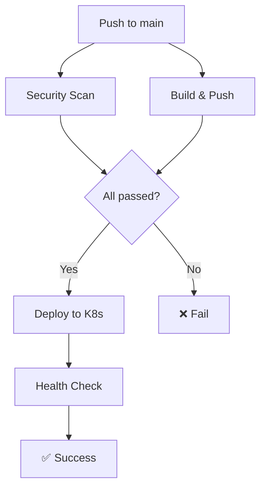

# 🔧 CI/CD Pipeline Fix & Best Practices Analysis

## ❌ Основная проблема

**Ошибка**: `invalid reference format: repository name (TheMacroeconomicDao/CantonOTC) must be lowercase`

**Причина**: Docker требует, чтобы имена репозиториев были в нижнем регистре, но в конфигурации кеша использовались оригинальные названия с заглавными буквами.

```bash
# ❌ НЕПРАВИЛЬНО (было):
--cache-from type=registry,ref=ghcr.io/TheMacroeconomicDao/CantonOTC:buildcache

# ✅ ПРАВИЛЬНО (стало):
--cache-from type=registry,ref=ghcr.io/themacroeconomicdao/cantonotc:buildcache
```

## ✅ Исправления и улучшения

### 1. 🔧 Основное исправление - Нормализация имени образа

```yaml
- name: 🏷️ Normalize image name
  id: image-name
  run: |
    # Convert repository name to lowercase for Docker compatibility
    IMAGE_NAME_LOWER=$(echo "${{ env.IMAGE_NAME }}" | tr '[:upper:]' '[:lower:]')
    echo "value=${IMAGE_NAME_LOWER}" >> $GITHUB_OUTPUT
    echo "Normalized image name: ${IMAGE_NAME_LOWER}"
```

**Что это решает:**
- ✅ Исправляет ошибку с Docker cache references
- ✅ Обеспечивает совместимость с Docker naming conventions
- ✅ Предотвращает подобные ошибки в будущем

### 2. 🛡️ Security-first подход

#### Добавлена настройка безопасности:
```yaml
# Security scanning job
security:
  name: 🔒 Security Scan
  runs-on: ubuntu-latest
  permissions:
    contents: read
    security-events: write
  steps:
  - name: 🔍 Run CodeQL Analysis
    uses: github/codeql-action/init@v3
    with:
      languages: javascript
```

#### Container signing & SBOM:
```yaml
- name: 🔒 Install Cosign
  uses: sigstore/cosign-installer@v3

- name: ✍️ Sign container image
  run: |
    cosign sign --yes ${{ env.REGISTRY }}/${{ steps.image-name.outputs.value }}@${{ steps.build.outputs.digest }}
```

#### Vulnerability scanning:
```yaml
- name: 🛡️ Run Trivy vulnerability scanner
  uses: aquasecurity/trivy-action@master
  with:
    image-ref: ${{ env.REGISTRY }}/${{ steps.image-name.outputs.value }}@${{ steps.build.outputs.digest }}
    format: 'sarif'
    output: 'trivy-results.sarif'
```

### 3. 🚀 Production-ready развертывание

#### Environment protection:
```yaml
deploy:
  environment: 
    name: production
    url: https://1otc.cc
  if: success() && github.event_name != 'pull_request' && github.ref == 'refs/heads/main'
```

#### Multi-platform builds:
```yaml
- name: 🔨 Build and push Docker image
  with:
    platforms: linux/amd64,linux/arm64  # Поддержка ARM64
    provenance: true  # Provenance attestation
    sbom: true        # Software Bill of Materials
```

#### Improved caching strategy:
```yaml
cache-from: type=registry,ref=${{ env.REGISTRY }}/${{ steps.image-name.outputs.value }}:buildcache
cache-to: type=registry,ref=${{ env.REGISTRY }}/${{ steps.image-name.outputs.value }}:buildcache,mode=max
```

### 4. 📋 Enhanced deployment process

#### Conditional deployment:
- ✅ Только при push в main ветку
- ✅ Только при успешном build и security scan
- ✅ Не выполняется для pull requests

#### Better image management:
```yaml
# Используем нормализованное имя образа от build job
IMAGE_WITH_TAG="${{ env.REGISTRY }}/${{ needs.build.outputs.image-name }}:main"
kubectl set image deployment/canton-otc canton-otc=${IMAGE_WITH_TAG} -n canton-otc
```

## 🏆 Best Practices применённые

### 1. Security Best Practices
- ✅ **Code scanning** с CodeQL
- ✅ **Container image signing** с Cosign
- ✅ **Vulnerability scanning** с Trivy
- ✅ **SBOM generation** для supply chain security
- ✅ **SARIF reporting** в GitHub Security tab

### 2. Build Optimization
- ✅ **Multi-platform builds** (AMD64 + ARM64)
- ✅ **Registry caching** с proper naming
- ✅ **Conditional builds** (не пушим PR'ы)
- ✅ **Provenance attestation**

### 3. Deployment Best Practices
- ✅ **Environment protection**
- ✅ **Conditional deployment** только для main
- ✅ **Rolling updates** с zero downtime
- ✅ **Health checks** после deployment
- ✅ **Proper resource management**

### 4. Monitoring & Observability
- ✅ **Detailed logging** на каждом этапе
- ✅ **Status reporting** после deployment
- ✅ **Health verification**
- ✅ **Deployment summary** с полезными ссылками

## 🔄 Workflow Structure



## 🚀 Как тестировать исправления

### 1. Локальная проверка workflow:
```bash
# Проверить синтаксис workflow
gh workflow validate .github/workflows/deploy.yml

# Проверить что все секреты на месте
gh secret list
```

### 2. Тестовый deployment:
```bash
# Запустить workflow вручную
gh workflow run deploy.yml

# Мониторить выполнение
gh run list --workflow=deploy.yml
gh run watch $(gh run list --workflow=deploy.yml --limit=1 --json databaseId --jq '.[0].databaseId')
```

### 3. Проверка результата:
```bash
# Проверить деплой
kubectl get all -n canton-otc

# Проверить здоровье приложения
curl https://1otc.cc/api/health

# Проверить логи
kubectl logs -f deployment/canton-otc -n canton-otc
```

## 🎯 Ожидаемые результаты

После применения исправлений:

1. **✅ Docker build успешно завершается** - исправлена ошибка с naming
2. **✅ Security scanning проходит** - добавлен анализ кода и образов  
3. **✅ Container signing работает** - образы подписываются Cosign
4. **✅ Deployment автоматизирован** - zero-downtime rolling updates
5. **✅ Monitoring включен** - health checks и подробные логи

## 📚 Дополнительные ресурсы

- [Docker naming conventions](https://docs.docker.com/engine/reference/commandline/tag/#extended-description)
- [GitHub Actions security best practices](https://docs.github.com/en/actions/security-guides/security-hardening-for-github-actions)
- [Cosign container signing](https://github.com/sigstore/cosign)
- [Trivy vulnerability scanner](https://github.com/aquasecurity/trivy)

## 🆘 Troubleshooting

### Если workflow всё ещё падает:

1. **Проверьте секреты:**
   ```bash
   gh secret list
   # Убедитесь что все необходимые секреты установлены
   ```

2. **Проверьте права доступа:**
   - Container registry permissions
   - Kubernetes cluster access
   - GitHub Actions permissions

3. **Проверьте логи workflow:**
   ```bash
   gh run view --log
   ```

4. **Проверьте статус кластера:**
   ```bash
   kubectl cluster-info
   kubectl get nodes
   ```

---

**🎉 Результат: Production-ready CI/CD pipeline с enterprise-grade security и best practices!**
