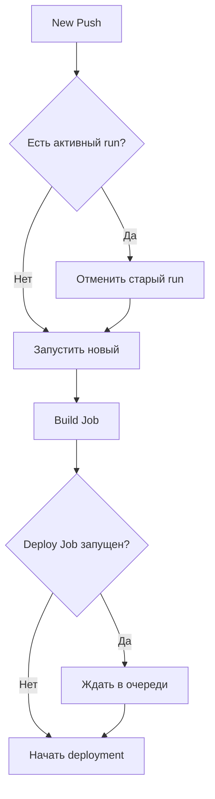
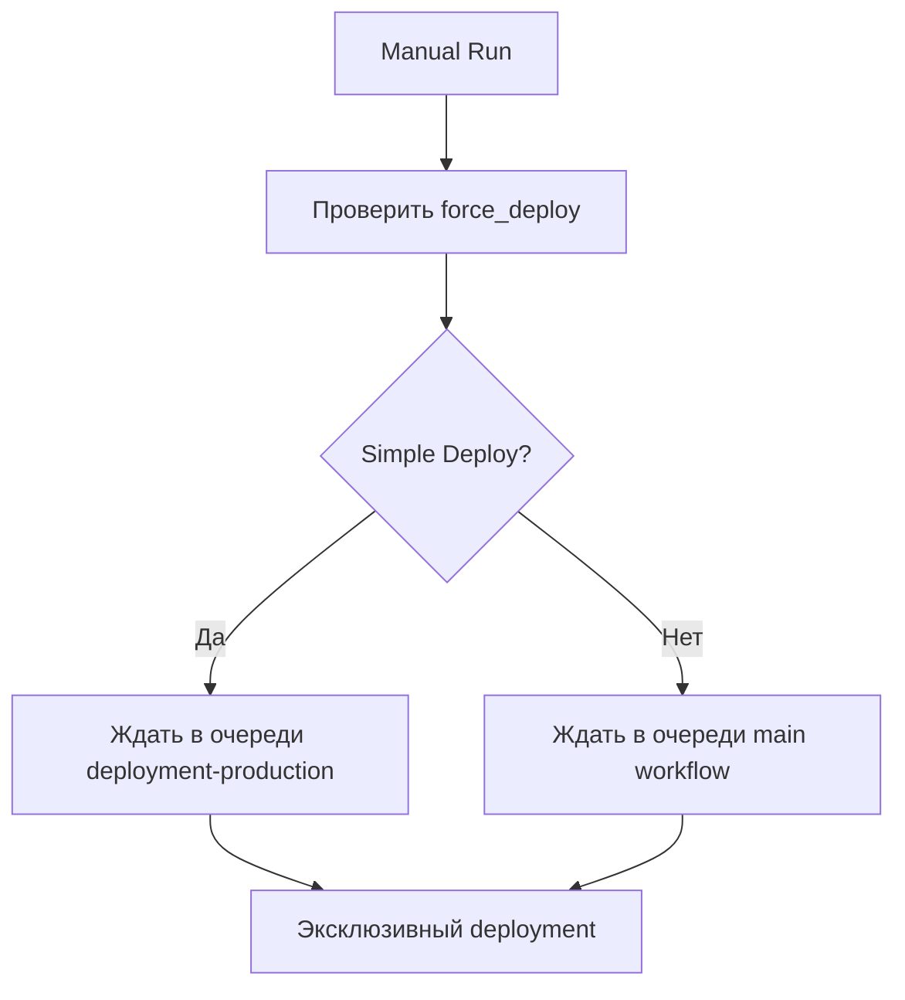

# 🛡️ Защита от конкурентных деплоев - Concurrency Protection

## ❌ Проблемы одновременных пайплайнов

### 🚨 Критические риски:

1. **Kubernetes Deployment Conflicts**
   ```bash
   # Два процесса пытаются обновить один deployment
   Process A: kubectl set image deployment/canton-otc...
   Process B: kubectl set image deployment/canton-otc...
   # Результат: Race condition, непредсказуемое состояние
   ```

2. **Docker Registry Conflicts**
   ```bash
   # Одновременный push одного и того же тега
   Process A: docker push ghcr.io/repo:latest
   Process B: docker push ghcr.io/repo:latest  
   # Результат: Corrupted layers, failed pulls
   ```

3. **Resource Locking в Kubernetes**
   ```bash
   # Конфликт при обновлении ConfigMaps/Secrets
   kubectl apply -f secret.yaml (Process A)
   kubectl apply -f secret.yaml (Process B)
   # Результат: Resource version conflicts
   ```

4. **Rolling Update Конфликты**
   ```bash
   # Два rollout одновременно
   kubectl rollout restart deployment/canton-otc
   kubectl rollout restart deployment/canton-otc
   # Результат: Broken rolling update, downtime
   ```

## ✅ Реализованная защита

### 1. 🔒 **Workflow-level Concurrency**

```yaml
# В deploy.yml
concurrency:
  group: ${{ github.workflow }}-${{ github.ref }}
  cancel-in-progress: true  # ✅ Отменяем старые runs при новом push
```

**Что это защищает:**
- ✅ Отменяет предыдущие runs при новом commit
- ✅ Предотвращает накопление очереди старых builds
- ✅ Экономит ресурсы CI/CD

### 2. 🎯 **Deployment-level Concurrency**

```yaml
# Для deploy job
concurrency:
  group: deployment-production
  cancel-in-progress: false  # ✅ НЕ отменяем деплой, ставим в очередь
```

**Что это защищает:**
- ✅ Только один деплой в production одновременно
- ✅ Очередь deployment'ов (sequential execution)
- ✅ Предотвращает Kubernetes conflicts

### 3. 🔍 **Pre-deployment Checks**

```yaml
- name: 🔍 Pre-deployment cluster check  
  run: |
    echo "🔄 Проверка на конфликтующие операции..."
    ROLLOUT_STATUS=$(kubectl rollout status deployment/canton-otc -n canton-otc --timeout=10s)
    if [[ "$ROLLOUT_STATUS" == *"Waiting"* ]]; then
      echo "⚠️ WARNING: Обнаружен активный rollout, ждем завершения..."
      kubectl rollout status deployment/canton-otc -n canton-otc --timeout=60s
    fi
```

**Что это защищает:**
- ✅ Обнаруживает активные rollouts
- ✅ Ждет завершения конфликтующих операций
- ✅ Проверяет состояние кластера

## 🔄 Стратегия concurrency по типам событий

### **Push to main:**


### **Manual Workflow Dispatch:**


## 📊 Мониторинг защиты

### Как понять что защита работает:

1. **В GitHub Actions UI:**
   ```
   ⏳ Waiting for a deployment slot...
   🛡️ This run is queued because another deployment is in progress
   ```

2. **В логах workflow:**
   ```bash
   🛡️ Проверка безопасности деплоя...
   📋 Run ID: 12345678
   🔒 Concurrency group: deployment-production
   ✅ Эксклюзивный доступ к production deployment гарантирован
   ```

3. **В kubectl output:**
   ```bash
   🔍 Проверка состояния кластера перед деплоем...
   📊 Текущие pods в namespace canton-otc: 2
   📊 Статус deployment: 2/2
   ✅ Кластер готов к деплою
   ```

## 🆘 Troubleshooting

### Если деплой застрял в очереди:

1. **Проверить активные runs:**
   ```bash
   gh run list --workflow=deploy.yml --limit=5
   ```

2. **Отменить застрявший run:**
   ```bash
   gh run cancel <run-id>
   ```

3. **Проверить статус в Kubernetes:**
   ```bash
   kubectl get deployment canton-otc -n canton-otc
   kubectl rollout status deployment/canton-otc -n canton-otc
   ```

### Если нужно экстренно деплоить:

1. **Использовать Simple Deploy:**
   ```bash
   # Через UI: Actions → Simple Deploy → force_deploy: true
   gh workflow run simple-deploy.yml -f force_deploy=true
   ```

2. **Отменить все активные runs:**
   ```bash
   gh run list --workflow=deploy.yml --json databaseId --jq '.[].databaseId' | xargs -I {} gh run cancel {}
   ```

## 🏆 Преимущества защиты

### ✅ **Безопасность:**
- Предотвращает corruption состояния Kubernetes
- Избегает race conditions в Docker registry
- Гарантирует consistency деплоев

### ✅ **Надежность:**
- Sequential deployment execution
- Automatic conflict detection
- Graceful queue management

### ✅ **Наблюдаемость:**
- Подробные логи concurrency events
- Clear status reporting
- Easy troubleshooting

### ✅ **Эффективность:**
- Отменяет ненужные старые runs
- Экономит CI/CD resources
- Faster feedback loops

## 📋 Настройки concurrency по workflow

| Workflow | Concurrency Group | Cancel in Progress | Цель |
|----------|-------------------|-------------------|------|
| `deploy.yml` | `${{ github.workflow }}-${{ github.ref }}` | `true` | Отменять старые builds при новом push |
| `deploy.yml` (deploy job) | `deployment-production` | `false` | Только один деплой одновременно |
| `simple-deploy.yml` | `simple-deployment-${{ github.ref }}` | `false` | Защита fallback workflow |
| `simple-deploy.yml` (job) | `deployment-production` | `false` | Общая очередь с основным workflow |

---

**🎯 Результат: Bullet-proof CI/CD без конфликтов и race conditions!**
