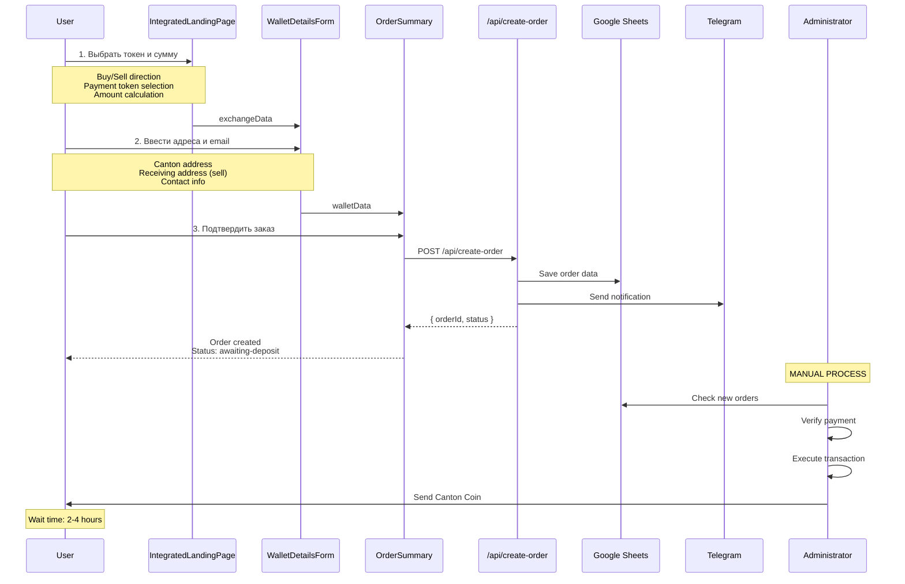
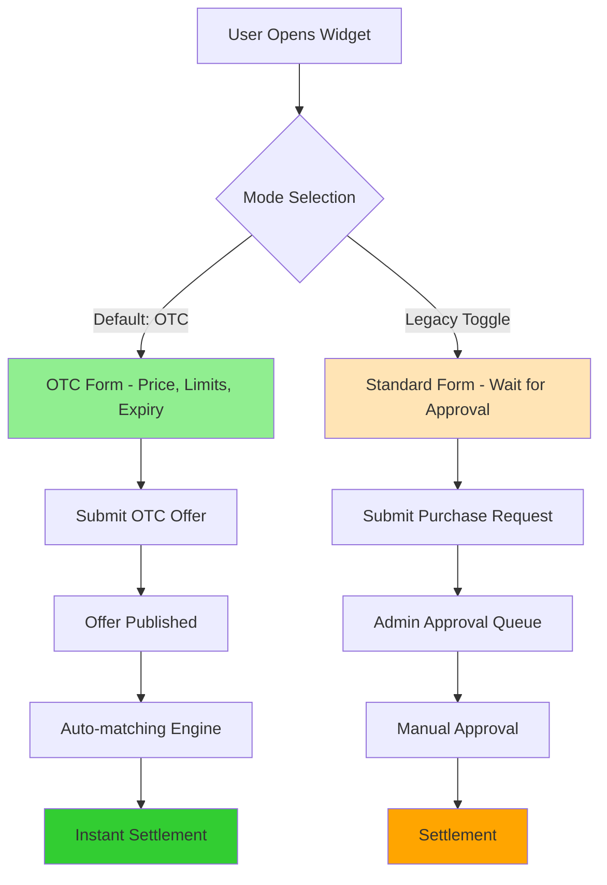
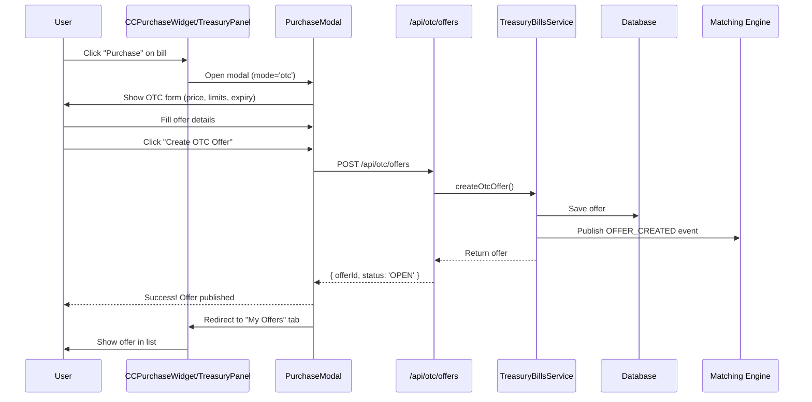
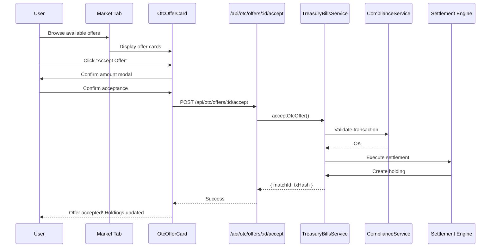
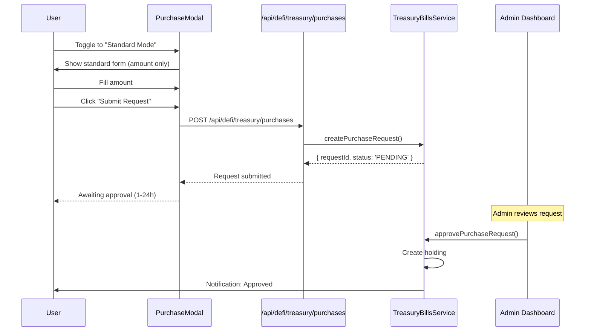

# OTC Frontend Requirements Document
**Автоматизированный OTC-режим как основной (Primary Mode)**

---

## 0. Executive Summary

### Что торгует платформа Canton OTC

**Основные активы:**
1. **Canton Coin (CC)** - нативная криптовалюта Canton Network
   - Основной продукт платформы
   - Покупка/продажа за USDT, ETH, BNB
   - Поддержка множества сетей: Ethereum, BSC, TRON, Solana, Optimism

2. **US Treasury Bills** - токенизированные казначейские облигации США
   - Institutional DeFi продукт
   - Фиксированная доходность (APY 4-6%)
   - Минимальная инвестиция: $100

3. **Real Estate Tokens** - токенизированная недвижимость
   - Fractional ownership коммерческой недвижимости
   - APY 8-12%
   - Canton Network multi-party contracts

4. **Privacy Vaults** - приватные хранилища активов
   - Zero-knowledge доказательства
   - Institutional custody через Canton
   - Compliance с сохранением конфиденциальности

5. **AI Portfolio Optimizer** - AI-управляемые портфели
   - Автоматическая ребалансировка
   - Institutional data access через Canton participants
   - APY 14-22%

**Платежные токены (для покупки):**
- USDT (TRC-20, ERC-20, BEP-20, Solana, Optimism)
- ETH (Ethereum)
- BNB (Binance Smart Chain)

### Ключевое изменение архитектуры
**OTC режим становится ОСНОВНЫМ (default)** способом покупки **ВСЕХ продуктов** на платформе Canton OTC:
- Canton Coin (через существующий OTC flow)
- Treasury Bills (focus этого документа)
- Real Estate Tokens (future extension)
- Privacy Vault deposits (future extension)
- AI Portfolio investments (future extension)

Текущий режим с ручным одобрением (manual approval) переходит в статус **LEGACY/FALLBACK** для всех продуктов.

### Стратегия реализации
- **Минимальные изменения UI** - расширение существующих компонентов, не полная переписывание
- **Backward compatibility** - сохранение старого flow через toggle переключатель
- **Progressive enhancement** - поэтапное развертывание через feature flags
- **Zero breaking changes** - старые API endpoints продолжают работать

### Временные рамки
- **Фаза 1** (Неделя 1-2): Расширение компонентов и API
- **Фаза 2** (Неделя 3): Тестирование и интеграция
- **Фаза 3** (Неделя 4): Feature flag rollout
- **Фаза 4** (Неделя 5+): Мониторинг и оптимизация

### Текущий OTC Flow для Canton Coin (Buy/Sell)

**Обзор:** Платформа Canton OTC в данный момент поддерживает покупку и продажу Canton Coin через простой 3-шаговый интерфейс с последующим ручным одобрением администратором.

#### Шаг 1: Выбор обмена и суммы
**Компонент:** [`IntegratedLandingPage`](../../src/components/IntegratedLandingPage.tsx)
**Страница:** [`src/app/page.tsx`](../../src/app/page.tsx:36) (step: 'landing')

**Функциональность:**
- **Выбор направления обмена:**
  - **Buy Canton Coin** - покупка CC за USDT/ETH/BNB
  - **Sell Canton Coin** - продажа CC за USDT
- **Выбор платежного токена:** через [`TokenSelector`](../../src/components/TokenSelector.tsx)
  - Поддерживаемые токены: USDT (TRC-20, ERC-20, BEP-20, Solana, Optimism), ETH (Ethereum), BNB (BSC)
  - Из конфигурации: [`SUPPORTED_TOKENS`](../../src/config/otc.ts)
- **Калькулятор суммы:**
  - Пользователь вводит сумму в платежном токене
  - Автоматический расчет Canton Coin по текущему курсу
  - Отображение комиссии и итоговой суммы
- **Опции сделки:**
  - Private Deal (приватная сделка) - флаг `isPrivateDeal`
  - Market Price (по рыночной цене) - флаг `isMarketPrice`
  - Service Commission - комиссия сервиса

**Данные, передаваемые дальше:**
```typescript
interface ExchangeData {
  paymentToken: TokenConfig;        // Выбранный токен для оплаты
  paymentAmount: number;             // Сумма в токене
  paymentAmountUSD: number;          // Эквивалент в USD
  cantonAmount: number;              // Сколько CC получит/отдаст
  usdtAmount: number;                // Legacy compatibility
  exchangeDirection: 'buy' | 'sell'; // Направление обмена
  isPrivateDeal?: boolean;           // Приватная сделка
  isMarketPrice?: boolean;           // По рыночной цене
  marketPriceDiscountPercent?: number;
  serviceCommission?: number;
}
```

#### Шаг 2: Ввод адресов и контактных данных
**Компонент:** [`WalletDetailsForm`](../../src/components/WalletDetailsForm.tsx)
**Страница:** [`src/app/page.tsx`](../../src/app/page.tsx:76) (step: 'wallet')

**Функциональность:**
- **Canton Address** (обязательно):
  - При **Buy**: адрес для получения купленных Canton Coin
  - При **Sell**: адрес, с которого будут отправлены Canton Coin
  - Валидация формата адреса
  - Визуальная индикация корректности (зеленая/красная рамка)
  
- **Receiving Address** (только для Sell):
  - Адрес в сети платежного токена (USDT/ETH/BNB) для получения средств
  - Показывается только при `exchangeDirection === 'sell'`
  - Валидация под конкретную сеть (TRC-20, ERC-20 и т.д.)
  
- **Refund Address** (опционально):
  - Резервный адрес для возврата средств при проблемах
  - Должен быть в той же сети, что и платежный токен
  
- **Email** (обязательно):
  - Для получения уведомлений о статусе заказа
  - Валидация email формата
  
- **WhatsApp / Telegram** (опционально):
  - Дополнительные каналы связи для поддержки
  - Используются для оперативной связи с клиентом

**Валидация:**
- Компонент использует `useState` для отслеживания ошибок: `errors`, `validatedFields`
- Визуальная индикация: успешно проверенные поля подсвечиваются зеленым
- Адреса проверяются на корректность формата для соответствующей сети

**Данные, передаваемые дальше:**
```typescript
interface WalletData {
  cantonAddress: string;      // CC адрес
  receivingAddress?: string;  // Адрес для получения (при sell)
  refundAddress?: string;     // Резервный адрес
  email: string;              // Email для уведомлений
  whatsapp?: string;          // WhatsApp (опционально)
  telegram?: string;          // Telegram (опционально)
}
```

#### Шаг 3: Подтверждение заказа и инструкции по оплате
**Компоненты:**
- [`OrderSummary`](../../src/components/OrderSummary.tsx) (базовый)
- [`EnhancedOrderSummary`](../../src/components/EnhancedOrderSummary.tsx) (с Intercom интеграцией)

**Страница:** [`src/app/page.tsx`](../../src/app/page.tsx:104) (step: 'summary')

**Функциональность:**
- **Генерация Order ID:**
  - Уникальный идентификатор заказа генерируется в формате: `${timestamp}-${randomString}`
  - Функция: [`generateOrderId()`](../../src/lib/utils.ts)
  
- **Отображение деталей заказа:**
  - Платежный токен и сеть
  - Сумма к оплате (в токене и USD эквивалент)
  - Сумма Canton Coin к получению/отправке
  - Canton адрес назначения
  - Refund адрес (если указан)
  - Контактная информация
  
- **Создание заказа в системе:**
  - **API Endpoint:** [`POST /api/create-order`](../../src/app/api/create-order/route.ts)
  - Альтернатива: [`POST /api/create-order/enhanced-route`](../../src/app/api/create-order/enhanced-route.ts) (с улучшенной интеграцией)
  
- **Сохранение данных:**
  - **Google Sheets:** через [`googleSheetsService`](../../src/lib/services/googleSheets.ts)
  - **Supabase:** сохранение в таблицу `public_orders` (если настроен)
  - **Status:** Заказ создается со статусом `'awaiting-deposit'`
  
- **Уведомления:**
  - **Telegram:** уведомление в группу через [`telegramMediatorService`](../../src/lib/services/telegramMediator.ts)
  - **Intercom:** создание/обновление пользователя с контекстом заказа
  - **Email:** отправка подтверждения на email клиента
  
- **Интеграция с поддержкой:**
  - Кнопка "Contact Support" открывает Intercom чат
  - Автоматическая отправка деталей заказа в поддержку
  - Контекст заказа доступен оператору в Intercom

**Шаги обработки заказа (Processing Steps):**
```typescript
// Из конфигурации OTC_CONFIG.PROCESSING_STEPS:
1. Order Created     - Заказ создан, ожидает депозита
2. Payment Received  - Платеж получен, проверяется
3. Processing        - Обработка транзакции
4. Completed         - Транзакция завершена
```

#### Backend Flow: Создание и обработка заказа

**API Route:** [`/api/create-order/route.ts`](../../src/app/api/create-order/route.ts)

**Основные этапы:**
1. **Валидация входных данных:**
   - Проверка обязательных полей (cantonAddress, email, paymentToken, amounts)
   - Проверка формата адресов
   - Проверка соответствия сумм (tolerance 0.1% для защиты от манипуляций)
   
2. **Определение типа токена:**
   ```typescript
   // Новый формат (multi-token)
   paymentToken = orderData.paymentToken as TokenConfig
   
   // Legacy формат (только USDT)
   paymentToken = SUPPORTED_TOKENS.find(t =>
     t.symbol === 'USDT' && t.network === 'TRON'
   )
   ```

3. **Расчет сумм:**
   - Buy: `cantonAmount = calculateCantonAmount(paymentAmountUSD, true)`
   - Sell: `cantonAmount` предоставлен пользователем
   - Применение дисконтов/комиссий

4. **Создание объекта заказа:**
   ```typescript
   const order: OTCOrder = {
     orderId: generateOrderId(),
     timestamp: Date.now(),
     paymentToken,
     paymentAmount,
     paymentAmountUSD,
     cantonAmount,
     cantonAddress,
     receivingAddress, // для sell
     refundAddress,
     email,
     whatsapp,
     telegram,
     status: 'awaiting-deposit',
     exchangeDirection: 'buy' | 'sell',
     isPrivateDeal,
     isMarketPrice,
     // ... другие поля
   }
   ```

5. **Сохранение данных (параллельно):**
   - Google Sheets: `googleSheetsService.appendOrder(order)`
   - Supabase: сохранение в `public_orders` таблицу
   
6. **Отправка уведомлений (параллельно):**
   - Telegram: уведомление в группу операторов
   - Intercom: создание/обновление контакта с контекстом заказа
   - Email: подтверждение клиенту

7. **Возврат результата:**
   ```typescript
   return {
     success: true,
     orderId: order.orderId,
     status: order.status,
     estimatedCompletionTime: '2-4 hours'
   }
   ```

#### Текущие ограничения и особенности

**Что работает хорошо:**
- ✅ Простой и понятный 3-шаговый интерфейс
- ✅ Поддержка multiple tokens и сетей
- ✅ Автоматические уведомления во все каналы
- ✅ Интеграция с Intercom для поддержки
- ✅ Надежное сохранение данных (Google Sheets + Supabase)
- ✅ Visually validated input fields

**Текущие недостатки (что будем улучшать через OTC):**
- ❌ **Ручное одобрение администратором** - каждый заказ требует вмешательства оператора
- ❌ **Нет мгновенного исполнения** - ожидание 2-4 часа для обработки
- ❌ **Отсутствие автоматического matching** - нет автоматического сопоставления buy/sell заказов
- ❌ **Нет orderbook** - пользователь не видит доступные предложения от других
- ❌ **Фиксированная цена** - цена определяется системой, пользователь не может задать свою
- ❌ **Нет partial fills** - заказ либо исполнен полностью, либо не исполнен
- ❌ **Отсутствие экспирации** - заказы не имеют времени истечения
- ❌ **Не масштабируется** при большом объеме заказов

#### Используемые ключевые компоненты

**UI Components:**
- [`TokenSelector`](../../src/components/TokenSelector.tsx) - выбор платежного токена
- [`IntegratedLandingPage`](../../src/components/IntegratedLandingPage.tsx) - главная страница с калькулятором
- [`WalletDetailsForm`](../../src/components/WalletDetailsForm.tsx) - форма ввода адресов
- [`OrderSummary`](../../src/components/OrderSummary.tsx) - подтверждение заказа
- [`EnhancedOrderSummary`](../../src/components/EnhancedOrderSummary.tsx) - расширенная версия с Intercom

**Services:**
- [`googleSheetsService`](../../src/lib/services/googleSheets.ts) - сохранение в Google Sheets
- [`telegramMediatorService`](../../src/lib/services/telegramMediator.ts) - отправка уведомлений в Telegram
- [`emailService`](../../src/lib/services/email.ts) - отправка email уведомлений
- [`intercomService`](../../src/lib/services/intercom.ts) - интеграция с Intercom support

**API Routes:**
- [`POST /api/create-order`](../../src/app/api/create-order/route.ts) - основной endpoint создания заказа
- [`POST /api/create-order/enhanced-route`](../../src/app/api/create-order/enhanced-route.ts) - enhanced версия

**Configuration:**
- [`OTC_CONFIG`](../../src/config/otc.ts) - основная конфигурация платформы
- [`SUPPORTED_TOKENS`](../../src/config/otc.ts) - список поддерживаемых токенов

**TypeScript Types:**
- [`OTCOrder`](../../src/config/otc.ts) - тип заказа
- [`TokenConfig`](../../src/config/otc.ts) - конфигурация токена
- [`OrderStatus`](../../src/config/otc.ts) - статусы заказа

#### Диаграмма текущего флоу



---

## 1. Текущая архитектура (на основе реального кода)

### 1.1 Структура проекта

```
canton-otc/
├── src/
│   ├── app/                          # Next.js App Router
│   │   ├── defi/
│   │   │   ├── treasury/page.tsx     # Treasury Bills page
│   │   │   └── layout.tsx            # DeFi layout
│   │   └── api/
│   │       └── defi/
│   │           └── treasury/
│   │               ├── purchases/route.ts  # ТЕКУЩИЙ: Manual approval API
│   │               └── bills/route.ts      # Treasury Bills API
│   ├── components/
│   │   ├── defi/
│   │   │   ├── CCPurchaseWidget.tsx         # Canton Coin purchase widget
│   │   │   ├── StablecoinSelector.tsx       # Stablecoin selection
│   │   │   └── treasury/
│   │   │       └── TreasuryBillsPanel.tsx   # Treasury Bills UI
│   │   └── dex/
│   │       └── PortfolioTracker.tsx         # Portfolio management
│   ├── lib/
│   │   └── canton/
│   │       ├── services/
│   │       │   ├── treasuryBillsService.ts  # Treasury service
│   │       │   ├── damlIntegrationService.ts
│   │       │   ├── complianceService.ts
│   │       │   └── oracleService.ts
│   │       └── hooks/
│   │           └── useTreasuryBills.ts       # React hook
│   └── config/
│       └── otc.ts                            # OTC configuration
└── public/
```

### 1.2 Существующие компоненты

#### [`CCPurchaseWidget.tsx`](../../../canton-otc/src/components/defi/CCPurchaseWidget.tsx)
**Назначение:** Виджет для покупки Canton Coin через cross-chain bridge

**Текущее поведение:**
- Выбор стablecoin для оплаты (USDT, USDC, USD1)
- Bridge integration с Canton Network
- Approve → Bridge flow
- Instant settlement после bridge confirmation

**Используемые технологии:**
- `wagmi` hooks: [`useAccount`](../../../canton-otc/src/components/defi/CCPurchaseWidget.tsx:57), [`useBalance`](../../../canton-otc/src/components/defi/CCPurchaseWidget.tsx:91), [`useWriteContract`](../../../canton-otc/src/components/defi/CCPurchaseWidget.tsx:141)
- `framer-motion` для анимаций
- Custom hook [`useCantonBridge`](../../../canton-otc/src/components/defi/CCPurchaseWidget.tsx:59)

**Важные детали:**
- Bridge contract address validation ([lines 100-124](../../../canton-otc/src/components/defi/CCPurchaseWidget.tsx:100))
- Quote expiry mechanism ([line 164](../../../canton-otc/src/components/defi/CCPurchaseWidget.tsx:164))
- Multi-step purchase flow: Approval → Bridge → Success

#### [`TreasuryBillsPanel.tsx`](../../../canton-otc/src/components/defi/treasury/TreasuryBillsPanel.tsx)
**Назначение:** Панель для отображения и покупки Treasury Bills

**Текущее поведение:**
- Две вкладки: Market (доступные bills) и My Holdings
- Purchase modal с validation
- Integration с [`useTreasuryBills`](../../../canton-otc/src/components/defi/treasury/TreasuryBillsPanel.tsx:72) hook
- Manual purchase flow: Select → Modal → Purchase Request → Wait for approval

**Структура данных:**
```typescript
interface TreasuryBill {
  id: string;
  name: string;
  symbol: string;
  maturityDate: string;
  apy: number;
  pricePerToken: number;
  minInvestment: number;
  totalSupply: number;
  availableSupply: number;
  riskLevel: 'Ultra-Low' | 'Low' | 'Medium';
  status: 'live' | 'pending' | 'coming-soon';
  features: string[];
}
```

### 1.3 API Integration Layer

#### Текущий Purchase Flow (Manual Approval)

**Endpoint:** [`POST /api/defi/treasury/purchases`](../../../canton-otc/src/app/api/defi/treasury/purchases/route.ts:115)

**Flow:**
1. Frontend вызывает POST `/api/defi/treasury/purchases`
2. Service создает [`PurchaseRequest`](../../../canton-otc/src/lib/canton/services/treasuryBillsService.ts:114) (status: PENDING)
3. Admin одобряет через [`approvePurchaseRequest`](../../../canton-otc/src/lib/canton/services/treasuryBillsService.ts:485)
4. Создается [`TreasuryBillHolding`](../../../canton-otc/src/lib/canton/services/treasuryBillsService.ts:67)

**Недостатки текущего подхода:**
- Требует ручного одобрения админа
- Задержка в исполнении (не instant)
- Плохой UX для крупных сделок
- Не масштабируется

#### [`TreasuryBillsService`](../../../canton-otc/src/lib/canton/services/treasuryBillsService.ts)
**Ключевые методы:**
- [`createPurchaseRequest`](../../../canton-otc/src/lib/canton/services/treasuryBillsService.ts:386) - создание запроса
- [`approvePurchaseRequest`](../../../canton-otc/src/lib/canton/services/treasuryBillsService.ts:485) - одобрение админом
- [`getInvestorHoldings`](../../../canton-otc/src/lib/canton/services/treasuryBillsService.ts:609) - получение holdings

### 1.4 State Management
- Локальное состояние через React hooks (`useState`, `useMemo`)
- Custom hooks для Canton integration
- Нет глобального state manager (Redux/Zustand)

### 1.5 TypeScript Types
Основные типы определены в [`src/lib/canton/services/treasuryBillsService.ts`](../../../canton-otc/src/lib/canton/services/treasuryBillsService.ts:27):
- [`TreasuryBill`](../../../canton-otc/src/lib/canton/services/treasuryBillsService.ts:37)
- [`TreasuryBillHolding`](../../../canton-otc/src/lib/canton/services/treasuryBillsService.ts:67)
- [`PurchaseRequest`](../../../canton-otc/src/lib/canton/services/treasuryBillsService.ts:114) - текущий manual flow
- [`SellOrder`](../../../canton-otc/src/lib/canton/services/treasuryBillsService.ts:141), [`BuyOrder`](../../../canton-otc/src/lib/canton/services/treasuryBillsService.ts:160) - secondary market

---

## 2. Стратегия трансформации в OTC-first

### 2.1 Принципы трансформации



### 2.2 Компонентная стратегия

#### **CCPurchaseWidget** - остается БЕЗ изменений
Этот компонент уже работает для Canton Coin purchase через bridge. Для Treasury Bills используется другой компонент.

#### **TreasuryBillsPanel** - РАСШИРЕНИЕ (не переписывание)

**Добавляемая функциональность:**
1. **Mode Toggle** в header компонента
2. **OTC Form Fields** в purchase modal
3. **Offer List** в новой вкладке

**Минимальные изменения:**
```typescript
// ДОБАВИТЬ новое состояние
const [purchaseMode, setPurchaseMode] = useState<'otc' | 'standard'>('otc'); // OTC по умолчанию

// РАСШИРИТЬ purchase modal
{showPurchaseModal && (
  <PurchaseModal
    mode={purchaseMode}  // ← NEW PROP
    bill={selectedBill}
    onSubmit={purchaseMode === 'otc' ? handleCreateOffer : handleCreateRequest}
  />
)}
```

### 2.3 Backward Compatibility Matrix

| Feature | Current (Standard) | New (OTC) | Compatibility |
|---------|-------------------|-----------|---------------|
| API Endpoints | `/api/defi/treasury/purchases` | `/api/otc/offers` | Оба работают |
| Database | `purchase_requests` table | `otc_offers` table | Separate tables |
| UI Components | Purchase Modal | Extended Modal | Условный рендеринг |
| User Flow | Request → Approval | Offer → Match | Toggle switch |
| Legacy Support | Primary | Fallback | Feature flag controlled |

---

## 3. Детальные изменения компонентов

### 3.1 TreasuryBillsPanel - Расширение для OTC

#### 3.1.1 Добавление Mode Toggle

**Расположение:** Header компонента, рядом с табами Market/Holdings

```typescript
// src/components/defi/treasury/TreasuryBillsPanel.tsx

const [purchaseMode, setPurchaseMode] = useState<'otc' | 'standard'>('otc');

// В header секции (после строки 207)
<motion.div className="flex items-center gap-4 mb-6">
  {/* Существующие табы */}
  <div className="flex bg-white/5 backdrop-blur-xl rounded-2xl p-2">
    {/* Market / Holdings tabs - БЕЗ ИЗМЕНЕНИЙ */}
  </div>
  
  {/* NEW: Mode Toggle */}
  <div className="flex items-center gap-2 ml-auto">
    <span className="text-sm text-gray-400">Purchase Mode:</span>
    <div className="flex bg-white/5 rounded-xl p-1">
      <button
        onClick={() => setPurchaseMode('otc')}
        className={cn(
          'px-4 py-2 rounded-lg text-sm font-medium transition-all',
          purchaseMode === 'otc'
            ? 'bg-gradient-to-r from-cyan-500 to-emerald-500 text-white'
            : 'text-gray-400 hover:text-white'
        )}
      >
        OTC (Instant)
      </button>
      <button
        onClick={() => setPurchaseMode('standard')}
        className={cn(
          'px-4 py-2 rounded-lg text-sm font-medium transition-all',
          purchaseMode === 'standard'
            ? 'bg-amber-500 text-white'
            : 'text-gray-400 hover:text-white'
        )}
      >
        Standard (Approval)
      </button>
    </div>
  </div>
</motion.div>
```

#### 3.1.2 Модификация Purchase Modal

**Текущая структура модала:** [lines 467-587](../../../canton-otc/src/components/defi/treasury/TreasuryBillsPanel.tsx:467)

**Изменения:**

```typescript
interface PurchaseModalProps {
  mode: 'otc' | 'standard';
  bill: TreasuryBill;
  onClose: () => void;
}

const PurchaseModal: React.FC<PurchaseModalProps> = ({ mode, bill, onClose }) => {
  // Shared state
  const [amount, setAmount] = useState('');
  
  // OTC-specific state
  const [offerPrice, setOfferPrice] = useState(bill.pricePerToken.toString());
  const [minAmount, setMinAmount] = useState(bill.minInvestment.toString());
  const [maxAmount, setMaxAmount] = useState('');
  const [expiryHours, setExpiryHours] = useState('24');
  const [allowedTaker, setAllowedTaker] = useState(''); // optional
  
  return (
    <motion.div className="...modal-wrapper...">
      {/* Header - SHARED */}
      <div className="flex items-center justify-between mb-6">
        <h3 className="text-2xl font-bold text-white">
          {mode === 'otc' ? 'Create OTC Offer' : 'Purchase Request'}
        </h3>
      </div>
      
      {/* Bill Info - SHARED - БЕЗ ИЗМЕНЕНИЙ */}
      <div className="p-4 bg-blue-500/10 border border-blue-400/30 rounded-xl mb-4">
        {/* ... existing bill info ... */}
      </div>
      
      {/* Investment Amount - SHARED - БЕЗ ИЗМЕНЕНИЙ */}
      <div className="mb-4">
        <label>Investment Amount (USD)</label>
        <input
          type="number"
          value={amount}
          onChange={(e) => setAmount(e.target.value)}
          min={bill.minInvestment}
          className="w-full px-4 py-3 bg-white/5 border border-white/10 rounded-xl..."
        />
      </div>
      
      {/* OTC-SPECIFIC FIELDS */}
      {mode === 'otc' && (
        <>
          {/* Offer Price */}
          <div className="mb-4">
            <label className="block text-sm font-medium text-gray-300 mb-2">
              Offer Price Per Token (USD)
              <span className="ml-2 text-xs text-gray-500">
                Market: ${bill.pricePerToken}
              </span>
            </label>
            <input
              type="number"
              value={offerPrice}
              onChange={(e) => setOfferPrice(e.target.value)}
              step="0.01"
              className="w-full px-4 py-3 bg-white/5 border border-white/10 rounded-xl..."
            />
            <p className="text-xs text-gray-400 mt-1">
              Your offer price. Can be above/below market.
            </p>
          </div>
          
          {/* Order Limits */}
          <div className="grid grid-cols-2 gap-4 mb-4">
            <div>
              <label className="block text-sm font-medium text-gray-300 mb-2">
                Min Order Size (USD)
              </label>
              <input
                type="number"
                value={minAmount}
                onChange={(e) => setMinAmount(e.target.value)}
                className="w-full px-4 py-3 bg-white/5 border border-white/10 rounded-xl..."
              />
            </div>
            <div>
              <label className="block text-sm font-medium text-gray-300 mb-2">
                Max Order Size (USD)
                <span className="ml-1 text-xs text-gray-500">(Optional)</span>
              </label>
              <input
                type="number"
                value={maxAmount}
                onChange={(e) => setMaxAmount(e.target.value)}
                placeholder="No limit"
                className="w-full px-4 py-3 bg-white/5 border border-white/10 rounded-xl..."
              />
            </div>
          </div>
          
          {/* Expiry */}
          <div className="mb-4">
            <label className="block text-sm font-medium text-gray-300 mb-2">
              Offer Expires In (hours)
            </label>
            <select
              value={expiryHours}
              onChange={(e) => setExpiryHours(e.target.value)}
              className="w-full px-4 py-3 bg-white/5 border border-white/10 rounded-xl..."
            >
              <option value="1">1 hour</option>
              <option value="6">6 hours</option>
              <option value="24">24 hours (recommended)</option>
              <option value="72">3 days</option>
              <option value="168">1 week</option>
            </select>
          </div>
          
          {/* Optional: Allowed Taker */}
          <div className="mb-4">
            <label className="block text-sm font-medium text-gray-300 mb-2">
              Allowed Taker Address (Optional)
              <span className="ml-1 text-xs text-gray-500">
                Leave empty for public offer
              </span>
            </label>
            <input
              type="text"
              value={allowedTaker}
              onChange={(e) => setAllowedTaker(e.target.value)}
              placeholder="0x... or leave empty"
              className="w-full px-4 py-3 bg-white/5 border border-white/10 rounded-xl..."
            />
          </div>
          
          {/* OTC Summary */}
          <div className="p-4 bg-emerald-500/10 border border-emerald-400/30 rounded-xl mb-4">
            <h4 className="text-sm font-semibold text-emerald-400 mb-2">Offer Summary</h4>
            <div className="space-y-2 text-sm">
              <div className="flex justify-between">
                <span className="text-gray-400">Total Offer Size:</span>
                <span className="text-white font-semibold">${parseFloat(amount || '0').toLocaleString()}</span>
              </div>
              <div className="flex justify-between">
                <span className="text-gray-400">Your Price:</span>
                <span className="text-white font-semibold">${offerPrice} per token</span>
              </div>
              <div className="flex justify-between">
                <span className="text-gray-400">Min/Max Order:</span>
                <span className="text-white font-semibold">
                  ${minAmount} - {maxAmount || '∞'}
                </span>
              </div>
              <div className="flex justify-between">
                <span className="text-gray-400">Expires:</span>
                <span className="text-white font-semibold">
                  {new Date(Date.now() + parseInt(expiryHours) * 3600000).toLocaleString()}
                </span>
              </div>
              <div className="flex justify-between">
                <span className="text-gray-400">Visibility:</span>
                <span className="text-white font-semibold">
                  {allowedTaker ? 'Private' : 'Public'}
                </span>
              </div>
            </div>
          </div>
        </>
      )}
      
      {/* Standard Mode Info */}
      {mode === 'standard' && (
        <div className="p-3 bg-amber-500/10 border border-amber-400/30 rounded-xl mb-4">
          <p className="text-amber-300 text-sm">
            Standard mode requires admin approval. Processing time: 1-24 hours.
            For instant execution, switch to OTC mode.
          </p>
        </div>
      )}
      
      {/* Submit Buttons */}
      <div className="flex gap-3">
        <button
          onClick={onClose}
          className="flex-1 px-4 py-3 bg-white/10 text-white rounded-xl hover:bg-white/20 transition-colors"
        >
          Cancel
        </button>
        <button
          onClick={() => mode === 'otc' ? handleCreateOffer() : handleCreateRequest()}
          disabled={!amount || parseFloat(amount) < bill.minInvestment}
          className={cn(
            "flex-1 px-4 py-3 rounded-xl font-semibold transition-all",
            mode === 'otc'
              ? "bg-gradient-to-r from-cyan-500 to-emerald-500 text-white hover:shadow-lg"
              : "bg-amber-500 text-white hover:bg-amber-600"
          )}
        >
          {mode === 'otc' ? 'Create OTC Offer' : 'Submit Request'}
        </button>
      </div>
    </motion.div>
  );
};
```

#### 3.1.3 Новая вкладка "My Offers"

**Добавить третью вкладку** после Market и My Holdings:

```typescript
const [activeTab, setActiveTab] = useState<'market' | 'holdings' | 'offers'>('market');

// В tabs section (около строки 207)
{[
  { id: 'market', name: 'Market', icon: BarChart3 },
  { id: 'holdings', name: 'My Holdings', icon: Shield },
  { id: 'offers', name: 'My Offers', icon: Zap }  // ← NEW TAB
].map((tab) => (
  <motion.button
    key={tab.id}
    onClick={() => setActiveTab(tab.id as any)}
    className={cn(
      'flex items-center gap-2 px-6 py-3 rounded-xl font-medium transition-all',
      activeTab === tab.id
        ? 'bg-gradient-to-r from-blue-500 to-cyan-500 text-white'
        : 'text-gray-300 hover:text-white hover:bg-white/10'
    )}
  >
    <tab.icon className="w-4 h-4" />
    <span>{tab.name}</span>
  </motion.button>
))}
```

### 3.2 Новый компонент: OtcOffersList

**Файл:** `src/components/defi/treasury/OtcOffersList.tsx`

```typescript
'use client';

import React, { useState } from 'react';
import { motion } from 'framer-motion';
import { Clock, DollarSign, XCircle, CheckCircle, AlertCircle } from 'lucide-react';
import { cn } from '@/lib/utils';

export interface OtcOffer {
  offerId: string;
  billId: string;
  billName: string;
  
  maker: string; // wallet address
  taker?: string; // optional, for private offers
  
  offerPrice: string; // decimal
  totalSize: string; // decimal in USD
  filledSize: string; // decimal in USD
  
  minOrderSize: string; // decimal
  maxOrderSize?: string; // optional decimal
  
  status: 'OPEN' | 'PARTIALLY_FILLED' | 'FILLED' | 'CANCELLED' | 'EXPIRED';
  
  createdAt: string; // ISO timestamp
  expiresAt: string; // ISO timestamp
  
  fillCount: number; // number of partial fills
}

interface OtcOffersListProps {
  userAddress?: string;
}

export const OtcOffersList: React.FC<OtcOffersListProps> = ({ userAddress }) => {
  const [offers, setOffers] = useState<OtcOffer[]>([]);
  const [isLoading, setIsLoading] = useState(true);
  
  // TODO: Fetch offers from API
  React.useEffect(() => {
    if (!userAddress) return;
    
    // Fetch user's offers
    fetch(`/api/otc/offers?maker=${userAddress}`)
      .then(res => res.json())
      .then(data => {
        setOffers(data.offers || []);
        setIsLoading(false);
      })
      .catch(err => {
        console.error('Failed to fetch offers:', err);
        setIsLoading(false);
      });
  }, [userAddress]);
  
  const handleCancelOffer = async (offerId: string) => {
    try {
      const response = await fetch(`/api/otc/offers/${offerId}/cancel`, {
        method: 'POST',
      });
      
      if (response.ok) {
        setOffers(prev => prev.map(o => 
          o.offerId === offerId ? { ...o, status: 'CANCELLED' } : o
        ));
      }
    } catch (error) {
      console.error('Failed to cancel offer:', error);
    }
  };
  
  const getStatusConfig = (status: OtcOffer['status']) => {
    switch (status) {
      case 'OPEN':
        return { label: 'Open', class: 'bg-emerald-500/20 text-emerald-400 border-emerald-400/30', icon: CheckCircle };
      case 'PARTIALLY_FILLED':
        return { label: 'Partially Filled', class: 'bg-blue-500/20 text-blue-400 border-blue-400/30', icon: AlertCircle };
      case 'FILLED':
        return { label: 'Filled', class: 'bg-gray-500/20 text-gray-400 border-gray-400/30', icon: CheckCircle };
      case 'CANCELLED':
        return { label: 'Cancelled', class: 'bg-red-500/20 text-red-400 border-red-400/30', icon: XCircle };
      case 'EXPIRED':
        return { label: 'Expired', class: 'bg-amber-500/20 text-amber-400 border-amber-400/30', icon: Clock };
    }
  };
  
  if (isLoading) {
    return <div className="text-center text-gray-400 py-8">Loading offers...</div>;
  }
  
  if (!userAddress) {
    return (
      <div className="text-center text-gray-400 py-8">
        Connect wallet to view your offers
      </div>
    );
  }
  
  if (offers.length === 0) {
    return (
      <div className="text-center py-12">
        <DollarSign className="w-16 h-16 text-gray-600 mx-auto mb-4" />
        <h3 className="text-xl font-semibold text-white mb-2">No Active Offers</h3>
        <p className="text-gray-400">Create your first OTC offer in the Market tab</p>
      </div>
    );
  }
  
  return (
    <div className="space-y-4">
      {offers.map((offer, index) => {
        const statusConfig = getStatusConfig(offer.status);
        const StatusIcon = statusConfig.icon;
        const fillPercentage = (parseFloat(offer.filledSize) / parseFloat(offer.totalSize)) * 100;
        const isExpiringSoon = new Date(offer.expiresAt).getTime() - Date.now() < 3600000; // < 1 hour
        
        return (
          <motion.div
            key={offer.offerId}
            initial={{ opacity: 0, y: 20 }}
            animate={{ opacity: 1, y: 0 }}
            transition={{ delay: index * 0.1 }}
            className="bg-gradient-to-br from-white/10 to-white/5 backdrop-blur-xl rounded-2xl p-6 border border-white/10"
          >
            {/* Header */}
            <div className="flex items-center justify-between mb-4">
              <div>
                <h3 className="text-lg font-bold text-white">{offer.billName}</h3>
                <p className="text-sm text-gray-400">Offer #{offer.offerId.slice(0, 8)}</p>
              </div>
              
              <div className="flex items-center gap-3">
                {/* Status Badge */}
                <div className={cn('px-3 py-1.5 rounded-full text-xs font-medium border flex items-center gap-1.5', statusConfig.class)}>
                  <StatusIcon className="w-3 h-3" />
                  <span>{statusConfig.label}</span>
                </div>
                
                {/* Cancel Button */}
                {(offer.status === 'OPEN' || offer.status === 'PARTIALLY_FILLED') && (
                  <button
                    onClick={() => handleCancelOffer(offer.offerId)}
                    className="px-3 py-1.5 bg-red-500/20 text-red-400 border border-red-400/30 rounded-lg text-xs font-medium hover:bg-red-500/30 transition-colors"
                  >
                    Cancel
                  </button>
                )}
              </div>
            </div>
            
            {/* Offer Details */}
            <div className="grid grid-cols-2 md:grid-cols-4 gap-4 mb-4">
              <div>
                <div className="text-xs text-gray-400 mb-1">Offer Price</div>
                <div className="text-lg font-bold text-white">${offer.offerPrice}</div>
              </div>
              <div>
                <div className="text-xs text-gray-400 mb-1">Total Size</div>
                <div className="text-lg font-bold text-white">
                  ${parseFloat(offer.totalSize).toLocaleString()}
                </div>
              </div>
              <div>
                <div className="text-xs text-gray-400 mb-1">Filled</div>
                <div className="text-lg font-bold text-cyan-400">
                  ${parseFloat(offer.filledSize).toLocaleString()}
                </div>
              </div>
              <div>
                <div className="text-xs text-gray-400 mb-1">Remaining</div>
                <div className="text-lg font-bold text-emerald-400">
                  ${(parseFloat(offer.totalSize) - parseFloat(offer.filledSize)).toLocaleString()}
                </div>
              </div>
            </div>
            
            {/* Fill Progress */}
            {offer.status === 'PARTIALLY_FILLED' && (
              <div className="mb-4">
                <div className="flex justify-between text-xs text-gray-400 mb-1">
                  <span>Fill Progress</span>
                  <span>{fillPercentage.toFixed(1)}%</span>
                </div>
                <div className="w-full bg-white/10 rounded-full h-2">
                  <div
                    className="bg-gradient-to-r from-cyan-500 to-emerald-500 h-2 rounded-full transition-all"
                    style={{ width: `${fillPercentage}%` }}
                  />
                </div>
              </div>
            )}
            
            {/* Metadata */}
            <div className="grid grid-cols-2 gap-4 pt-4 border-t border-white/10">
              <div>
                <div className="text-xs text-gray-400">Order Range</div>
                <div className="text-sm text-white">
                  ${parseFloat(offer.minOrderSize).toLocaleString()} - {offer.maxOrderSize ? `$${parseFloat(offer.maxOrderSize).toLocaleString()}` : '∞'}
                </div>
              </div>
              <div>
                <div className="text-xs text-gray-400">Visibility</div>
                <div className="text-sm text-white">{offer.taker ? 'Private' : 'Public'}</div>
              </div>
              <div>
                <div className="text-xs text-gray-400">Fills</div>
                <div className="text-sm text-white">{offer.fillCount} transaction(s)</div>
              </div>
              <div>
                <div className="text-xs text-gray-400">Expires</div>
                <div className={cn(
                  "text-sm font-medium",
                  isExpiringSoon ? "text-amber-400" : "text-white"
                )}>
                  {new Date(offer.expiresAt).toLocaleString()}
                </div>
              </div>
            </div>
            
            {/* Expiring Soon Warning */}
            {isExpiringSoon && offer.status === 'OPEN' && (
              <div className="mt-4 p-3 bg-amber-500/10 border border-amber-400/30 rounded-lg flex items-center gap-2">
                <Clock className="w-4 h-4 text-amber-400" />
                <span className="text-amber-300 text-sm">
                  Offer expires in less than 1 hour
                </span>
              </div>
            )}
          </motion.div>
        );
      })}
    </div>
  );
};

export default OtcOffersList;
```

### 3.3 Новый компонент: OtcOfferCard (для Market view)

**Файл:** `src/components/defi/treasury/OtcOfferCard.tsx`

```typescript
'use client';

import React from 'react';
import { motion } from 'framer-motion';
import { DollarSign, Clock, Shield, TrendingUp } from 'lucide-react';
import { cn } from '@/lib/utils';
import type { OtcOffer } from './OtcOffersList';

interface OtcOfferCardProps {
  offer: OtcOffer;
  onAccept: (offerId: string) => void;
  userAddress?: string;
}

export const OtcOfferCard: React.FC<OtcOfferCardProps> = ({ 
  offer, 
  onAccept,
  userAddress 
}) => {
  const remainingSize = parseFloat(offer.totalSize) - parseFloat(offer.filledSize);
  const isOwnOffer = offer.maker.toLowerCase() === userAddress?.toLowerCase();
  const isPrivate = !!offer.taker;
  const canAccept = !isOwnOffer && (!isPrivate || offer.taker?.toLowerCase() === userAddress?.toLowerCase());
  
  return (
    <motion.div
      whileHover={{ scale: 1.02, y: -4 }}
      className="bg-gradient-to-br from-white/10 to-white/5 backdrop-blur-xl rounded-2xl p-6 border border-white/10 hover:border-cyan-400/30 transition-all"
    >
      {/* Own Offer Indicator */}
      {isOwnOffer && (
        <div className="mb-3 px-3 py-1 bg-blue-500/20 border border-blue-400/30 rounded-lg inline-flex items-center gap-2 text-blue-300 text-xs font-medium">
          <Shield className="w-3 h-3" />
          Your Offer
        </div>
      )}
      
      {/* Bill Name */}
      <h3 className="text-xl font-bold text-white mb-2">{offer.billName}</h3>
      
      {/* Key Metrics */}
      <div className="grid grid-cols-2 gap-4 mb-4">
        <div>
          <div className="text-xs text-gray-400 mb-1">Offer Price</div>
          <div className="text-2xl font-bold text-cyan-400">${offer.offerPrice}</div>
        </div>
        <div className="text-right">
          <div className="text-xs text-gray-400 mb-1">Available</div>
          <div className="text-lg font-semibold text-emerald-400">
            ${remainingSize.toLocaleString()}
          </div>
        </div>
      </div>
      
      {/* Order Limits */}
      <div className="flex items-center justify-between mb-4 text-sm">
        <span className="text-gray-400">Order Range:</span>
        <span className="text-white font-medium">
          ${parseFloat(offer.minOrderSize).toLocaleString()} - {offer.maxOrderSize ? `$${parseFloat(offer.maxOrderSize).toLocaleString()}` : '∞'}
        </span>
      </div>
      
      {/* Expiry */}
      <div className="flex items-center gap-2 mb-4 text-sm text-gray-300">
        <Clock className="w-4 h-4 text-amber-400" />
        <span>Expires: {new Date(offer.expiresAt).toLocaleDateString()}</span>
      </div>
      
      {/* Visibility Badge */}
      <div className="mb-4">
        {isPrivate ? (
          <div className="px-3 py-1.5 bg-purple-500/20 border border-purple-400/30 rounded-lg inline-flex items-center gap-2 text-purple-300 text-xs">
            Private Offer
          </div>
        ) : (
          <div className="px-3 py-1.5 bg-emerald-500/20 border border-emerald-400/30 rounded-lg inline-flex items-center gap-2 text-emerald-300 text-xs">
            Public Offer
          </div>
        )}
      </div>
      
      {/* Accept Button */}
      <button
        onClick={() => canAccept && onAccept(offer.offerId)}
        disabled={!canAccept || isOwnOffer}
        className={cn(
          "w-full py-3 px-6 rounded-xl font-semibold transition-all",
          canAccept && !isOwnOffer
            ? "bg-gradient-to-r from-cyan-500 to-emerald-500 text-white hover:shadow-lg hover:shadow-cyan-500/25"
            : "bg-white/5 text-gray-500 cursor-not-allowed border border-white/10"
        )}
      >
        {isOwnOffer ? 'Your Offer' : isPrivate && !canAccept ? 'Private Offer' : 'Accept Offer'}
      </button>
    </motion.div>
  );
};

export default OtcOfferCard;
```

---

## 4. API Integration Layer - NEW Endpoints

### 4.1 Новые API Endpoints

#### 4.1.1 `POST /api/otc/offers` - Создание OTC оферты

**Request:**
```typescript
{
  billId: string;
  maker: string; // wallet address
  offerPrice: string; // decimal
  totalSize: string; // decimal USD amount
  minOrderSize: string; // decimal
  maxOrderSize?: string; // optional decimal
  expiryHours: number; // 1-168
  allowedTaker?: string; // optional wallet address for private offer
}
```

**Response:**
```typescript
{
  success: true;
  data: {
    offerId: string;
    status: 'OPEN';
    createdAt: string;
    expiresAt: string;
  }
}
```

**Implementation:**
```typescript
// src/app/api/otc/offers/route.ts

import { NextRequest, NextResponse } from 'next/server';
import Decimal from 'decimal.js';

export async function POST(request: NextRequest) {
  try {
    const body = await request.json();
    
    // Validation
    if (!body.billId || !body.maker || !body.offerPrice || !body.totalSize) {
      return NextResponse.json(
        { success: false, error: 'Missing required fields' },
        { status: 400 }
      );
    }
    
    // Создание оферты
    const offerId = `OTC_${Date.now()}_${Math.random().toString(36).substr(2, 9)}`;
    const expiresAt = new Date(Date.now() + body.expiryHours * 3600000).toISOString();
    
    const offer = {
      offerId,
      billId: body.billId,
      maker: body.maker,
      taker: body.allowedTaker || null,
      offerPrice: body.offerPrice,
      totalSize: body.totalSize,
      filledSize: '0',
      minOrderSize: body.minOrderSize,
      maxOrderSize: body.maxOrderSize || null,
      status: 'OPEN',
      createdAt: new Date().toISOString(),
      expiresAt,
      fillCount: 0
    };
    
    // Сохранение в БД (TODO: implement)
    // await saveOfferToDatabase(offer);
    
    // Emit event для matching engine
    // await publishOfferCreatedEvent(offer);
    
    return NextResponse.json({
      success: true,
      data: offer
    }, { status: 201 });
    
  } catch (error: any) {
    console.error('Error creating OTC offer:', error);
    return NextResponse.json(
      { success: false, error: error.message },
      { status: 500 }
    );
  }
}

export async function GET(request: NextRequest) {
  try {
    const searchParams = request.nextUrl.searchParams;
    const maker = searchParams.get('maker');
    const billId = searchParams.get('billId');
    const status = searchParams.get('status');
    
    // Fetch offers from database
    // const offers = await fetchOffersFromDatabase({ maker, billId, status });
    
    return NextResponse.json({
      success: true,
      offers: [] // TODO: implement
    });
    
  } catch (error: any) {
    return NextResponse.json(
      { success: false, error: error.message },
      { status: 500 }
    );
  }
}
```

#### 4.1.2 `POST /api/otc/offers/:offerId/accept` - Принятие оферты

**Request:**
```typescript
{
  taker: string; // wallet address
  acceptAmount: string; // decimal USD amount
}
```

**Response:**
```typescript
{
  success: true;
  data: {
    matchId: string;
    offerId: string;
    filledAmount: string;
    executedPrice: string;
    settlementTxHash?: string;
  }
}
```

#### 4.1.3 `POST /api/otc/offers/:offerId/cancel` - Отмена оферты

#### 4.1.4 `GET /api/otc/offers/available` - Получение доступных офферов

### 4.2 Расширение существующего сервиса

**Файл:** `src/lib/canton/services/treasuryBillsService.ts`

**Добавить новые методы:**

```typescript
// Новые типы
export interface OtcOffer {
  offerId: string;
  billId: string;
  maker: string;
  taker?: string;
  offerPrice: string;
  totalSize: string;
  filledSize: string;
  minOrderSize: string;
  maxOrderSize?: string;
  status: 'OPEN' | 'PARTIALLY_FILLED' | 'FILLED' | 'CANCELLED' | 'EXPIRED';
  createdAt: string;
  expiresAt: string;
  fillCount: number;
}

export interface OtcMatch {
  matchId: string;
  offerId: string;
  maker: string;
  taker: string;
  matchedAmount: string;
  executedPrice: string;
  status: 'PENDING' | 'SETTLED' | 'FAILED';
  createdAt: string;
  settledAt?: string;
  txHash?: string;
}

// В классе TreasuryBillsService добавить:
export class TreasuryBillsService extends EventEmitter {
  // ... existing code ...
  
  private otcOffers: Map<string, OtcOffer> = new Map();
  private otcMatches: Map<string, OtcMatch> = new Map();
  
  /**
   * Create OTC offer
   */
  public async createOtcOffer(offerData: {
    billId: string;
    maker: string;
    offerPrice: string;
    totalSize: string;
    minOrderSize: string;
    maxOrderSize?: string;
    expiryHours: number;
    allowedTaker?: string;
  }): Promise<OtcOffer> {
    try {
      console.log('Creating OTC offer...', offerData);
      
      const bill = this.treasuryBills.get(offerData.billId);
      if (!bill) {
        throw new Error('Treasury bill not found');
      }
      
      // Validate offer size
      const totalSize = new Decimal(offerData.totalSize);
      const minInvestment = new Decimal(bill.minimumInvestment);
      
      if (totalSize.lt(minInvestment)) {
        throw new Error(`Offer size below minimum: ${bill.minimumInvestment}`);
      }
      
      // Create offer
      const offerId = this.generateOfferId();
      const expiresAt = new Date(Date.now() + offerData.expiryHours * 3600000).toISOString();
      
      const offer: OtcOffer = {
        offerId,
        billId: offerData.billId,
        maker: offerData.maker,
        taker: offerData.allowedTaker,
        offerPrice: offerData.offerPrice,
        totalSize: offerData.totalSize,
        filledSize: '0',
        minOrderSize: offerData.minOrderSize,
        maxOrderSize: offerData.maxOrderSize,
        status: 'OPEN',
        createdAt: new Date().toISOString(),
        expiresAt,
        fillCount: 0
      };
      
      this.otcOffers.set(offerId, offer);
      
      console.log('OTC offer created:', offerId);
      this.emit('otc_offer_created', { offerId, offer });
      
      return offer;
      
    } catch (error) {
      console.error('Failed to create OTC offer:', error);
      throw error;
    }
  }
  
  /**
   * Accept OTC offer
   */
  public async acceptOtcOffer(
    offerId: string,
    taker: string,
    acceptAmount: string
  ): Promise<OtcMatch> {
    try {
      console.log('Accepting OTC offer...', { offerId, taker, acceptAmount });
      
      const offer = this.otcOffers.get(offerId);
      if (!offer) {
        throw new Error('Offer not found');
      }
      
      if (offer.status !== 'OPEN' && offer.status !== 'PARTIALLY_FILLED') {
        throw new Error('Offer is not available');
      }
      
      // Check expiry
      if (new Date(offer.expiresAt) < new Date()) {
        offer.status = 'EXPIRED';
        throw new Error('Offer has expired');
      }
      
      // Check taker authorization (if private offer)
      if (offer.taker && offer.taker.toLowerCase() !== taker.toLowerCase()) {
        throw new Error('Not authorized to accept this offer');
      }
      
      // Validate accept amount
      const acceptAmountDecimal = new Decimal(acceptAmount);
      const minOrderSize = new Decimal(offer.minOrderSize);
      const maxOrderSize = offer.maxOrderSize ? new Decimal(offer.maxOrderSize) : null;
      
      if (acceptAmountDecimal.lt(minOrderSize)) {
        throw new Error(`Accept amount below minimum: ${offer.minOrderSize}`);
      }
      
      if (maxOrderSize && acceptAmountDecimal.gt(maxOrderSize)) {
        throw new Error(`Accept amount above maximum: ${offer.maxOrderSize}`);
      }
      
      // Check remaining size
      const filledSize = new Decimal(offer.filledSize);
      const totalSize = new Decimal(offer.totalSize);
      const remainingSize = totalSize.sub(filledSize);
      
      if (acceptAmountDecimal.gt(remainingSize)) {
        throw new Error(`Accept amount exceeds remaining size: ${remainingSize.toString()}`);
      }
      
      // Compliance check
      const complianceResult = await this.complianceService.validateTransaction(
        taker,
        acceptAmount,
        'TREASURY_BILL',
        ''
      );
      
      if (!complianceResult.compliant) {
        throw new Error(`Compliance check failed: ${complianceResult.reasons.join(', ')}`);
      }
      
      // Create match
      const matchId = this.generateMatchId();
      const match: OtcMatch = {
        matchId,
        offerId,
        maker: offer.maker,
        taker,
        matchedAmount: acceptAmount,
        executedPrice: offer.offerPrice,
        status: 'PENDING',
        createdAt: new Date().toISOString()
      };
      
      // Update offer
      offer.filledSize = filledSize.add(acceptAmountDecimal).toString();
      offer.fillCount += 1;
      
      if (new Decimal(offer.filledSize).gte(totalSize)) {
        offer.status = 'FILLED';
      } else {
        offer.status = 'PARTIALLY_FILLED';
      }
      
      this.otcMatches.set(matchId, match);
      
      // Execute settlement (would trigger actual on-chain transaction)
      await this.settleOtcMatch(matchId);
      
      console.log('OTC offer accepted:', matchId);
      this.emit('otc_match_created', { matchId, match });
      
      return match;
      
    } catch (error) {
      console.error('Failed to accept OTC offer:', error);
      throw error;
    }
  }
  
  /**
   * Cancel OTC offer
   */
  public async cancelOtcOffer(offerId: string, requester: string): Promise<void> {
    try {
      console.log('Cancelling OTC offer...', offerId);
      
      const offer = this.otcOffers.get(offerId);
      if (!offer) {
        throw new Error('Offer not found');
      }
      
      // Check ownership
      if (offer.maker.toLowerCase() !== requester.toLowerCase()) {
        throw new Error('Not authorized to cancel this offer');
      }
      
      if (offer.status !== 'OPEN' && offer.status !== 'PARTIALLY_FILLED') {
        throw new Error('Offer cannot be cancelled in current status');
      }
      
      offer.status = 'CANCELLED';
      
      console.log('OTC offer cancelled:', offerId);
      this.emit('otc_offer_cancelled', { offerId });
      
    } catch (error) {
      console.error('Failed to cancel OTC offer:', error);
      throw error;
    }
  }
  
  /**
   * Settle OTC match (execute transfer)
   */
  private async settleOtcMatch(matchId: string): Promise<void> {
    try {
      const match = this.otcMatches.get(matchId);
      if (!match) {
        throw new Error('Match not found');
      }
      
      const offer = this.otcOffers.get(match.offerId);
      if (!offer) {
        throw new Error('Offer not found');
      }
      
      // Calculate tokens to transfer
      const matchedAmount = new Decimal(match.matchedAmount);
      const executedPrice = new Decimal(match.executedPrice);
      const tokensToTransfer = matchedAmount.div(executedPrice);
      
      // Create holdings (simplified - in production, use Daml contracts)
      const holdingId = this.generateHoldingId();
      const holding: TreasuryBillHolding = {
        holdingId,
        billId: offer.billId,
        investor: match.taker,
        
        tokensOwned: tokensToTransfer.toString(),
        averageCostBasis: executedPrice.toString(),
        currentMarketValue: matchedAmount.toString(),
        unrealizedGainLoss: '0',
        unrealizedGainLossPercent: '0',
        
        purchaseDate: new Date().toISOString(),
        purchasePrice: matchedAmount.toString(),
        
        accumulatedYield: '0',
        lastYieldDistribution: new Date().toISOString(),
        
        status: 'ACTIVE',
        
        createdAt: new Date().toISOString(),
        updatedAt: new Date().toISOString()
      };
      
      this.holdings.set(holdingId, holding);
      
      // Update match status
      match.status = 'SETTLED';
      match.settledAt = new Date().toISOString();
      match.txHash = `0x${Date.now().toString(16)}${Math.random().toString(16).slice(2)}`; // Mock tx hash
      
      console.log('OTC match settled:', matchId);
      this.emit('otc_match_settled', { matchId, holdingId });
      
    } catch (error) {
      console.error('Failed to settle OTC match:', error);
      throw error;
    }
  }
  
  /**
   * Get available OTC offers for a bill
   */
  public getAvailableOffers(billId?: string, taker?: string): OtcOffer[] {
    let offers = Array.from(this.otcOffers.values())
      .filter(o => o.status === 'OPEN' || o.status === 'PARTIALLY_FILLED')
      .filter(o => new Date(o.expiresAt) > new Date());
    
    if (billId) {
      offers = offers.filter(o => o.billId === billId);
    }
    
    // Filter private offers
    if (taker) {
      offers = offers.filter(o => !o.taker || o.taker.toLowerCase() === taker.toLowerCase());
    } else {
      offers = offers.filter(o => !o.taker); // Only public offers if no taker specified
    }
    
    return offers;
  }
  
  /**
   * Get user's OTC offers
   */
  public getUserOffers(maker: string): OtcOffer[] {
    return Array.from(this.otcOffers.values())
      .filter(o => o.maker.toLowerCase() === maker.toLowerCase());
  }
  
  private generateOfferId(): string {
    return `OTC_${Date.now()}_${Math.random().toString(36).substr(2, 9)}`;
  }
  
  private generateMatchId(): string {
    return `MATCH_${Date.now()}_${Math.random().toString(36).substr(2, 9)}`;
  }
}
```

---

## 5. User Flows

### 5.1 Create OTC Offer (PRIMARY FLOW)



### 5.2 Accept OTC Offer



### 5.3 Legacy Flow (Manual Approval) - FALLBACK



---

## 6. Feature Flags

### 6.1 Environment Variables

```typescript
// .env.local or via ConfigMap
OTC_ENABLED=true                    # Enable OTC features
OTC_DEFAULT_MODE=true               # OTC as default (not standard)
LEGACY_MODE_AVAILABLE=true          # Allow toggle to standard mode
OTC_MATCHING_ENGINE_ENABLED=true    # Enable auto-matching
```

### 6.2 Feature Flag Implementation

```typescript
// src/lib/canton/config/features.ts

export const FEATURE_FLAGS = {
  OTC_ENABLED: process.env.NEXT_PUBLIC_OTC_ENABLED === 'true',
  OTC_DEFAULT_MODE: process.env.NEXT_PUBLIC_OTC_DEFAULT_MODE === 'true',
  LEGACY_MODE_AVAILABLE: process.env.NEXT_PUBLIC_LEGACY_MODE_AVAILABLE === 'true',
  OTC_MATCHING_ENGINE: process.env.OTC_MATCHING_ENGINE_ENABLED === 'true',
};

// В компоненте
import { FEATURE_FLAGS } from '@/lib/canton/config/features';

const [purchaseMode, setPurchaseMode] = useState<'otc' | 'standard'>(
  FEATURE_FLAGS.OTC_DEFAULT_MODE ? 'otc' : 'standard'
);

// Условный рендеринг toggle
{FEATURE_FLAGS.LEGACY_MODE_AVAILABLE && (
  <ModeToggleButton />
)}
```

---

## 7. Testing Strategy

### 7.1 Unit Tests

```typescript
// src/components/defi/treasury/__tests__/TreasuryBillsPanel.test.tsx

import { render, screen, fireEvent } from '@testing-library/react';
import { TreasuryBillsPanel } from '../TreasuryBillsPanel';

describe('TreasuryBillsPanel - OTC Mode', () => {
  it('should default to OTC mode when enabled', () => {
    render(<TreasuryBillsPanel />);
    expect(screen.getByText('OTC (Instant)')).toHaveClass('active');
  });
  
  it('should show OTC fields in purchase modal', async () => {
    render(<TreasuryBillsPanel />);
    fireEvent.click(screen.getByText('Purchase Tokens'));
    
    expect(screen.getByLabelText('Offer Price Per Token')).toBeInTheDocument();
    expect(screen.getByLabelText('Min Order Size')).toBeInTheDocument();
    expect(screen.getByLabelText('Offer Expires In')).toBeInTheDocument();
  });
  
  it('should create OTC offer on submit', async () => {
    const mockCreate = jest.fn();
    render(<TreasuryBillsPanel onCreateOffer={mockCreate} />);
    
    // Fill form and submit
    // ...
    
    expect(mockCreate).toHaveBeenCalledWith({
      billId: 'TEST_BILL',
      offerPrice: '100.50',
      totalSize: '10000',
      // ...
    });
  });
});

describe('TreasuryBillsPanel - Legacy Mode', () => {
  it('should switch to standard mode on toggle', () => {
    render(<TreasuryBillsPanel />);
    fireEvent.click(screen.getByText('Standard (Approval)'));
    
    expect(screen.getByText('Standard (Approval)')).toHaveClass('active');
  });
  
  it('should not show OTC fields in standard mode', () => {
    render(<TreasuryBillsPanel />);
    fireEvent.click(screen.getByText('Standard (Approval)'));
    fireEvent.click(screen.getByText('Purchase Tokens'));
    
    expect(screen.queryByLabelText('Offer Price Per Token')).not.toBeInTheDocument();
  });
});
```

### 7.2 Integration Tests

```typescript
// e2e/otc-flow.spec.ts

import { test, expect } from '@playwright/test';

test.describe('OTC Purchase Flow', () => {
  test('should create OTC offer and see it in My Offers', async ({ page }) => {
    await page.goto('/defi/treasury');
    
    // Connect wallet
    await page.click('text=Connect Wallet');
    // ... wallet connection steps
    
    // Open purchase modal
    await page.click('text=Purchase Tokens');
    
    // Verify OTC mode is default
    await expect(page.locator('text=Create OTC Offer')).toBeVisible();
    
    // Fill OTC form
    await page.fill('input[name="amount"]', '10000');
    await page.fill('input[name="offerPrice"]', '100.50');
    await page.selectOption('select[name="expiryHours"]', '24');
    
    // Submit
    await page.click('text=Create OTC Offer');
    
    // Wait for success
    await expect(page.locator('text=Offer published')).toBeVisible();
    
    // Navigate to My Offers tab
    await page.click('text=My Offers');
    
    // Verify offer appears
    await expect(page.locator('text=Offer #')).toBeVisible();
    await expect(page.locator('text=$100.50')).toBeVisible();
  });
  
  test('should accept OTC offer', async ({ page, context }) => {
    // ... similar steps for accepting offer
  });
});
```

### 7.3 Migration Testing

```typescript
// Test backward compatibility
test.describe('Legacy Mode Migration', () => {
  test('should still process old purchase requests', async () => {
    // Create purchase request via old API
    const response = await fetch('/api/defi/treasury/purchases', {
      method: 'POST',
      body: JSON.stringify({
        billId: 'TEST_BILL',
        investor: '0x...',
        numberOfTokens: 100
      })
    });
    
    expect(response.ok).toBe(true);
    const data = await response.json();
    expect(data.status).toBe('PENDING');
  });
});
```

---

## 8. Database Schema

### 8.1 New Tables

```sql
-- OTC Offers table
CREATE TABLE otc_offers (
  offer_id VARCHAR(64) PRIMARY KEY,
  bill_id VARCHAR(64) NOT NULL,
  
  maker VARCHAR(256) NOT NULL,
  taker VARCHAR(256), -- nullable for public offers
  
  offer_price DECIMAL(18, 6) NOT NULL,
  total_size DECIMAL(18, 6) NOT NULL,
  filled_size DECIMAL(18, 6) DEFAULT 0,
  
  min_order_size DECIMAL(18, 6) NOT NULL,
  max_order_size DECIMAL(18, 6),
  
  status VARCHAR(32) NOT NULL CHECK (status IN ('OPEN', 'PARTIALLY_FILLED', 'FILLED', 'CANCELLED', 'EXPIRED')),
  
  created_at TIMESTAMP NOT NULL DEFAULT CURRENT_TIMESTAMP,
  expires_at TIMESTAMP NOT NULL,
  fill_count INTEGER DEFAULT 0,
  
  FOREIGN KEY (bill_id) REFERENCES treasury_bills(bill_id),
  INDEX idx_maker (maker),
  INDEX idx_status (status),
  INDEX idx_expires (expires_at)
);

-- OTC Matches table
CREATE TABLE otc_matches (
  match_id VARCHAR(64) PRIMARY KEY,
  offer_id VARCHAR(64) NOT NULL,
  
  maker VARCHAR(256) NOT NULL,
  taker VARCHAR(256) NOT NULL,
  
  matched_amount DECIMAL(18, 6) NOT NULL,
  executed_price DECIMAL(18, 6) NOT NULL,
  
  status VARCHAR(32) NOT NULL CHECK (status IN ('PENDING', 'SETTLED', 'FAILED')),
  
  created_at TIMESTAMP NOT NULL DEFAULT CURRENT_TIMESTAMP,
  settled_at TIMESTAMP,
  tx_hash VARCHAR(128),
  
  FOREIGN KEY (offer_id) REFERENCES otc_offers(offer_id),
  INDEX idx_taker (taker),
  INDEX idx_status (status)
);
```

### 8.2 Migration Script

```sql
-- Migration: Add OTC tables while preserving existing purchase_requests
-- Run with: psql -U postgres -d canton_otc -f migrations/001_add_otc_tables.sql

BEGIN;

-- Create OTC tables (schema above)
-- ...

-- Ensure purchase_requests table still exists (no changes)
-- This table continues to support legacy flow

COMMIT;
```

---

## 9. Deployment Plan

### Phase 1: Code Deployment (Week 1)
- Deploy backend with OTC endpoints
- Deploy frontend with OTC components
- Feature flags OFF (no user-facing changes)
- Run integration tests in staging

### Phase 2: Beta Testing (Week 2)
- Enable `OTC_ENABLED=true` for beta testers
- Collect feedback and metrics
- Fix bugs and optimize

### Phase 3: Gradual Rollout (Week 3)
- Enable `OTC_ENABLED=true` for all users
- `OTC_DEFAULT_MODE=false` (OTC available but not default)
- Monitor adoption and performance

### Phase 4: Flip to Primary (Week 4)
- Set `OTC_DEFAULT_MODE=true` (OTC becomes default)
- Monitor system stability
- Legacy mode still available via toggle

### Phase 5: Legacy Deprecation (Optional, Month 2+)
- Set `LEGACY_MODE_AVAILABLE=false` (hide toggle)
- Migrate remaining users
- Archive old purchase_requests

---

## 10. UI Mockups (текстовое описание)

### 10.1 Before (Current State)
```
┌─────────────────────────────────────────────────┐
│ Treasury Bills Tokenization                     │
│ [Market] [Holdings]                             │
├─────────────────────────────────────────────────┤
│ ┌─────┐  ┌─────┐  ┌─────┐                      │
│ │Bill │  │Bill │  │Bill │                      │
│ │  A  │  │  B  │  │  C  │                      │
│ │APY: │  │APY: │  │APY: │                      │
│ │4.5% │  │5.2% │  │4.8% │                      │
│ │     │  │     │  │     │                      │
│ │[Purchase]│ │[Purchase]│ │[Purchase]│         │
│ └─────┘  └─────┘  └─────┘                      │
└─────────────────────────────────────────────────┘

Purchase Modal (Standard):
┌─────────────────────────────┐
│ Purchase Treasury Bills     │
├─────────────────────────────┤
│ Bill: US T-Bill 6M          │
│ APY: 5.2%                   │
├─────────────────────────────┤
│ Amount: [____] USD          │
│                             │
│ Requires admin approval     │
│ Wait time: 1-24 hours       │
├─────────────────────────────┤
│ [Cancel] [Submit Request]   │
└─────────────────────────────┘
```

### 10.2 After (OTC Mode)
```
┌──────────────────────────────────────────────────────────┐
│ Treasury Bills Tokenization                              │
│ [Market] [Holdings] [My Offers]   Mode: [OTC] [Std]     │
├──────────────────────────────────────────────────────────┤
│ ┌─────┐  ┌─────┐  ┌─────┐                               │
│ │Bill │  │Bill │  │Bill │                               │
│ │  A  │  │  B  │  │  C  │                               │
│ │APY: │  │APY: │  │APY: │                               │
│ │4.5% │  │5.2% │  │4.8% │                               │
│ │     │  │     │  │     │                               │
│ │[Purchase]│ │[Purchase]│ │[Purchase]│                  │
│ └─────┘  └─────┘  └─────┘                               │
│                                                           │
│ Available OTC Offers:                                    │
│ ┌─────────────────────────────────────┐                 │
│ │ Bill B - $100.8/token               │                 │
│ │ Available: $50K | Range: $1K-$10K   │                 │
│ │ Expires: 2026-02-12                 │                 │
│ │ [Accept Offer]                      │                 │
│ └─────────────────────────────────────┘                 │
└──────────────────────────────────────────────────────────┘

Purchase Modal (OTC Mode):
┌──────────────────────────────────────┐
│ Create OTC Offer                     │
├──────────────────────────────────────┤
│ Bill: US T-Bill 6M                   │
│ Market Price: $100/token             │
├──────────────────────────────────────┤
│ Investment Amount: [10000] USD       │
│ Offer Price: [100.50] USD/token      │
│ Min Order: [1000] USD                │
│ Max Order: [5000] USD (optional)     │
│ Expires In: [24 hours ▼]             │
│ Private For: [____] (optional)       │
├──────────────────────────────────────┤
│ Offer Summary:                       │
│ Total: $10,000                       │
│ Price: $100.50/token (0.5% premium)  │
│ Range: $1K - $5K                     │
│ Visibility: Public                   │
│ Expires: Feb 12, 10:30 AM            │
├──────────────────────────────────────┤
│ [Cancel] [Create OTC Offer]           │
└──────────────────────────────────────┘
```

---

## 11. Accessibility & i18n

### 11.1 ARIA Labels

```typescript
<button
  aria-label="Create OTC offer for instant settlement"
  className="..."
>
  Create OTC Offer
</button>

<div
  role="tab"
  aria-selected={activeTab === 'offers'}
  aria-controls="offers-panel"
>
  My Offers
</div>

<input
  type="number"
  aria-label="Offer price per token in USD"
  aria-describedby="price-help"
/>
<div id="price-help" className="sr-only">
  Set your offer price. Can be above or below market price.
</div>
```

### 11.2 Internationalization

```typescript
// src/locales/en.json
{
  "otc": {
    "createOffer": "Create OTC Offer",
    "offerPrice": "Offer Price Per Token",
    "minOrder": "Min Order Size",
    "maxOrder": "Max Order Size",
    "expires": "Offer Expires In",
    "instant": "OTC (Instant)",
    "standard": "Standard (Approval)",
    "publicOffer": "Public Offer",
    "privateOffer": "Private Offer"
  }
}

// src/locales/ru.json
{
  "otc": {
    "createOffer": "Создать OTC оферту",
    "offerPrice": "Цена оферты за токен",
    "minOrder": "Мин. размер заказа",
    "maxOrder": "Макс. размер заказа",
    "expires": "Оферта истекает через",
    "instant": "OTC (Мгновенно)",
    "standard": "Стандарт (Одобрение)",
    "publicOffer": "Публичная оферта",
    "privateOffer": "Приватная оферта"
  }
}

// Usage
import { useTranslation } from 'next-i18next';

const { t } = useTranslation('common');

<button>{t('otc.createOffer')}</button>
```

### 11.3 Keyboard Navigation

```typescript
// Ensure tab order is logical
<div className="modal" onKeyDown={handleKeyDown}>
  <input tabIndex={1} />  {/* Amount */}
  <input tabIndex={2} />  {/* Offer Price */}
  <input tabIndex={3} />  {/* Min Order */}
  <input tabIndex={4} />  {/* Max Order */}
  <select tabIndex={5} /> {/* Expiry */}
  <button tabIndex={6}>Cancel</button>
  <button tabIndex={7}>Submit</button>
</div>

// ESC to close modal
const handleKeyDown = (e: KeyboardEvent) => {
  if (e.key === 'Escape') {
    onClose();
  }
};
```

---

## 12. Performance Considerations

### 12.1 Lazy Loading

```typescript
// Lazy load OtcOffersList only when "My Offers" tab is active
import dynamic from 'next/dynamic';

const OtcOffersList = dynamic(
  () => import('./OtcOffersList'),
  {
    loading: () => <div className="animate-pulse">Loading offers...</div>,
    ssr: false
  }
);

// In component
{activeTab === 'offers' && (
  <OtcOffersList userAddress={address} />
)}
```

### 12.2 Optimistic Updates

```typescript
const handleCreateOffer = async (offerData: any) => {
  // Optimistic update
  const tempOfferId = `TEMP_${Date.now()}`;
  const optimisticOffer = {
    ...offerData,
    offerId: tempOfferId,
    status: 'OPEN',
    filledSize: '0',
    fillCount: 0
  };
  
  setOffers(prev => [optimisticOffer, ...prev]);
  setShowPurchaseModal(false);
  
  try {
    const response = await fetch('/api/otc/offers', {
      method: 'POST',
      body: JSON.stringify(offerData)
    });
    
    const result = await response.json();
    
    // Replace optimistic offer with real one
    setOffers(prev => prev.map(o => 
      o.offerId === tempOfferId ? result.data : o
    ));
    
  } catch (error) {
    // Rollback on error
    setOffers(prev => prev.filter(o => o.offerId !== tempOfferId));
    toast.error('Failed to create offer');
  }
};
```

### 12.3 Caching

```typescript
// SWR for fetching offers with revalidation
import useSWR from 'swr';

const fetcher = (url: string) => fetch(url).then(r => r.json());

export const useOtcOffers = (billId?: string) => {
  const { data, error, mutate } = useSWR(
    billId ? `/api/otc/offers/available?billId=${billId}` : null,
    fetcher,
    {
      refreshInterval: 30000, // Refresh every 30 seconds
      revalidateOnFocus: true,
      revalidateOnReconnect: true
    }
  );
  
  return {
    offers: data?.offers || [],
    isLoading: !error && !data,
    isError: error,
    refresh: mutate
  };
};
```

---

## 13. Security - Frontend

### 13.1 Input Validation

```typescript
// Decimal input validation (no floating point)
const validateDecimalInput = (value: string): boolean => {
  // Allow only numbers and one decimal point
  const regex = /^\d*\.?\d{0,6}$/;
  return regex.test(value);
};

const handlePriceChange = (e: React.ChangeEvent<HTMLInputElement>) => {
  const value = e.target.value;
  
  if (validateDecimalInput(value)) {
    setOfferPrice(value);
  }
};

// Use Decimal.js for calculations
import Decimal from 'decimal.js';

const calculateTotal = () => {
  const amount = new Decimal(investmentAmount || '0');
  const price = new Decimal(offerPrice || '0');
  return amount.div(price); // Not JavaScript's risky float division
};
```

### 13.2 XSS Protection

```typescript
// Sanitize user input before display
import DOMPurify from 'dompurify';

const sanitizedOfferId = DOMPurify.sanitize(offer.offerId);

// Never use dangerouslySetInnerHTML for user content
<div>{offer.offerId}</div> // Safe
// <div dangerouslySetInnerHTML={{ __html: offer.offerId }} /> // Dangerous
```

### 13.3 Rate Limiting (Client-side)

```typescript
// Prevent rapid-fire submissions
const [isSubmitting, setIsSubmitting] = useState(false);
const [lastSubmitTime, setLastSubmitTime] = useState(0);

const handleSubmit = async () => {
  const now = Date.now();
  
  // Prevent submissions within 3 seconds
  if (now - lastSubmitTime < 3000) {
    toast.error('Please wait before submitting again');
    return;
  }
  
  setIsSubmitting(true);
  setLastSubmitTime(now);
  
  try {
    await createOffer();
  } finally {
    setIsSubmitting(false);
  }
};
```

---

## 14. Documentation for Users

### 14.1 In-app Tooltips

```typescript
import { Info } from 'lucide-react';
import { Tooltip } from '@/components/ui/Tooltip';

<div className="flex items-center gap-2">
  <label>Offer Price</label>
  <Tooltip content="Set your custom price per token. Can be above (premium) or below (discount) market price.">
    <Info className="w-4 h-4 text-gray-400 hover:text-white cursor-help" />
  </Tooltip>
</div>
```

### 14.2 Help Link

```typescript
// Add help link in modal header
<div className="flex items-center justify-between mb-6">
  <h3>Create OTC Offer</h3>
  <a
    href="/docs/otc-guide"
    target="_blank"
    rel="noopener noreferrer"
    className="text-sm text-cyan-400 hover:text-cyan-300 flex items-center gap-1"
  >
    <HelpCircle className="w-4 h-4" />
    Learn about OTC
  </a>
</div>
```

### 14.3 Migration Notification Banner

```typescript
// Show one-time banner explaining OTC mode
const [showBanner, setShowBanner] = useState(
  !localStorage.getItem('otc_banner_dismissed')
);

{showBanner && (
  <motion.div
    initial={{ opacity: 0, y: -20 }}
    animate={{ opacity: 1, y: 0 }}
    className="mb-6 p-4 bg-gradient-to-r from-cyan-500/20 to-emerald-500/20 border border-cyan-400/30 rounded-2xl"
  >
    <div className="flex items-start justify-between">
      <div className="flex items-start gap-3">
        <Sparkles className="w-5 h-5 text-cyan-400 flex-shrink-0 mt-0.5" />
        <div>
          <h4 className="text-white font-semibold mb-1">
            New: Instant OTC Trading
          </h4>
          <p className="text-sm text-gray-300">
            Create offers with custom prices and get instant settlement. No waiting for admin approval!
            Standard approval mode is still available if you need it.
          </p>
          <a
            href="/docs/otc-guide"
            target="_blank"
            className="text-sm text-cyan-400 hover:text-cyan-300 mt-2 inline-block"
          >
            Learn more
          </a>
        </div>
      </div>
      <button
        onClick={() => {
          localStorage.setItem('otc_banner_dismissed', 'true');
          setShowBanner(false);
        }}
        className="text-gray-400 hover:text-white"
      >
        <X className="w-5 h-5" />
      </button>
    </div>
  </motion.div>
)}
```

---

## 15. Success Metrics

### 15.1 KPIs для OTC Mode

```typescript
// Track adoption metrics
interface OtcMetrics {
  totalOffers: number;
  activeOffers: number;
  filledOffers: number;
  averageFillTime: number; // seconds
  totalVolumeTraded: string; // decimal
  uniqueMakers: number;
  uniqueTakers: number;
  averageOfferSize: string;
  conversionRate: number; // offers that got filled vs created
}

// Success criteria
const SUCCESS_CRITERIA = {
  otcAdoptionRate: 0.7, // 70% of users use OTC vs standard
  averageFillTime: 300, // < 5 minutes
  conversionRate: 0.5, // 50% of offers get filled
  volumeGrowth: 1.5, // 50% increase in trading volume
};
```

### 15.2 Мониторинг

```typescript
// Log events for analytics
const trackOfferCreated = (offer: OtcOffer) => {
  analytics.track('OTC_OFFER_CREATED', {
    offerId: offer.offerId,
    billId: offer.billId,
    size: offer.totalSize,
    premium: calculatePremium(offer.offerPrice, marketPrice),
    expiryHours: calculateHours(offer.expiresAt)
  });
};

const trackOfferAccepted = (match: OtcMatch) => {
  analytics.track('OTC_OFFER_ACCEPTED', {
    matchId: match.matchId,
    fillTime: Date.now() - new Date(offer.createdAt).getTime(),
    amount: match.matchedAmount
  });
};
```

---

## 16. Rollback Plan

### 16.1 Quick Rollback

Если возникнут критические проблемы:

```bash
# 1. Disable OTC via environment variable
kubectl set env deployment/canton-otc \
  NEXT_PUBLIC_OTC_ENABLED=false \
  -n canton-otc

# 2. Switch default to standard
kubectl set env deployment/canton-otc \
  NEXT_PUBLIC_OTC_DEFAULT_MODE=false \
  -n canton-otc

# 3. Restart pods
kubectl rollout restart deployment/canton-otc -n canton-otc
```

### 16.2 Data Integrity

```sql
-- Mark all OPEN offers as CANCELLED during rollback
UPDATE otc_offers
SET status = 'CANCELLED'
WHERE status IN ('OPEN', 'PARTIALLY_FILLED');

-- Keep historical data for analysis
-- DO NOT DELETE otc_offers or otc_matches tables
```

---

## 17. Appendix

### 17.1 Key Files to Modify

```
MODIFY (Extend):
- src/components/defi/treasury/TreasuryBillsPanel.tsx
- src/lib/canton/services/treasuryBillsService.ts
- src/lib/canton/hooks/useTreasuryBills.ts

CREATE (New):
- src/components/defi/treasury/OtcOffersList.tsx
- src/components/defi/treasury/OtcOfferCard.tsx
- src/app/api/otc/offers/route.ts
- src/app/api/otc/offers/[offerId]/accept/route.ts
- src/app/api/otc/offers/[offerId]/cancel/route.ts
- src/lib/canton/config/features.ts

DO NOT MODIFY:
- src/components/defi/CCPurchaseWidget.tsx (different purpose)
- src/app/api/defi/treasury/purchases/route.ts (legacy, keep as-is)
```

### 17.2 Dependencies to Add

```json
// package.json
{
  "dependencies": {
    "swr": "^2.2.4",              // Data fetching with cache
    "dompurify": "^3.0.8",         // XSS protection
    "next-i18next": "^15.2.0"      // i18n if not already present
  },
  "devDependencies": {
    "@playwright/test": "^1.40.1"  // E2E testing
  }
}
```

### 17.3 Environment Variables

```bash
# .env.local (development)
NEXT_PUBLIC_OTC_ENABLED=true
NEXT_PUBLIC_OTC_DEFAULT_MODE=true
NEXT_PUBLIC_LEGACY_MODE_AVAILABLE=true

# Production
NEXT_PUBLIC_OTC_ENABLED=true
NEXT_PUBLIC_OTC_DEFAULT_MODE=true
NEXT_PUBLIC_LEGACY_MODE_AVAILABLE=true
OTC_MATCHING_ENGINE_ENABLED=true

# Database
DATABASE_URL=postgresql://...
```

---

## Заключение

Этот документ описывает **минимальную, но полную** трансформацию фронтенда Canton OTC для поддержки автоматизированного OTC-режима как основного способа покупки институциональных активов.

**Ключевые достижения:**
- OTC становится default без breaking changes
- Backward compatibility через toggle switch
- Минимальные изменения существующих компонентов
- Поэтапное развертывание через feature flags
- Детальная стратегия тестирования и мониторинга

**Следующие шаги:**
1. Review этого документа с командой
2. Создание tasks в Jira/Linear
3. Старт Phase 1 разработки
4. Еженедельные sync встречи для отслеживания прогресса

---

**Документ версия:** 1.0  
**Дата создания:** 2026-02-11  
**Автор:** Canton OTC Architecture Team  
**Статус:** Ready for Review
